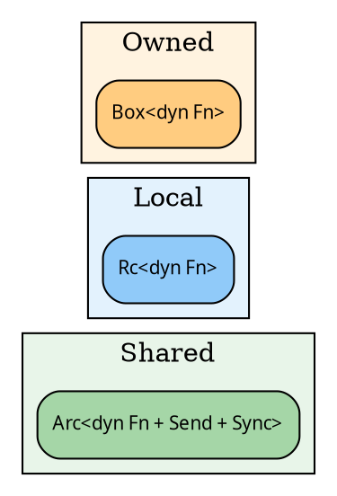
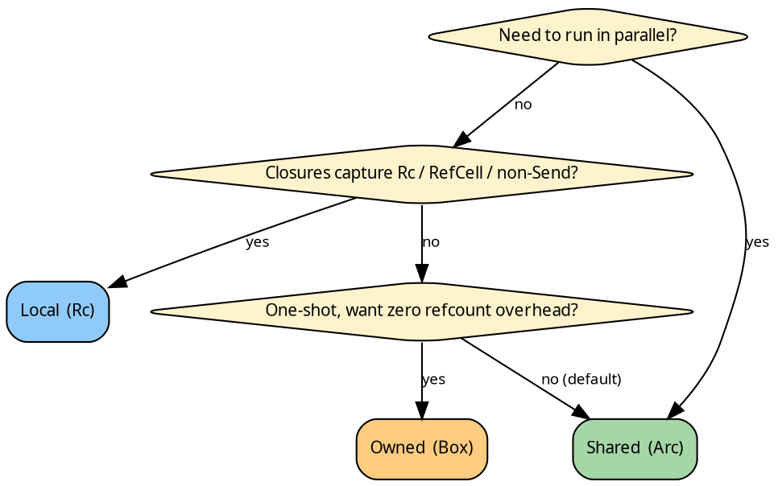

# The three domains

## The underlying question

A recursion is, at its heart, five closures — a fold's `init`,
`accumulate`, and `finalize`, a graph's edge function, and (in
seed pipelines) a `grow`. hylic retains these closures across
the duration of a run and hands them to executors, lifts, and
user code. A single question organises the design:

> How shall `dyn Fn(&N) -> H` be stored?

Rust offers three practical answers:

| Storage     | Clone?                    | `Send + Sync`?        |
|-------------|---------------------------|-----------------------|
| `Arc<dyn>`  | cheap (refcount bump)     | yes, if the closure is |
| `Rc<dyn>`   | cheap (refcount bump)     | no (single-threaded)  |
| `Box<dyn>`  | not `Clone`               | possible, but consumed on use |

Each choice is a compromise. `Arc` pays an atomic instruction on
every clone in exchange for the ability to cross thread
boundaries. `Rc` uses a plain counter — faster single-threaded,
incompatible with multi-threading. `Box` avoids any counter but
forces transformation pipelines to *consume* the closure on each
rewrite.

Every closure in a recursion must agree on the choice. hylic
therefore selects once at the top level and propagates the choice
through the entire pipeline; that selection is what is called a
**domain**.

## Three choices, three types



- **`Shared`** stores closures behind `Arc` with
  `Send + Sync` bounds. The atomic clone grants access to the
  parallel `Funnel` executor and makes every pipeline `Clone`.
- **`Local`** stores closures behind `Rc` (no `Send` bound).
  Clones remain cheap and the pipeline interfaces are unchanged,
  but execution is confined to a single thread. In return,
  captures may include `Rc<_>`, `RefCell<_>`, or any
  non-`Send` type.
- **`Owned`** stores closures in `Box`. Clones and sharing are
  both absent; each stage of a pipeline consumes its predecessor.
  Appropriate for one-shot computations that should avoid
  reference-counting overhead entirely.

`Shared` is the conservative default and serves most code. `Local`
is the escape hatch for non-`Send` captures. `Owned` is the
minimalist one-shot variant.

## The Domain trait

The three choices are encoded as marker types implementing the
`Domain<N>` trait:

```rust
{{#include ../../../../hylic/src/domain/mod.rs:domain_trait}}
```

A `Domain<N>` implementation specifies:

- the concrete `Fold<H, R>` type in use (closure storage lives
  inside `Fold`),
- the concrete `Graph` type,
- the concrete `Grow<Seed, N>` type (for seed pipelines),
- constructor methods (`make_fold`, `make_graph`, `make_grow`)
  that build each of the above generically.

Code generic over `D: Domain<N>` constructs any of the three
without knowing whether the underlying storage is `Arc`, `Rc`,
or `Box`; the constructor methods handle the distinction.

## Constructors across domains

Each domain exposes the same construction surface, distinguished
only by its bounds:

```rust
{{#include ../../../src/docs_examples.rs:domains_three_folds}}
```

The `Shared` constructor requires `Fn + Send + Sync + 'static`
for every closure; `Local` requires `Fn + 'static`; `Owned` shares
`Local`'s bounds but returns a `Box`-backed struct. The
signatures are aligned so that generic code compiles without
modification across domains; the bounds differ so that each
domain accepts only those closures it is able to store.

## The Fold struct, three times

Because storage differs, each domain ships its own `Fold`:

```rust
{{#include ../../../../hylic/src/domain/shared/fold.rs:fold_struct}}
```

`Local` and `Owned` share the same shape, with `Rc` and `Box`
substituted for `Arc`. The three are not interchangeable at the
type level: the `Fused` executor reads whichever concrete
`D::Fold<H, R>` the pipeline provides, and crossing domain
boundaries requires an explicit conversion that the library does
not supply — the expected discipline is to select a single domain
per computation.

## Parallelism

The parallel `Funnel` executor requires
[`ShareableLift`](./lifts.md), a capability that reduces to
`D = Shared` together with `Send + Sync` on every payload
(`N`, `H`, `R`). `Local` and `Owned` cannot run in parallel by
construction: their storage types do not cross thread boundaries,
and the `ShareableLift` bound does not hold.

The converse is not true — a `Shared` pipeline runs without issue
under `Fused`. The price of choosing `Shared` is one atomic
operation per closure clone, and nothing more.

## Picking one (decision tree)



In short: `Shared` by default, `Local` for non-`Send` captures,
`Owned` for the one-shot minimal case.

## For library authors

Prefer code generic over `D: Domain<N>`. The three domain
markers are not interchangeable at runtime, but almost the whole
of hylic compiles once and operates across all three. Select a
concrete domain only where its specific capability is required
(`D = Shared` for parallelism; `D = Owned` for consume-on-use).
