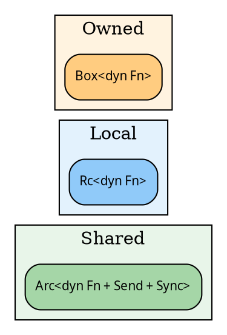
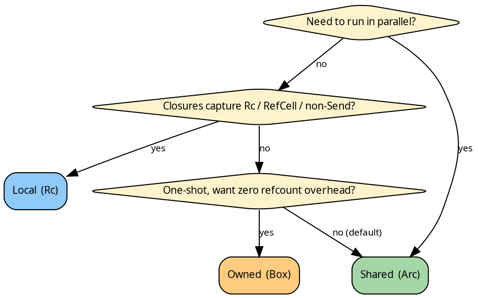

# The three domains

## The engineering problem

The recursion boils down to three closures: a fold's `init`, its
`accumulate`, its `finalize`, plus a graph's edge function and
(in seed pipelines) a `grow`. hylic holds these closures for the
duration of a run and hands them to executors, lifts, and user
code. That raises a single question:

> How do we *store* `dyn Fn(&N) -> H`?

Rust gives three realistic answers:

| Storage     | Clone?                    | Send + Sync?        |
|-------------|---------------------------|---------------------|
| `Arc<dyn>`  | cheap (refcount bump)     | yes, if the closure is |
| `Rc<dyn>`   | cheap (refcount bump)     | no (single-threaded)   |
| `Box<dyn>`  | no (unique ownership)     | possible, but consumed on use |

Each one is a compromise. `Arc` pays an atomic on every clone but
lets you run across threads. `Rc` is a plain counter — faster in
the single-thread case, uncrossable in the multi-thread case.
`Box` avoids the counter entirely but forces the transformation
pipeline to *consume* each closure as it rewrites it.

Every closure in a recursion must make the same choice. So hylic
picks *once*, at the top level, and propagates. That choice is
the **domain**.

## Three choices, three types



- **`Shared`** stores closures behind `Arc` with `Send + Sync`
  bounds. Paying the atomic clone buys you parallel executors
  (Funnel, ParLazy, ParEager) and `Clone` on every pipeline.
- **`Local`** stores closures behind `Rc` (no `Send`). You still
  get cheap clones and ergonomic pipelines, but you're locked to
  a single thread. In exchange, you can capture `Rc<_>`,
  `RefCell<_>`, or anything that isn't `Send`.
- **`Owned`** stores closures in `Box`. No cloning, no sharing —
  each step of a pipeline consumes the previous one. Useful when
  you're building a one-shot computation and don't want to pay
  the reference-count overhead at all.

Shared is the conservative choice and what most code uses. Local
is the escape hatch when you need `!Send` captures. Owned is the
minimalist.

## The Domain trait

The three choices are encoded as marker types implementing the
`Domain<N>` trait:

```rust
{{#include ../../../../hylic/src/domain/mod.rs:domain_trait}}
```

A `Domain<N>` impl specifies:

- which concrete `Fold<H, R>` type to use (closure storage lives
  inside `Fold`),
- which concrete `Graph` type to use,
- which concrete `Grow<Seed, N>` type to use (for seed pipelines),
- how to construct each of them generically (`make_fold`,
  `make_graph`, `make_grow`).

Code generic over `D: Domain<N>` builds any of the three without
knowing whether the storage is Arc, Rc, or Box — the constructor
methods handle it.

## Constructors in parallel

Each domain exposes the same construction surface with different
bounds:

```rust
{{#include ../../../src/docs_examples.rs:domains_three_folds}}
```

The `Shared` version demands `Fn + Send + Sync + 'static` on
every closure; `Local` demands `Fn + 'static`; `Owned` is the
same as `Local` but returns a `Box`-backed struct. The signatures
match so that generic code compiles unchanged; the bounds
diverge so that each domain is only constructible with closures
it can actually store.

## The Fold struct, three times

Because storage differs, each domain ships its own `Fold`:

```rust
{{#include ../../../../hylic/src/domain/shared/fold.rs:fold_struct}}
```

`Local` and `Owned` have identical shapes with `Rc` and `Box`
replacing `Arc`. They're not interchangeable at the type level —
a `Fused` executor reads the concrete `D::Fold<H, R>` the
pipeline handed it. Crossing domains requires an explicit
conversion (none is provided in the library; the ergonomic answer
is "pick one domain per computation").

## Parallelism

Parallel executors (`Funnel`, `ParLazy`, `ParEager`) require
[`ShareableLift`](./lifts.md), a capability that folds down to
`D = Shared` plus `Send + Sync` on every payload (`N`, `H`, `R`).
`Local` and `Owned` cannot run in parallel by construction —
their storage types don't cross thread boundaries, and the
`ShareableLift` bound won't compile.

The inverse is not true: Shared pipelines run happily under
`Fused` too. Picking Shared costs you one atomic per closure
clone and nothing else.

## Picking one (decision tree)



The short version: **Shared by default, Local for `!Send`
captures, Owned for the one-shot minimal case.**

## For library authors

Write generic over `D: Domain<N>`. The three domain markers are
not interchangeable at runtime, but almost all library code in
hylic compiles once and works for all three. Reach for a
concrete domain only when you actually need the capability it
gates (`D = Shared` for parallel; `D = Owned` for consume-on-use).
