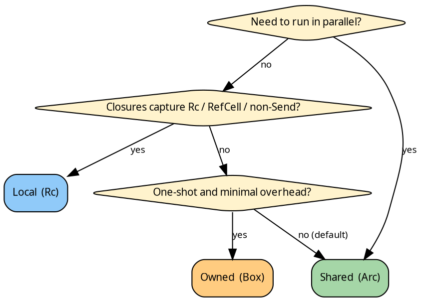

# The three domains

hylic stores the user's closures in one of three ways. The choice
affects what captures the closures can hold and which executors
you can pass them to.

## Picking one



Shared is the default choice. Local is the escape hatch for
non-`Send` captures. Owned is the minimalist choice for one-shot
computations.

## What each domain gives you

| Domain | Storage                       | `Clone` | `Send + Sync` | Typical executor |
|--------|-------------------------------|---------|----------------|------------------|
| `Shared` | `Arc<dyn Fn + Send + Sync>` | yes     | yes            | `Fused` or `Funnel` (parallel) |
| `Local`  | `Rc<dyn Fn>`                 | yes     | no             | `Fused` |
| `Owned`  | `Box<dyn Fn>`                | no      | no             | `Fused` (`run_from_node_once`) |

All three implement the [`Domain`](../reference/domains.md) trait.

## The Domain trait

`Domain<N>` is the anchor — one impl per marker type (`Shared`,
`Local`, `Owned`) describes how the domain stores the three slot
types: the fold, the graph, and the grow closure.

```rust
{{#include ../../../../hylic/src/domain/mod.rs:domain_trait}}
```

Each domain picks its own concrete `Fold`, `Graph`, and `Grow`
types. The `make_*` constructors let code that's generic over `D`
build any of them without knowing the storage choice.

## Per-domain constructors

Each domain exposes the same constructor surface (with different
bounds):

```rust
use hylic::prelude::*;

// Shared: closures must be Send + Sync (they go into Arc).
let f = fold(
    |n: &u64| *n,                         // init
    |h: &mut u64, c: &u64| *h += c,       // accumulate
    |h: &u64| *h,                         // finalize
);

// Local: closures can capture Rc / RefCell.
use hylic::domain::local as ldom;
let state = std::rc::Rc::new(std::cell::RefCell::new(0));
let lf = ldom::fold(
    move |n: &u64| { *state.borrow_mut() += 1; *n },
    |h: &mut u64, c: &u64| *h += c,
    |h: &u64| *h,
);

// Owned: one-shot construction; not Clone.
use hylic::domain::owned as odom;
let of = odom::fold(
    |n: &u64| *n,
    |h: &mut u64, c: &u64| *h += c,
    |h: &u64| *h,
);
```

## The three Fold types in parallel

Because storage differs, each domain ships its own `Fold` struct:

### Shared

```rust
{{#include ../../../../hylic/src/domain/shared/fold.rs:fold_struct}}
```

### Local

(inline in `domain/local/mod.rs` — identical shape, `Rc` storage,
no `Send+Sync`.)

### Owned

(inline in `domain/owned/mod.rs` — `Box` storage; consumed by
transformations.)

The three types are not interchangeable — the executor picks up
whichever `D::Fold<H, R>` the pipeline/bare call handed it.

## Shared vs parallelism

Parallel executors (Funnel, ParLazy, ParEager) require
[`ShareableLift`](../concepts/lifts.md) — which folds down to
`D = Shared` plus `Send + Sync` on every payload type. Local and
Owned cannot run in parallel by construction.

## Relating to Rust's ownership model

- **Shared** is the "parallel-safe reference-counted" domain. Closures
  are cheap to clone (Arc bumps a counter); many threads can hold
  references simultaneously.
- **Local** is the "single-threaded reference-counted" domain. Same
  cloning ergonomics, but confined to one thread. Lets closures
  capture non-`Send` data.
- **Owned** is the "consume-on-use" domain. Closures are cheap to
  construct and run, but each transformation consumes the original.

In library design, prefer code generic over `D: Domain<N>`. In
application code, pick one and stick with it; mix only when the
call graph genuinely requires crossing the boundary.
