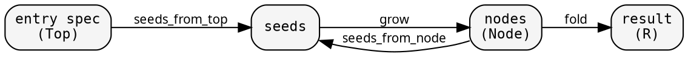

# Entry points

So far, the tree exists upfront — your nodes store their children.
But many real problems discover the tree lazily: you parse a
config file to find its imports, resolve each import to find more
imports, and so on. The tree materializes during traversal.

hylic handles this with SeedGraph, Graph, and GraphWithFold.
All three reduce to `dom::FUSED.run(...)` — they just add one
level of indirection for the entry point.

## The two-function pattern

Most recursive algorithms in practice have two functions:

```rust
fn resolve(spec: &str) -> Resolution {
    let root = find_module(spec);        // entry: spec → first node
    resolve_recursive(&root)             // recursion: node → children → fold
}

fn resolve_recursive(module: &Module) -> Resolution {
    let children = module.deps.iter()
        .map(|dep| resolve_recursive(&lookup(dep)))
        .collect();
    Resolution { module, children }
}
```

The entry point has different inputs (a spec string) than the
recursive function (a module). They share fold logic but differ
in how they produce the first node. As the algorithm grows,
error handling, logging, caching get woven into both — concerns
tangle.

The underlying structure is simpler than it looks:



The entry point is just a different edge into the same graph.
The recursive structure (node → seeds → grow → node) is the
tree. The entry (spec → seeds → grow → first nodes) is a
single layer that feeds into it.

## SeedGraph

`SeedGraph<Node, Seed, Top>` captures this with three functions:

- **seeds_from_node**: `Edgy<Node, Seed>` — given a node, what
  are its dependency seeds?
- **grow**: `Fn(&Seed) → Node` — given a seed, produce a node
- **seeds_from_top**: `Edgy<Top, Seed>` — given the entry point,
  what are the initial seeds?

From these, SeedGraph builds the full graph:

```rust
// make_treeish: Node → seeds → grow each → children (Treeish<Node>)
// make_top_edgy: Top → seeds → grow each → first nodes (Edgy<Top, Node>)
// make_graph: both paired into Graph<Top, Node>
let graph: Graph<Top, Node> = seed_graph.make_graph();
```

The tree is never materialized — `make_treeish` returns a
callback-based `Treeish<Node>` that lazily discovers children
during traversal. This is a hylomorphism: the anamorphism (unfold
from seeds) and catamorphism (fold to result) fuse.

## Graph and GraphWithFold

`Graph<Top, Node>` pairs two things:
- `treeish: Treeish<Node>` — the recursive children
- `top_edgy: Edgy<Top, Node>` — the entry point edges

`GraphWithFold` wires a Graph with a Fold and a top-level heap
initializer into a runnable pipeline:

```rust
{{#include ../../../../hylic/src/graph/compose.rs:pipeline_run}}
```

This is one manual fold step for `Top`: initialize a heap,
visit Top's children (via `top_edgy`), call `exec.run` on each
child tree, accumulate, finalize. The recursive computation
inside each child is pure `exec.run(&fold, &treeish, &child)`.

The pipeline adds no new execution mechanism. It's wiring.

## When to use what

| Situation | API |
|---|---|
| Nodes store children | `exec.run(&fold, &treeish, &root)` |
| Tree discovered lazily, entry type = node type | Build Treeish from SeedGraph, use `exec.run` |
| Tree discovered lazily, entry type ≠ node type | `GraphWithFold::run(&exec, &top)` |

Most simple examples (Fibonacci, expression eval, filesystem) use
the first form. Module resolution and dependency analysis use the
third — the entry is a list of top-level specs, not a module node.

## Transforms on the pipeline

GraphWithFold supports the same transformation pattern as Fold:

| Transform | What it does |
|---|---|
| `map(fwd, back)` | Change result type |
| `zipmap(f)` | Augment result: `R → (R, Extra)` |
| `map_fold(f)` | Transform the fold |
| `map_graph(f)` | Transform the graph |

Derived pipelines use these transforms: the base pipeline
produces `R`, and `zipmap` augments it with extra data.
One traversal, multiple views — each derived pipeline runs
the same fold on the same graph.
