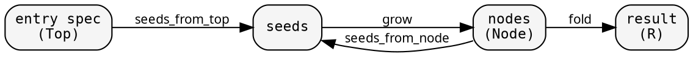
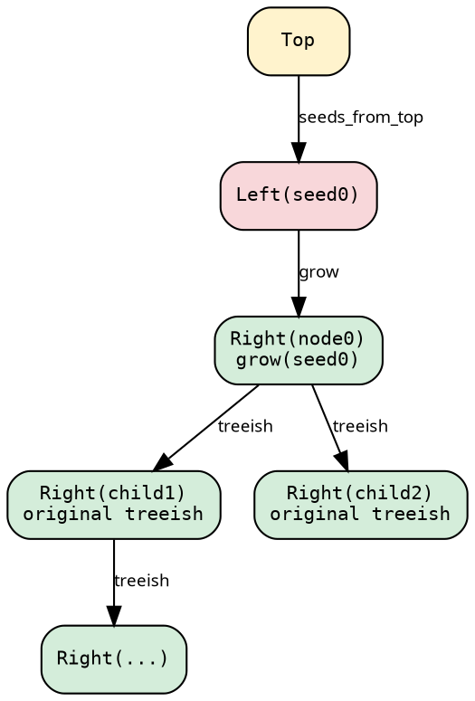

# Entry points and seed-based graphs

Many recursive computations discover their tree lazily: parsing a
config file reveals imports, resolving each import reveals more
imports. The tree materializes during traversal. hylic handles this
through the seed-based graph pattern, where a `grow` function
resolves references (seeds) into nodes.

## The two-function pattern

Most recursive resolution algorithms have two functions:

```rust
fn resolve(spec: &str) -> Resolution {
    let root = find_module(spec);        // entry: spec → first node
    resolve_recursive(&root)             // recursion: node → children → fold
}

fn resolve_recursive(module: &Module) -> Resolution {
    let children = module.deps.iter()
        .map(|dep| resolve_recursive(&lookup(dep)))
        .collect();
    Resolution { module, children }
}
```

The entry point has different inputs (a spec string) than the
recursive function (a module). They share fold logic but differ
in how they produce the first node.

The underlying structure separates into three concerns:



The entry point maps Top → [Seed]. The recursive structure maps
Node → [Seed] → grow → [Node]. The fold computes the result.

## SeedPipeline — the lift-based approach

`SeedPipeline` encapsulates the seed pattern as a proper lift. The
user provides five things:

- **grow**: `Fn(&Seed) → Node` — resolve a seed into a node
- **treeish**: `Treeish<Node>` — the Node → [Node] traversal (built from seeds_from_node + grow)
- **seeds_from_top**: `Edgy<Top, Seed>` — the entry point mapping
- **fold**: `Fold<Node, H, R>` — the computation
- **heap_of_top**: `Fn(&Top) → H` — how to initialize the top-level heap

Internally, the pipeline uses `SeedLift` to transform the treeish
and fold into an `Either<Seed, Node>` domain. Each top seed enters
the lifted tree as `Left(seed)`, which the lifted treeish grows into
`Right(node)`. From there, the original treeish takes over for all
recursive children. The lift is transparent — the user sees only
Node, H, and R:



After the single Seed→Node transition at the root, every subsequent
level is handled by the original treeish. The lifted computation
converges to the original.

```rust
use hylic::cata::seed_lift::SeedPipeline;
use hylic::domain::shared as dom;
use hylic::graph;

let pipeline = SeedPipeline::new(
    grow_fn,                   // Fn(&Seed) -> Node
    treeish,                   // Treeish<Node>
    seeds_from_top,            // Edgy<Top, Seed>
    &fold,                     // &Fold<Node, H, R>
    heap_of_top,               // Fn(&Top) -> H
);

// Sequential:
let result = pipeline.run(&dom::FUSED, &top);

// Parallel:
use hylic::cata::exec::funnel;
let result = pipeline.run(&dom::exec(funnel::Spec::default(8)), &top);
```

The executor is passed at `.run()` time. Since Fused and Funnel
implement `Executor` generically, they accept the internal
`Either<Seed, Node>` type without the user naming it.

## SeedLift — the manual path

For users who want direct access to the lift mechanics, `SeedLift`
is public and implements `LiftOps`. It carries only the `grow`
function and provides `lift_treeish` and `lift_fold`:

```rust
use hylic::cata::seed_lift::SeedLift;

let lift = SeedLift::new(grow_fn);
let lifted_treeish = lift.lift_treeish(treeish);
let lifted_fold = lift.lift_fold(fold);

// Enter through a seed:
let result = exec.run(&lifted_fold, &lifted_treeish, &Either::Left(seed));

// Enter through a node (transparent — same as direct execution):
let result = exec.run(&lifted_fold, &lifted_treeish, &Either::Right(node));
```

This is useful for composing the seed lift with other operations,
or for understanding the lift's internal mechanics.

## SeedGraph and GraphWithFold — the composition approach

`SeedGraph` is an older abstraction that fuses the seed mechanics
into a single `make_treeish()` call, producing a `Treeish<Node>`
where the Seed→Node indirection is invisible. `Graph` pairs a
treeish with a top-level entry edge. `GraphWithFold` wires a Graph
with a Fold into a runnable pipeline.

These types remain available in `hylic::graph` and are used by
existing code (including mb_resolver's current implementation).
The SeedPipeline is the lift-based alternative that makes the seed
layer explicit and composable with other lifts.

## When to use what

| Situation | Approach |
|---|---|
| Nodes store children directly | `exec.run(&fold, &treeish, &root)` |
| Tree discovered lazily, simple case | `SeedPipeline::new(grow, treeish, ...)` |
| Need to compose with Explainer or other lifts | `SeedLift` manual path |
| Existing code using SeedGraph/GraphWithFold | Continue using — both approaches produce the same results |
