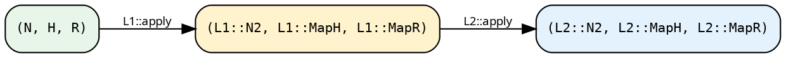

# Lifts — the CPS triple transformer

A **lift** is a structural transformation of hylic's computation
triple `(Grow, Graph, Fold)`. Where the [fold/graph
transforms](./transforms.md) change one axis at a time, a lift
changes as many as it needs to and composes with other lifts to
form chains.

## Formal shape

A `Lift<D, N, H, R>` declares three output types and a single
`apply` method in continuation-passing style:

```rust
{{#include ../../../../hylic/src/ops/lift/core.rs:lift_trait}}
```

Read this as a type-level arrow:

```
L : (Grow<Seed, N>, Graph<N>, Fold<N, H, R>)
  → (Grow<Seed, L::N2>, Graph<L::N2>, Fold<L::N2, L::MapH, L::MapR>)
```

`apply` consumes the input triple and hands the transformed
triple to a user continuation `cont`. CPS lets the three output
types be existentials that only the continuation knows how to
close over.

## Why CPS

The alternative would be for `apply` to *return* the transformed
triple. Rust would then need to know the exact return type at the
call site — which, for a chain of lifts, is an obscure nested
`(Grow<…>, Graph<…>, Fold<…>)` where each type is GATed on the
domain. CPS lets each chain element hand its result to the next,
with Rust's type inference walking the chain end-to-end.

## The four atoms

Every lift in the library is built out of four atoms:

### `IdentityLift`

```rust
{{#include ../../../../hylic/src/ops/lift/identity.rs:identity_lift}}
```

Passes the triple through unchanged. `N2 = N`, `MapH = H`, `MapR = R`.
`.lift()` on a Stage-1 pipeline uses this as the chain's seed.

### `ComposedLift<L1, L2>`

```rust
{{#include ../../../../hylic/src/ops/lift/composed.rs:composed_lift}}
```

Sequential composition. `L1` runs first; its output types feed
`L2`.



At the type level, `ComposedLift<L1, L2>: Lift<D, N, H, R>` when
`L2: Lift<D, L1::N2, L1::MapH, L1::MapR>` — the outer has to
accept the inner's outputs.

### `ShapeLift<D, N, H, R, N2, H2, R2>`

The universal library lift. Stores three domain-specific xforms
(grow, treeish, fold) and runs them in sequence:

```rust
{{#include ../../../../hylic/src/ops/lift/shape.rs:shape_lift_struct}}
```

Every concrete library lift (`wrap_init_lift`, `map_r_bi_lift`,
`n_lift`, `filter_edges_lift`, `memoize_by_lift`, `explainer_lift`,
`phases_lift`, `treeish_lift`) is a `ShapeLift` built with the
right trio of xforms.

### `SeedLift<N, Seed, H>`

```rust
{{#include ../../../../hylic/src/ops/lift/seed_lift.rs:seed_lift_struct}}
```

A specialised **finishing** lift: turns a Seed-shaped coalgebra
into an executable `Treeish<LiftedNode<N>>` rooted at an `Entry`
variant. Used internally by `SeedPipeline::run(...)`. Users rarely
touch it directly, but it *is* a `Lift<Shared, N, H, R>` and
composes like any other.

`LiftedNode<N>`:

```rust
{{#include ../../../../hylic/src/ops/lift/lifted_node.rs:lifted_node_enum}}
```

Two variants: `Entry` is the root fan-out point; `Node(N)`
wraps resolved nodes during traversal.

## Domain capability

Not every domain supports `ShapeLift`. The `ShapeCapable` trait
declares the per-domain xform storage types:

```rust
{{#include ../../../../hylic/src/ops/lift/capability.rs:shape_capable}}
```

`Shared` and `Local` implement `ShapeCapable`; `Owned` does not
(its single-use storage semantics preclude cheaply applying xforms
across composition).

## Applying a lift without a pipeline

`LiftBare` is a blanket trait over every `Lift`. It lets you
apply a lift directly to a `(treeish, fold)` pair and run it:

```rust
{{#include ../../../../hylic/src/ops/lift/bare.rs:lift_bare_trait}}
```

In practice:

```rust
use hylic::prelude::*;

let treeish = treeish(|n: &u64| if *n > 0 { vec![*n - 1] } else { vec![] });
let fld     = fold(|n: &u64| *n, |h: &mut u64, c: &u64| *h += c, |h: &u64| *h);

// Wrap init to add +1 to each node's seed value.
let wi = Shared::wrap_init_lift::<u64, u64, u64, _>(|n, orig| orig(n) + 1);
let r  = wi.run_on(&FUSED, treeish, fld, &3u64);
```

No pipeline, no `.lift()` ceremony — just "apply this lift then
run." Useful for bare-Fold+Graph users and for parallel-lift
benchmarks where the pipeline layer isn't needed.

## Capability markers — parallel vs sequential

Two blanket markers gate which executors a lift can feed:

- `PureLift<D, N, H, R>` — any `Lift + Clone + 'static` with
  `Clone` outputs. Sufficient for sequential executors.
- `ShareableLift<D, N, H, R>` — adds `Send + Sync` on
  everything. Required for parallel executors (Funnel, ParLazy,
  ParEager).

Both are implemented via blanket impls in
[`ops::lift::capability`](../../../../hylic/src/ops/lift/capability.rs).
You don't write them; the compiler checks whether your lift meets
the executor's bound when you call `.run(...)`.

## The library catalogue

Each capable domain exposes a set of `ShapeLift` constructors.
For `Shared`:

| Constructor                        | Semantics                                           |
|------------------------------------|-----------------------------------------------------|
| `Shared::wrap_init_lift(w)`        | intercept each node's init                          |
| `Shared::wrap_accumulate_lift(w)`  | intercept each accumulate                           |
| `Shared::wrap_finalize_lift(w)`    | intercept each finalize                             |
| `Shared::zipmap_lift(m)`           | append `(R, Extra)` to the R axis                   |
| `Shared::map_r_bi_lift(fwd, bwd)`  | change R axis bijectively                           |
| `Shared::filter_edges_lift(pred)`  | drop edges matching a predicate                     |
| `Shared::wrap_visit_lift(w)`       | intercept graph `visit` calls                       |
| `Shared::memoize_by_lift(key)`     | memoise subtree results by key                      |
| `Shared::map_n_bi_lift(co, contra)`| change N axis bijectively                           |
| `Shared::n_lift(ln, bt, fc)`       | change N axis with per-slot coordination            |
| `Shared::explainer_lift()`         | wrap fold with per-node trace recording             |
| `Shared::explainer_describe_lift(fmt, emit)` | streaming trace emission (R stays transparent) |
| `Shared::phases_lift(mi, ma, mf)`  | rewrite all three fold phases (primitive)           |
| `Shared::treeish_lift(mt)`         | rewrite the graph (primitive)                       |

`Local` mirrors the same set (except `explainer_describe_lift`),
with `Rc` storage and no `Send+Sync` bounds.

## Why "the triple" and not just Fold + Graph

The third axis is `Grow<Seed, N>` — a Seed-to-N resolver. Users
who start from a tree already "grown" into `Treeish<N>` never see
it, but lifts have to carry it through composition so that
`SeedPipeline`-rooted computations (which *do* use Grow) keep
working when chained with lifts that don't care about it.

Internally, each lift decides how to handle the Grow axis:

- **N-change lifts** (`n_lift`, `map_n_bi_lift`) produce a
  new Grow that wraps the old one with the N conversion.
- **Other lifts** pass the Grow through unchanged.
- `SeedLift` *consumes* the Grow into its `Entry` / `Node`
  dispatch and synthesises a downstream "unreachable grow" —
  after SeedLift, no further lift can read Grow because there's
  nothing to resolve.

You only care about this when writing a custom lift; see
[Writing a custom Lift](../pipeline/custom_lift.md).
