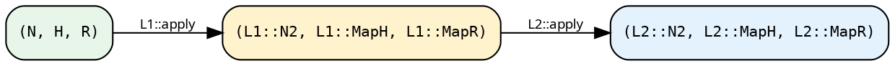

# Lifts — cross-axis transforms

## The problem

The transforms in the [previous chapter](./transforms.md) act on
a single structure — a Fold or a Graph, not both. Some rewrites,
however, must touch both in a coordinated manner: a change of
node type that the Graph produces and the Fold consumes; a
filter that drops edges and must therefore also leave the Fold
structurally consistent with what remains; a per-node trace that
wraps the Fold's output and composes with whatever other
transforms are already in place.

A **Lift** is the object that performs such cross-axis rewrites.
It operates on the full *triple* carried by a pipeline, not on
one slot in isolation, and composes with other lifts to form a
chain.

## Why three axes

Besides `Fold<N, H, R>` and `Graph<N>`, there's a third slot:
`Grow<Seed, N>` — a closure that resolves a `Seed` into an `N`.
Most users never build a Grow by hand; [`SeedPipeline`](../pipeline/seed.md)
constructs one from `grow: Seed → N`. But because lifts compose
and some pipelines carry a Grow, the trait has to account for it.

Three slots, not two. The [`Lift`](./lifts.md) trait threads all
three through composition. A lift that doesn't care about Grow
(say, a fold-wrapper) passes it unchanged. A lift that does care
(the N-change lifts; `SeedLift`) rewrites it in concert with the
other slots.

## The trait

```rust
{{#include ../../../../hylic/src/ops/lift/core.rs:lift_trait}}
```

Three associated output types (`N2`, `MapH`, `MapR`) and a single
`apply` method. As a type-level arrow:

```
L : (Grow<Seed, N>, Graph<N>, Fold<N, H, R>)
  → (Grow<Seed, L::N2>, Graph<L::N2>, Fold<L::N2, L::MapH, L::MapR>)
```

## Quick start

Most users never interact with the `Lift` trait directly; the
pipeline sugars are the usual surface, and each sugar delegates
to a library lift. A small example demonstrates what a lift
changes at the value level:

```rust
{{#include ../../../src/docs_examples.rs:bare_lift_wrap_init}}
```

`wrap_init_lift` accepts a closure that intercepts every call to
`init`. The pipeline's `R` is unchanged; only the per-node init
closure is wrapped. The remaining sugars follow the same pattern:
select an axis, supply the transformation as a closure, obtain a
new pipeline that differs only along that axis.

The [Library catalogue](#library-catalogue) below lists the axes
touched by each library lift.

## Four atoms

Every library lift is an instance of one of four types. The
sugars compose these atoms without requiring any of them to be
constructed by hand; this section names the parts so that they
are recognisable in compiler errors and in custom-lift
implementations.

**`IdentityLift`** — pass-through. Used as the seed of a lift chain
when a Stage-1 pipeline transitions to Stage 2 via `.lift()`.

```rust
{{#include ../../../../hylic/src/ops/lift/identity.rs:identity_lift}}
```

**`ComposedLift<L1, L2>`** — sequential composition. `L1` runs
first; `L2` takes `L1`'s outputs as its inputs.

```rust
{{#include ../../../../hylic/src/ops/lift/composed.rs:composed_lift}}
```



The type-level bound `L2: Lift<D, L1::N2, L1::MapH, L1::MapR>`
enforces the connection. A mistake here surfaces as a compile
error at the composition site.

**`ShapeLift<D, N, H, R, N2, H2, R2>`** — the universal library
lift. Stores three per-domain xforms (one per slot) and applies
them in sequence.

```rust
{{#include ../../../../hylic/src/ops/lift/shape.rs:shape_lift_struct}}
```

Every concrete library lift is a `ShapeLift` with appropriate
xforms. `wrap_init_lift` only rewrites Fold's init phase;
`filter_edges_lift` only rewrites Graph's visit; `n_lift` rewrites
all three; `explainer_lift` rewrites only Fold (but changes
`MapH` and `MapR` to the explainer's wrapper types).

**`SeedLift<D, N, Seed, H>`** — a finishing lift that closes a
SeedPipeline by turning the `(grow, seeds_from_node, fold)` triple
into a runnable `(treeish, fold)` pair rooted at an `EntryRoot`
variant. Domain-parametric over `ShapeCapable` (Shared + Local
impls; per-domain because the fold-construction closures'
Send+Sync discipline differs by domain). Assembled at run time
inside the seed-rooted `Stage2Pipeline::run(...)` from the base's
`grow` plus the caller-supplied `root_seeds` and `entry_heap`,
then composed as the **first** lift of the run-time chain.

```rust
{{#include ../../../../hylic/src/ops/lift/seed_lift.rs:seed_lift_struct}}
```

Its N2 is `SeedNode<N>` — a sealed row type whose variants are
library-internal; user code inspects via `is_entry_root()`,
`as_node()`, `map_node(f)`. Two inhabitants: the synthetic
EntryRoot (root fan-out over entry seeds) and a resolved Node(N).
`SeedLift` builds a `Treeish<SeedNode<N>>` that dispatches on
variant: EntryRoot visits the entry seeds via grow, Node visits
the user's treeish.

For an N-typed view of a seed-closed `.explain()` result, convert
the raw `ExplainerResult<SeedNode<N>, H, R>` to `SeedExplainerResult`
via `raw.into()` — see
[seed explainer result](../pipeline/seed.md#seed-explainer-result).

## Bare application

Any `Lift` is usable without a pipeline. `LiftBare` is a blanket
trait:

```rust
{{#include ../../../../hylic/src/ops/lift/bare.rs:lift_bare_trait}}
```

See [Bare lift application](../pipeline/overview.md#alternative-bare-lift-application)
in the Pipelines overview for the rationale and the `panic-grow`
trick that lets `LiftBare` skip the grow slot.

## Per-domain capability

Not every domain supports `ShapeLift`. A domain has to declare
what it can store as a per-slot xform:

```rust
{{#include ../../../../hylic/src/ops/lift/capability.rs:shape_capable}}
```

`Shared` and `Local` are `ShapeCapable` — each storage uses its
own pointer type (Arc vs Rc) and closure bounds (`Send + Sync`
vs none). `Owned` is **not** `ShapeCapable`: `Box<dyn Fn>` is not
`Clone`, so xforms can't be applied to produce a new owned fold.
Owned pipelines have no Stage-2 surface.

## Parallel vs sequential

Two blanket markers gate which executors a lift can feed:

- `PureLift<D, N, H, R>` — any `Lift + Clone + 'static` with
  `Clone` outputs. Sufficient for the sequential executor `Fused`.
- `ShareableLift<D, N, H, R>` — adds `Send + Sync` on everything.
  Required for the parallel `Funnel` executor.

You don't implement these; the compiler picks them up via blanket
impls in [`ops::lift::capability`](../../../../hylic/src/ops/lift/capability.rs).
If your lift (or your data) doesn't meet the parallel bounds,
calling `.run(&funnel_exec, ...)` is a compile error — there's
no silent fallback.

## Library catalogue

Each `ShapeCapable` domain exposes a set of constructors that
return a `ShapeLift` shaped for the transformation. For `Shared`:

| Constructor                        | What it changes                                     |
|------------------------------------|-----------------------------------------------------|
| `Shared::wrap_init_lift(w)`        | intercept `init` at every node                      |
| `Shared::wrap_accumulate_lift(w)`  | intercept `accumulate`                              |
| `Shared::wrap_finalize_lift(w)`    | intercept `finalize`                                |
| `Shared::zipmap_lift(m)`           | extend R: `R → (R, Extra)`                          |
| `Shared::map_r_bi_lift(fwd, bwd)`  | change R (bijection required; R is invariant)       |
| `Shared::filter_edges_lift(pred)`  | drop edges matching a predicate                     |
| `Shared::wrap_visit_lift(w)`       | intercept graph `visit`                             |
| `Shared::memoize_by_lift(key)`     | memoise subtree results by key                      |
| `Shared::map_n_bi_lift(co, contra)`| change N (bijection; N is invariant across slots)   |
| `Shared::n_lift(ln, bt, fc)`       | change N with per-slot coordination                 |
| `Shared::explainer_lift()`         | wrap fold with per-node trace recording             |
| `Shared::explainer_describe_lift(fmt, emit)` | streaming trace; `MapR = R`                |
| `Shared::phases_lift(mi, ma, mf)`  | rewrite all three Fold phases (primitive)           |
| `Shared::treeish_lift(mt)`         | rewrite the graph (primitive)                       |

`Local` mirrors the set (except `explainer_describe_lift`), with
Rc storage and no `Send + Sync` bounds.

The last two (`phases_lift`, `treeish_lift`) are the *primitives*:
the per-axis sugars all delegate to one of them. `n_lift` is the
primitive for coordinated N-change; `map_n_bi_lift` is the
bijective special case.

## Appendix: why the trait takes a continuation

This section is relevant only to writing a custom `Lift`
implementation; it explains the signature rather than the
everyday use of lifts.

A direct signature would return the transformed triple from
`apply`. The return type of such a form is
`(Grow<D, Seed, N2>, Graph<D, N2>, Fold<D, N2, H2, R2>)`, each
component a domain-associated GAT and each axis an associated
type of the lift. Following three chained lifts, the return type
admits no nameable alias.

Continuation-passing style — "CPS" in the source and in some
comments — avoids this. The caller supplies `apply` with a
closure (the continuation `cont`), which `apply` invokes with
the transformed triple. Because the continuation's return type
propagates outward, Rust's type inference threads every
intermediate through end-to-end, and no intermediate requires a
nameable alias.

Consequently, every pipeline's `.run(...)` reduces to a single
descent through the lift chain via nested `apply` calls, each
closing over the next. The chain is constructed at the type
level, evaluated once at the value level, and the executor
ultimately sees only the final `(treeish, fold)` pair.
