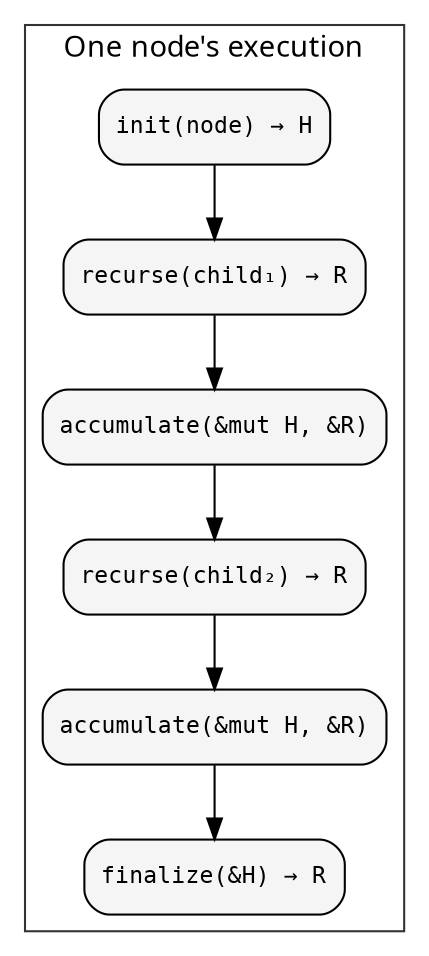
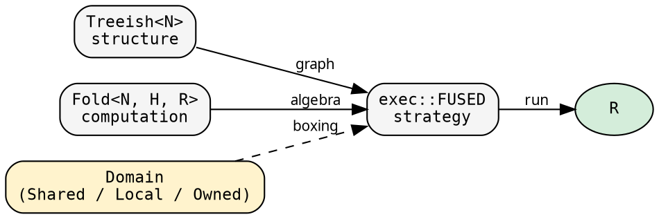

# The recursive pattern

Every recursive tree computation does the same thing. hylic
makes that pattern explicit, separates its parts, and lets you
transform each part independently.

## One function

This is the entire computation, from `exec.rs`:

```rust
{{#include ../../../../hylic/src/cata/exec/variant/fused/mod.rs:run_inner}}
```

Read it carefully. At each node:

1. **init** — create a heap `H` from the node
2. **visit children** — for each child, recurse and accumulate the result
3. **finalize** — produce the node's result `R` from the heap

That's it. Every tree fold — fibonacci, dependency resolution,
filesystem aggregation, AST evaluation — is this function with
different `init`, `accumulate`, `finalize`, and different child
structure.



## Three pieces

The function above takes three things as parameters. hylic
gives each a name and a type:

**Treeish** — the tree structure. Given a node, visit its children:

```rust
{{#include ../../../../hylic/src/graph/types.rs:edgy_struct}}
```

`Treeish<N>` is an alias for `Edgy<N, N>` — an edge function where
nodes and edges are the same type:

```rust
{{#include ../../../../hylic/src/graph/types.rs:treeish_alias}}
```

You construct one by providing a function from node to children:

```rust
{{#include ../../../src/docs_examples.rs:treeish_constructor}}
```

The callback-based signature (`Fn(&N, &mut dyn FnMut(&N))`) means
zero allocation per visit. The `treeish()` constructor wraps a
`Vec`-returning function into this form.

**Fold** — the computation. In the Shared domain, three closures behind Arc:

```rust
{{#include ../../../../hylic/src/fold/algebra.rs:fold_struct}}
```

Other [domains](../design/domains.md) use Rc (Local) or Box (Owned)
— same operations, different boxing. The fold type doesn't carry the
domain; the [executor](../design/executors.md) does.

- `init`: node → heap (initialize working state)
- `accumulate`: heap × child result → heap (fold in one child)
- `finalize`: heap → result (produce the node's answer)

The intermediate heap `H` lets you accumulate children one at a time
without collecting them first. `simple_fold` is a shorthand where
`H = R` and finalize is clone:

```rust
{{#include ../../../src/docs_examples.rs:simple_fold_example}}
```

**Executor** — the strategy. Controls HOW the recursion runs:

```rust
{{#include ../../../src/docs_examples.rs:exec_usage}}
```

Four built-in executors, each in its own module, each
domain-parameterized:

| Executor | Traversal | Domains | Arc/node |
|---|---|---|---|
| `exec::FUSED` | Callback | all | 0 |
| `exec::SEQUENTIAL` | Vec collect | all | 0 |
| `exec::RAYON` | `par_iter` | Shared | 0 |
| `Custom` | User-defined | Shared | 5 |

Each implements the `Executor<N, R, D>` trait — parameterized by
a boxing [domain](../design/domains.md). Lift integration is
provided automatically via `ExecutorExt`.
See [Executor architecture](../design/executors.md) for details.

## The separation



The fold doesn't know about the tree. The tree doesn't know about
the fold. The executor connects them. The domain determines how
closures are stored — but the fold and treeish don't carry it;
the executor does.

Everything in hylic reduces to `exec::FUSED.run(&fold, &treeish, &root)`.
Even `GraphWithFold::run` (the pipeline for lazy tree discovery)
is just one manual fold step for the entry point, then `exec.run`
for each child tree — see [Entry points](./entry.md).
