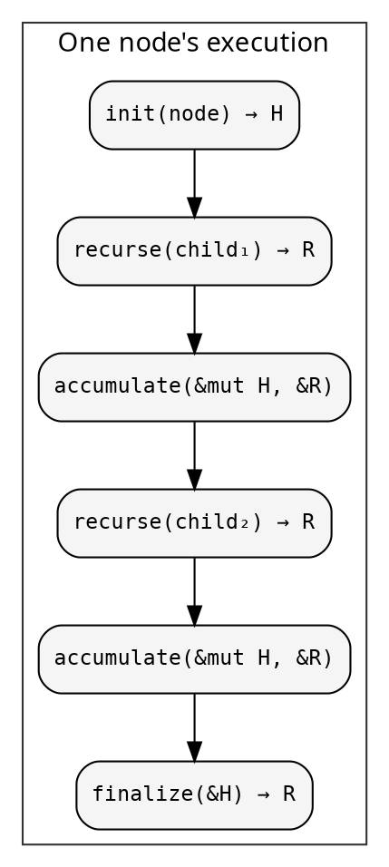
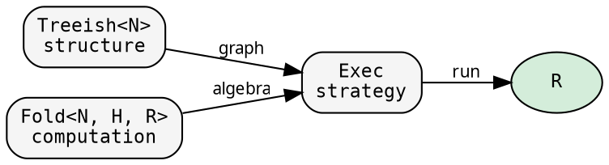

# The recursive pattern

Every recursive tree computation does the same thing. hylic
makes that pattern explicit, separates its parts, and lets you
transform each part independently.

## One function

This is the entire computation, from `exec.rs`:

```rust
{{#include ../../../../hylic/src/cata/exec/variant/fused/mod.rs:run_inner}}
```

Read it carefully. At each node:

1. **init** — create a heap `H` from the node
2. **visit children** — for each child, recurse and accumulate the result
3. **finalize** — produce the node's result `R` from the heap

That's it. Every tree fold — fibonacci, dependency resolution,
filesystem aggregation, AST evaluation — is this function with
different `init`, `accumulate`, `finalize`, and different child
structure.



## Three pieces

The function above takes three things as parameters. hylic
gives each a name and a type:

**Treeish** — the tree structure. Given a node, visit its children:

```rust
{{#include ../../../../hylic/src/graph/types.rs:edgy_struct}}
```

`Treeish<N>` is an alias for `Edgy<N, N>` — an edge function where
nodes and edges are the same type:

```rust
{{#include ../../../../hylic/src/graph/types.rs:treeish_alias}}
```

You construct one by providing a function from node to children:

```rust
let graph = treeish(|d: &Dir| d.children.clone());
```

The callback-based signature (`Fn(&N, &mut dyn FnMut(&N))`) means
zero allocation per visit. The `treeish()` constructor wraps a
`Vec`-returning function into this form.

**Fold** — the computation. Three closures behind Arc:

```rust
{{#include ../../../../hylic/src/fold/algebra.rs:fold_struct}}
```

- `init`: node → heap (initialize working state)
- `accumulate`: heap × child result → heap (fold in one child)
- `finalize`: heap → result (produce the node's answer)

The intermediate heap `H` lets you accumulate children one at a time
without collecting them first. `simple_fold` is a shorthand where
`H = R` and finalize is clone:

```rust
let sum = simple_fold(
    |d: &Dir| d.size,                        // init
    |heap: &mut u64, child: &u64| *heap += child,  // accumulate
);
```

**Executor** — the strategy. Controls HOW the recursion runs:

```rust
let r = Fused.run(&fold, &treeish, &root);         // zero overhead
let r = Rayon.run(&fold, &treeish, &root);          // parallel
let r = Exec::rayon().run(&fold, &treeish, &root);  // via runtime dispatch
```

Four built-in executors, each in its own module:

| Executor | How it visits children | Allocation | Arc/node |
|---|---|---|---|
| `Fused` | Callback recursion | Zero | 0 |
| `Sequential` | Collect to Vec, iterate | Vec/node | 0 |
| `Rayon` | Collect to Vec, `par_iter` | Vec/node | 0 |
| `Custom` | User-defined visitor | depends | 5 |

Each implements the `Executor` trait — one `run()` method. Lift
integration (`run_lifted`, `run_lifted_zipped`) is provided automatically.
See [Executor architecture](../design/executors.md) for details.

## The separation



The fold doesn't know about the tree. The tree doesn't know about
the fold. The executor connects them. This separation is why
transformations work: you change one piece, the others stay.

Everything in hylic reduces to `executor.run(&fold, &treeish, &root)`.
Even `GraphWithFold::run` (the pipeline for lazy tree discovery)
is just one manual fold step for the entry point, then `exec.run`
for each child tree — see [Entry points](./entry.md).
