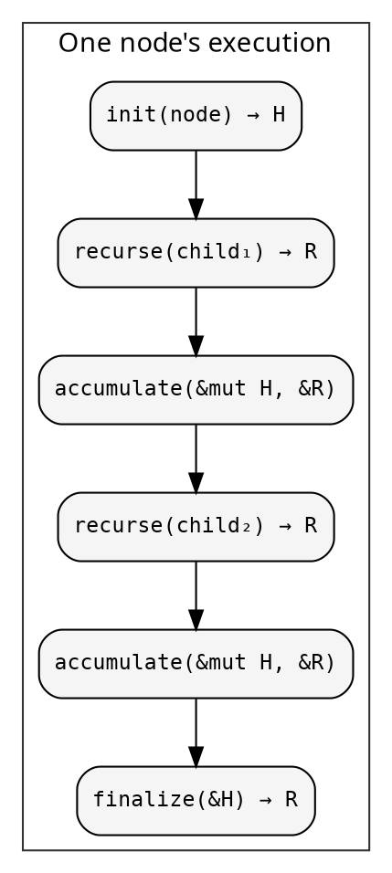
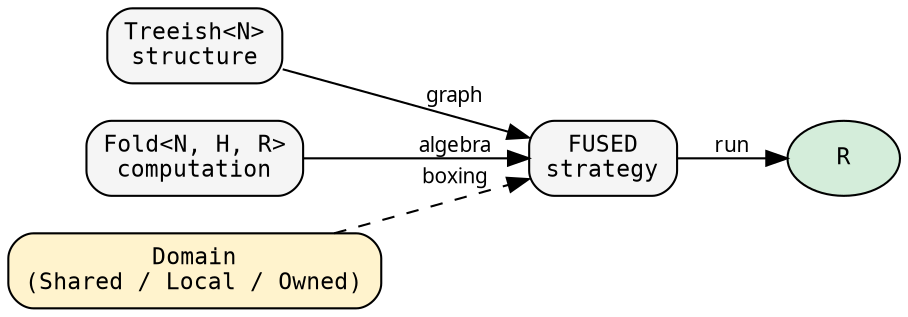

# The recursive pattern

Recursive tree computations — regardless of domain — share a
single underlying structure. hylic makes that structure explicit,
names its parts, and allows each part to be transformed
independently.

## One function

The entire computation, taken directly from the sequential
executor:

```rust
{{#include ../../../../hylic/src/exec/variant/fused/mod.rs:run_inner}}
```

At each node:

1. **init** — construct a heap `H` from the node
2. **visit children** — for each child, recurse and accumulate the result
3. **finalize** — produce the node's result `R` from the heap

Every tree fold — Fibonacci, dependency resolution, filesystem
aggregation, AST evaluation — is this function instantiated with
different choices for `init`, `accumulate`, `finalize`, and child
structure.



## Three pieces

The function above takes three things as parameters. hylic
gives each a name and a type:

**Treeish** — the tree structure. Given a node, visit its children:

```rust
{{#include ../../../../hylic/src/graph/edgy.rs:edgy_struct}}
```

`Treeish<N>` is an alias for `Edgy<N, N>` — an edge function where
nodes and edges are the same type:

```rust
{{#include ../../../../hylic/src/graph/edgy.rs:treeish_alias}}
```

A `Treeish` is constructed from a function from node to children:

```rust
{{#include ../../../src/docs_examples.rs:treeish_constructor}}
```

The callback-based signature `Fn(&N, &mut dyn FnMut(&N))` avoids
any allocation per visit. The `treeish()` constructor wraps a
`Vec`-returning function into this form.

The node type `N` may be anything — a nested struct, an integer
index into an adjacency list, a string key into a map, or a
reference resolved through I/O. The structure resides in the
treeish function rather than in the data.

**Fold** — the computation. In the Shared domain, three closures behind Arc:

```rust
{{#include ../../../../hylic/src/domain/shared/fold.rs:fold_struct}}
```

Other [domains](../design/domains.md) use Rc (Local) or Box (Owned)
— same operations, different boxing. The fold type doesn't carry the
domain; the [executor](../executor-design/exec_pattern.md) does.

- `init`: `&N → H` — create per-node working state from the node
- `accumulate`: `&mut H, &R` — fold one child's result into the heap
- `finalize`: `&H → R` — close the bracket, produce the node's result

`H` and `R` are distinct types: `H` is mutable working state (the
open bracket), `R` is the immutable result flowing to the parent (the
closed bracket). See
[The N-H-R algebra factorization](../design/milewski.md) for the
theoretical basis. Many folds have `H = R`, in which case `finalize`
is just an identity extraction from the heap:

```rust
{{#include ../../../src/docs_examples.rs:simple_fold_example}}
```

**Executor** — the strategy. Controls HOW the recursion runs:

```rust
{{#include ../../../src/docs_examples.rs:exec_usage}}
```

Two executors are provided:

| Executor | Traversal | Domains |
|---|---|---|
| `FUSED` (Shared) / `local::FUSED` / `owned::FUSED` | Direct sequential recursion | all |
| [Funnel](../funnel/overview.md) | Parallel work-stealing | Shared |

Both implement the `Executor<N, R, D, G>` trait, parameterised by
a [domain](../concepts/domains.md) and graph type. See
[Executor architecture](../executor-design/exec_pattern.md) for
details.

## The separation

<!-- -->



The fold carries no knowledge of the tree; the tree carries no
knowledge of the fold; the executor connects them. The domain
determines how closures are stored — the fold and treeish do not
record this, the executor does.

Every computation in hylic reduces to
`executor.run(&fold, &treeish, &root)`. When the tree is
discovered lazily (seeds resolved on demand),
[`SeedPipeline`](../pipeline/seed.md) constructs the treeish
from a seed edge function together with a `grow`, and delegates
to `executor.run` internally.

## The operations traits

The executor's recursion engine doesn't know about Arc, Rc, or Box.
It takes `&impl FoldOps<N, H, R>` and `&impl TreeOps<N>` — pure
operation traits:

```rust
{{#include ../../../../hylic/src/ops/fold.rs:foldops_trait}}
```

```rust
{{#include ../../../../hylic/src/ops/tree.rs:treeops_trait}}
```

The standard `Fold<N, H, R>` and `Treeish<N>` implement these traits.
So do `local::Fold`, `owned::Fold`, and any user-defined struct with
the right methods. The executor is generic over these traits — when
called with a concrete struct, the compiler inlines completely.

See [Domain system](../design/domains.md) for how domains connect
operations to storage.
