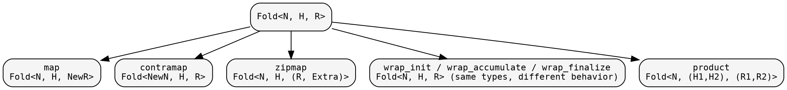
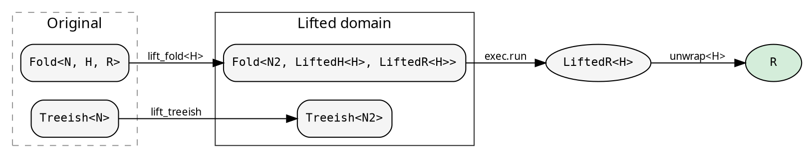

# Transformations and Lifts

hylic's types are designed for compositional transformation. Folds
can be mapped, contramapped, zipped, and wrapped. Graphs can be
filtered, contramapped, and treemapped. These operations produce new
values from existing ones without modifying the originals (for
Clone domains) or by consuming them (for Owned).

See the [Fold guide](../guides/fold.md) and
[Graph guide](../guides/graph.md) for the full transformation API.

## Fold transformations

The fold transformation diagram summarizes what's available:



These are all type-level transformations that compose. The fold's
three-phase structure (init/accumulate/finalize) is preserved.

## Lifts — type-domain transformations

A lift goes further than fold transformations: it transforms BOTH
the fold AND the treeish into a different type domain, runs the
computation there, and maps the result back. The caller receives
the same R — the lift is transparent.

The `LiftOps` trait defines four operations:

- **lift_treeish**: `Treeish<N>` → `Treeish<N2>`
- **lift_fold\<H\>**: `Fold<N, H, R>` → `Fold<N2, LiftedH<H>, LiftedR<H>>`
- **lift_root**: `&N` → `N2`
- **unwrap\<H\>**: `LiftedR<H>` → `R`

The lifted heap and result types are GATs on the trait, determined
by each lift implementation:



Execution uses `cata::lift::run_lifted`, which applies the four
transformations and runs the result through a Shared-domain executor.
H is inferred from the fold at the call site.

## Explainer — computation tracing

The `Explainer` is a unit struct implementing `LiftOps`. It wraps
the fold to record every accumulation step. The heap becomes
`ExplainerHeap` (initial state, node, transitions). The result
becomes `ExplainerResult` (original result + full trace).

```rust
{{#include ../../../src/docs_examples.rs:explainer_usage}}
```

In recursion-scheme terms, this is a histomorphism — each node
sees its subtree's full computation history.

## The mathematical picture

A fold is an F-algebra: a function `F<R> → R` that collapses one
layer of structure. hylic decomposes it into three phases
(init/accumulate/finalize) through the intermediate heap type H.

A lift is a natural transformation between two F-algebras. It maps
the carrier types through the `LiftedH` and `LiftedR` GATs while
preserving the fold structure. The `unwrap` function projects back
to R. The computation produces the same result regardless of which
algebra it runs in — the lift is transparent.
