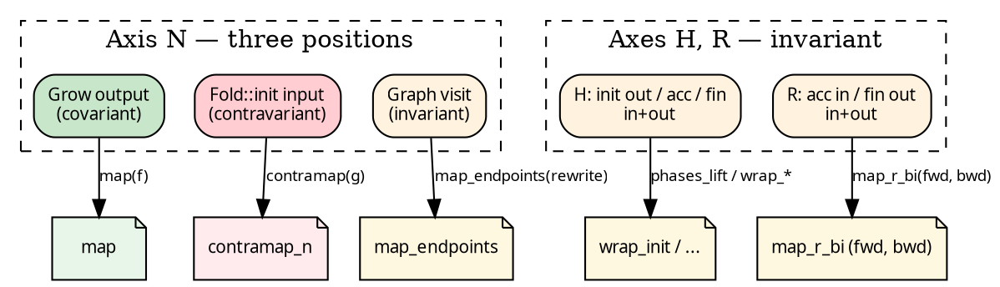

# Transforms and variance

Where a type axis *appears* inside a fold or graph determines how
it may be transformed. The chapter opens with three examples
whose argument shapes differ in an informative way; the following
section traces those differences to the notion of variance. After
that, the library's naming — `map` versus `contramap` versus
`_bi` — ceases to look like convention and becomes something that
can be read off the types.

## Three transforms, three shapes

**`map` on R** — covariant, a single function. Given a
`Fold<N, H, u64>` summing filesystem sizes, producing a
`Fold<N, H, String>` that formats the sum requires only a forward
function `u64 → String`:

```text
fold.map(|n: &u64| format!("{n} bytes"))
```

**`contramap_n`** — contravariant, a single function in the
opposite direction. Adapting a `Fold<Path, H, R>` to operate on
a `Fold<PathBuf, H, R>` requires bridging `PathBuf → Path`, since
the existing `init` consumes `&Path` and must continue to do so:

```text
fold.contramap_n(|pb: &PathBuf| pb.as_path().clone())
```

**`map_r_bi`** — invariant, a pair of functions. Changing the
result type of an existing fold to a different representation
requires both directions, because `R` is accumulated into (a
parent receives its children's `R`) as well as emitted (finalize
returns `R`); a one-way function cannot carry values through
both roles:

```text
fold.map_r_bi(
    /* forward  */ |n: &u64| format!("{n}"),
    /* backward */ |s: &String| s.parse().unwrap(),
)
```

Three argument shapes: one forward function (covariant), one
reverse function (contravariant), a pair (invariant). The names
track the shape.

## Why the three shapes?

Each axis occupies a specific position within the slots:

```
Grow<Seed, N>:        fn(&Seed) -> N            ← N is an output
Graph<N>:             fn(&N, &mut FnMut(&N))    ← N is both
Fold<N, H, R>::init:  fn(&N) -> H               ← N is an input
Fold<N, H, R>::acc:   fn(&mut H, &R)            ← H both, R input
Fold<N, H, R>::fin:   fn(&H) -> R               ← H input, R output
```

An axis that appears only in **output position** is *covariant*:
a forward function suffices to rewrite the produced value.
Hence `map`.

An axis that appears only in **input position** is
*contravariant*: adapting the axis requires a function in the
*opposite* direction, so the existing consumer continues to
receive values it understands. Hence `contramap`.

An axis that appears in **both positions** is *invariant*: no
single function bridges consumption and production together, so
both directions must be supplied. Hence the `_bi` suffix.

## The three positions



`N` occupies all three positions across different slots — output
in Grow, input in Fold, both in Graph. A single "N transform"
would therefore apply in different directions depending on the
slot; the library instead exposes a per-slot transform on each
side, or a coordinated [Lift](./lifts.md) that rewrites N across
all three slots at once.

`H` and `R` live only inside `Fold`, but each appears in both
positions there (H is init-output / acc-in+out / fin-input; R is
acc-input / fin-output). Both are invariant; changing either
requires a bijection.

## Method surface, derived

With the variance pinned, the catalogue follows automatically.

**On a `Fold<N, H, R>`:**

- `contramap_n(f: N' → N)` — contravariant change of N. One arg.
- `map_r_bi(fwd, bwd)` — invariant change of R. Two args.
- `wrap_init(w)`, `wrap_accumulate(w)`, `wrap_finalize(w)` —
  invariant decorators on H and R. They don't change the axes
  they touch; they intercept the existing functions.
- `zipmap(m)` — a *covariant* extension: pair the existing R with
  an extra value derived from it. R changes `R → (R, Extra)`,
  forward only; the new R's first component is the old R, so
  "going back" is structurally free (`|p: &(R, Extra)| &p.0`).
- `product(other)` — binary: run two folds in lockstep, carrier
  `(H1, H2), (R1, R2)`.

**On an `Edgy<N, E>`:**

- `map(f: E → E')` — functor over edges (covariant on E).
- `contramap(f: N' → N)` — contravariant on N.
- `filter(pred)` — edge predicate.
- `contramap_or_emit(f)` — contramap with an escape hatch emitting
  edges directly (used in fallible graph construction).

`Treeish<N> = Edgy<N, N>` is what executors consume — the
specialisation where node type equals edge type.

The primitive the Edgy sugars wrap:

```rust
{{#include ../../../../hylic/src/graph/edgy.rs:edgy_map}}
```

```rust
{{#include ../../../../hylic/src/graph/edgy.rs:edgy_contramap}}
```

## Naming convention, recovered

From the above:

| Suffix | When |
|---|---|
| none (`map`, `filter`, `wrap_*`)       | covariant or decorator-only |
| `contramap`, `contramap_<axis>`        | contravariant; one function |
| `_bi` (`map_r_bi`, `map_n_bi_lift`, …) | invariant; bijection required |
| `_or_emit`                              | contramap with a direct-emit escape |

Names mark the variance, so the shape of the arguments is
predictable from the identifier alone.

## What this chapter does NOT cover

All the operations above change *one axis of one structure*
(Fold OR Graph). Changing N across BOTH structures in sync — or
building a new transform that wraps the whole `(Grow, Graph, Fold)`
triple and composes with others — is the job of a
[`Lift`](./lifts.md). Every library lift internally reduces to
one of these single-axis transforms or a coordinated set of them
(e.g. `n_lift` changes N across all three slots at once).

## Category-theoretic framing (brief)

The catamorphism's algebra is `F R → R`. hylic factors this through
H: init creates H from N, accumulate folds child Rs into H,
finalize projects H → R. The carrier between nodes is R; H is
internal to each node's bracket. A lift is an algebra morphism —
it maps the carrier types (`MapR`, and internally the heap type
`MapH`) while preserving the fold structure. See
[The N-H-R algebra factorization](../design/milewski.md).
