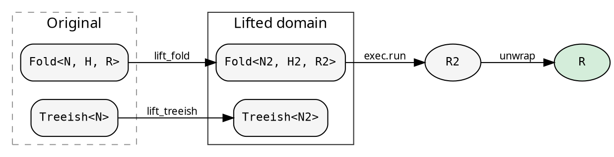

# Transformations and Lifts

Because Fold and Treeish are data — closures behind reference-counted
pointers (Arc for Shared, Rc for Local) — you transform them by
producing new values with modified closures. No subclassing, no
wrapping, no runtime dispatch.

## Fold transformations

A `Fold<N, H, R>` has three closures. Each can be wrapped
independently:


| Combinator | What it does |
|---|---|
| `wrap_init(f)` | Intercept the init phase: `f(node, orig)` → H |
| `wrap_accumulate(f)` | Intercept the accumulate phase |
| `wrap_finalize(f)` | Intercept the finalize phase |
| `map(fwd, back)` | Change result type: `R → R2` (with back-mapping for accumulate) |
| `zipmap(f)` | Augment result: `R → (R, Extra)` |
| `contramap(f)` | Change node type: `Fold<N,...> → Fold<N2,...>` |
| `product(other)` | Two folds in one traversal: `(R1, R2)` |

Each returns a new `Fold` — the original is unchanged (Shared/Local)
or consumed (Owned). Examples:

```rust
{{#include ../../../src/docs_examples.rs:fold_wrap_init}}
```

```rust
{{#include ../../../src/docs_examples.rs:fold_product}}
```

## Treeish transformations

`Treeish<N>` (which is `Edgy<N, N>`) supports:

| Combinator | What it does |
|---|---|
| `map(f)` | Transform edges: `Edgy<N, E> → Edgy<N, E2>` |
| `contramap(f)` | Change node type: `Edgy<N, E> → Edgy<N2, E>` |
| `contramap_or(f)` | Change node type, with fallback edges |
| `filter(pred)` | Keep only edges matching predicate |
| `treemap(co, contra)` | Both map + contramap (for `Treeish<N> → Treeish<N2>`) |

## When transformations aren't enough: Lift

Fold transformations change how the three phases behave, but
they preserve the types `H` and `R`. What if you need a different
heap type — one that carries trace information, or collects
deferred computations?

A **Lift** transforms both the Treeish and the Fold into a
different type domain, runs the computation there, and maps the
result back:

```rust
{{#include ../../../../hylic/src/cata/lift.rs:lift_struct}}
```

Four functions:
- `lift_treeish`: `Treeish<N> → Treeish<N2>`
- `lift_fold`: `Fold<N,H,R> → Fold<N2,H2,R2>`
- `lift_root`: `&N → N2`
- `unwrap`: `R2 → R`

Execution goes through `Exec::run_lifted`:

```rust
{{#include ../../../../hylic/src/cata/exec/mod.rs:run_lifted}}
```

The pattern: lift types → run in lifted domain → unwrap back to R.
The caller gets the same `R` as if no Lift were applied.



## The three built-in Lifts

hylic provides three Lifts, each transforming the fold's type
domain for a different purpose:

### Explainer — computation tracing

`Explainer::lift()` wraps the fold to record every accumulation
step. The heap becomes `ExplainerHeap` (initial state, node,
transitions, working state). The result becomes `ExplainerResult`
(original result + full trace). Unwrap extracts `R`.

```rust
{{#include ../../../src/docs_examples.rs:explainer_usage}}
```

In recursion-scheme terms, this is a histomorphism — each node
sees its subtree's full computation history.

### ParLazy — two-pass parallel evaluation

`ParLazy::lift(pool)` builds a data tree of `LazyNode` values
(Phase 1). Unwrap evaluates bottom-up via `fork_join_map` on the
`WorkPool`, borrowing the fold through `SyncRef` (Phase 2).

```rust
{{#include ../../../src/docs_examples.rs:parlazy_usage}}
```

### ParEager — pipelined continuation-passing

`ParEager::lift(pool, spec)` wires a continuation chain during the
fused traversal — leaves submit work immediately, results propagate
upward via `Completion` + `Collector`. Phase 2 starts during Phase 1.

```rust
{{#include ../../../src/docs_examples.rs:pareager_usage}}
```

See [Parallel execution](../cookbook/parallel_execution.md) for
detailed flow diagrams and benchmarks.

## The mathematical picture

A Fold is an F-algebra: a function `F<R> → R` that collapses one
layer of structure. hylic decomposes it into three phases
(init/accumulate/finalize) through the intermediate heap type `H`.

A Lift is a natural transformation between two F-algebras. It maps
the carrier types `(H, R)` to `(H2, R2)` while preserving the
fold structure. The `unwrap` function projects back: `R2 → R`.
The computation produces the same result regardless of which
algebra it runs in — the Lift is transparent.

This is why you can add tracing, parallelism, or any other
enrichment without the caller knowing. The fold's structure is
preserved. Only the domain it runs in changes.
