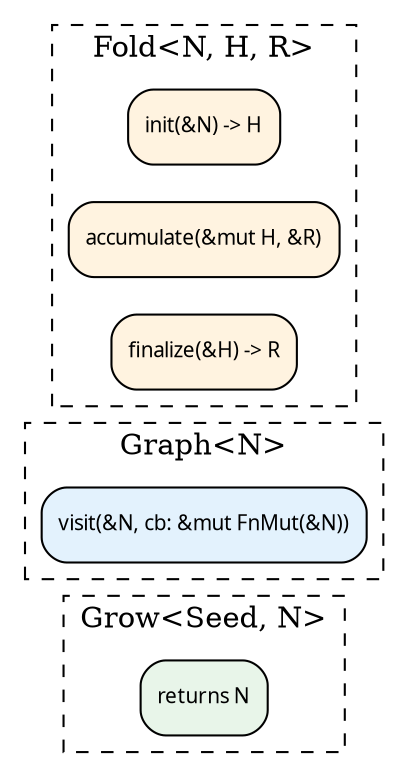

# Transforms and variance

Folds and graphs are data. You transform them like any other
value — you build a new one from an old one, without mutating
the original (on `Clone` domains) or by consuming it (on `Owned`).

The shapes of those transforms are dictated by **where each type
axis appears in the underlying closure slots**. This chapter
names the transforms; the next chapter puts them together with
the [`Lift`](./lifts.md) abstraction.

## Axes and variance

hylic's computation triple has three axes:

- **N** — the node type the graph and fold walk over.
- **H** — the fold's working heap.
- **R** — the fold's result.

Each axis appears in one or more closure slots. Where it appears
determines which transforms are valid:



Reading the variance off the slots:

| Axis | Position                                    | Variance          | Transform needs       |
|------|---------------------------------------------|-------------------|-----------------------|
| N    | `Grow` return                               | covariant         | `N → N'` (one fn)     |
| N    | `Graph` both as input and in callback       | invariant         | visit-rewrite         |
| N    | `Fold::init` input                          | contravariant     | `N' → N` (one fn)     |
| H    | `Fold::init` out / `accumulate` / `finalize`| invariant         | bijection H ↔ H'      |
| R    | `Fold::accumulate` in / `finalize` out      | invariant         | bijection R ↔ R'      |

## Transforms on a `Fold`

A `Fold<N, H, R>` (in any domain) exposes:

| method            | what it does                                             | role           |
|-------------------|----------------------------------------------------------|----------------|
| `wrap_init(w)`    | intercept every `init` call                              | phase wrapper  |
| `wrap_accumulate(w)` | intercept every `accumulate`                          | phase wrapper  |
| `wrap_finalize(w)`| intercept every `finalize`                               | phase wrapper  |
| `map_r_bi(fwd,bwd)` | change R to R' (invariant → bijection required)        | axis-change    |
| `zipmap(m)`       | derive an extra value beside R; produces `(R, Extra)`    | R-extension    |
| `contramap_n(f)`  | change the node type N' → N (contravariant, one fn)      | axis-change    |
| `product(other)`  | run two folds in parallel over one graph; result `(R1, R2)` | binary      |

The naming convention:

- `map_<axis>_bi` — bijection (fwd + bwd) required. The axis is
  invariant in storage and can't be changed without an inverse.
- `contramap_<axis>` — one function; the axis is contravariant in
  storage and only the backward direction is needed.
- `map` / `wrap_*` / `zipmap` / `filter` — covariant / decorator
  forms.

## Transforms on an `Edgy` / `Treeish`

`Edgy<N, E>` exposes analogous per-axis transforms:

| method                    | what it does                                           |
|---------------------------|--------------------------------------------------------|
| `map(f: E → E')`          | functor over edges                                     |
| `contramap(f: N' → N)`    | pre-adapt the node input                               |
| `contramap_or_emit(f)`    | contramap with an escape hatch returning edges         |
| `filter(pred)`            | prune edges by predicate                               |

`Treeish<N>` = `Edgy<N, N>` — node and edge types equal; used by
executors.

The sugars wrap `Edgy::map_endpoints(rewrite_visit)`:

```rust
{{#include ../../../../hylic/src/graph/edgy.rs:edgy_map}}
```

```rust
{{#include ../../../../hylic/src/graph/edgy.rs:edgy_contramap}}
```

## What's covered here vs. in "Lifts"

The transforms above operate on **one** of Fold or Graph at a
time. They change one axis of the triple and preserve everything
else.

A **lift** (next chapter) transforms the whole triple at once —
`(Grow, Graph, Fold)` → `(Grow', Graph', Fold')` — and composes
with other lifts into chains.

Every library lift is internally one of these single-axis
transforms or a small coordinated set of them. The library
exposes them per-domain as `Shared::wrap_init_lift(w)`,
`Shared::map_r_bi_lift(fwd, bwd)`, etc. See
[Lifts](./lifts.md).

## Category-theoretic framing (brief)

The catamorphism's algebra is `F R → R` — collapse one layer with
children already folded to R. hylic factors this through a working
type `H`: init creates `H` from the node, accumulate folds child
results `R` into `H`, finalize projects `H → R`. The carrier is `R`
at every subtree. `H` is internal to the bracket. See
[The N-H-R algebra factorization](../design/milewski.md) for the
correspondence with Milewski's monoidal decomposition.

A lift is an algebra morphism: it maps the carrier types through
`MapR` (and heap type through `MapH`) while preserving the fold
structure.
