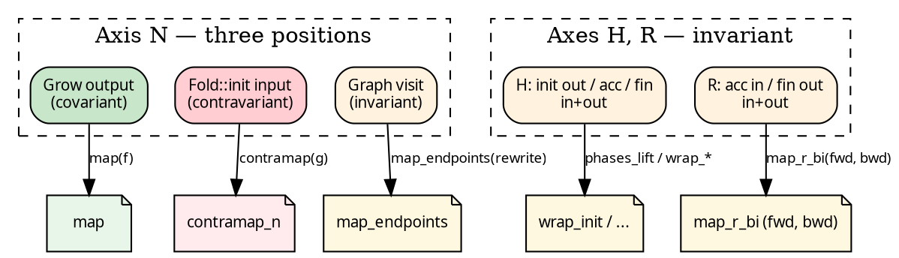

# Transforms and variance

Where a type axis *appears* inside a fold or graph determines how
you can transform that axis. Three positions, three different
kinds of map. This chapter derives the library's naming and
method surface from the variance structure, rather than presenting
it as convention.

## Where N lives

Start from the three slots that reference N at all. Rip out the
signatures and look only at where N sits:

```
Grow<Seed, N>:   fn(&Seed) -> N            ← N is an output
Graph<N>:        fn(&N, &mut FnMut(&N))    ← N is both an input and output
Fold<N, H, R>::init:  fn(&N) -> H          ← N is an input
```

Three positions — output, both-positions, input. Each one forces
a specific shape on any transform that changes N.

**N as output** (Grow). To change N to N', you need `f: N → N'`;
one forward function. You map the old Grow through `f` and get a
new `Grow<Seed, N'>`. This is a *functor* over N, and the name is
`map`.

**N as input** (Fold). To feed an N'-taking init, you need to
turn each N' *back* into an N so the old init can run. One
function: `g: N' → N`. The name is `contramap` — you're mapping
contravariantly.

**N as both** (Graph). The visit callback hands the user an `&N`
(input position) AND receives `&N` children back (output
position). You can't fix it with one function — you'd need a
pair. The library doesn't hand out a one-function sugar for Graph
node-change; instead, a graph rewrite operates on the whole
`visit` closure via `map_endpoints`.

## Where H and R live

H and R live inside `Fold` only. Trace where they appear:

```
init:        fn(&N)      -> H           ← H output
accumulate:  fn(&mut H, &R)              ← H input/output, R input
finalize:    fn(&H)      -> R           ← H input, R output
```

Both H and R appear in *both* positions. Each one is **invariant**:
a single function isn't enough. Changing H to H' needs a forward
and a backward — a bijection. Same for R.

The library's answer: `_bi` on any method that wants you to
supply both halves.

## The picture



## Reading the method surface

With the variance pinned, the method catalogue is no surprise.

**On a `Fold<N, H, R>`:**

- `contramap_n(f: N' → N)` — contravariant change of N. One arg.
- `map_r_bi(fwd, bwd)` — invariant change of R. Two args.
- `wrap_init(w)`, `wrap_accumulate(w)`, `wrap_finalize(w)` —
  invariant decorators on H and R. They don't change the axes
  they touch; they just intercept the existing functions.
- `zipmap(m)` — a *covariant* extension: pair the existing R with
  an extra value derived from it. R changes `R → (R, Extra)`,
  forward only; the new R's first component is the old R, so
  "going back" is structurally free (`|p: &(R, Extra)| &p.0`).
- `product(other)` — binary: run two folds in lockstep, carrier
  `(H1, H2), (R1, R2)`.

**On an `Edgy<N, E>`:**

- `map(f: E → E')` — functor over edges (covariant on E).
- `contramap(f: N' → N)` — contravariant on N.
- `filter(pred)` — edge predicate.
- `contramap_or_emit(f)` — contramap with an escape hatch emitting
  edges directly (used in fallible graph construction).

`Treeish<N> = Edgy<N, N>` is what executors consume — the
specialisation where node type equals edge type.

The primitive the Edgy sugars wrap:

```rust
{{#include ../../../../hylic/src/graph/edgy.rs:edgy_map}}
```

```rust
{{#include ../../../../hylic/src/graph/edgy.rs:edgy_contramap}}
```

## Naming convention, recovered

From the above:

| Suffix | When |
|---|---|
| none (`map`, `filter`, `wrap_*`)       | covariant or decorator-only |
| `contramap`, `contramap_<axis>`        | contravariant; one function |
| `_bi` (`map_r_bi`, `map_n_bi_lift`, …) | invariant; bijection required |
| `_or_emit`                              | contramap with a direct-emit escape |

Names mark the variance, so the shape of the arguments is
predictable from the identifier alone.

## What this chapter does NOT cover

All the operations above change *one axis of one structure*
(Fold OR Graph). Changing N across BOTH structures in sync — or
building a new transform that wraps the whole `(Grow, Graph, Fold)`
triple and composes with others — is the job of a
[`Lift`](./lifts.md). Every library lift internally reduces to
one of these single-axis transforms or a coordinated set of them
(e.g. `n_lift` changes N across all three slots at once).

## Category-theoretic framing (brief)

The catamorphism's algebra is `F R → R`. hylic factors this through
H: init creates H from N, accumulate folds child Rs into H,
finalize projects H → R. The carrier between nodes is R; H is
internal to each node's bracket. A lift is an algebra morphism —
it maps the carrier types (`MapR`, and internally the heap type
`MapH`) while preserving the fold structure. See
[The N-H-R algebra factorization](../design/milewski.md).
