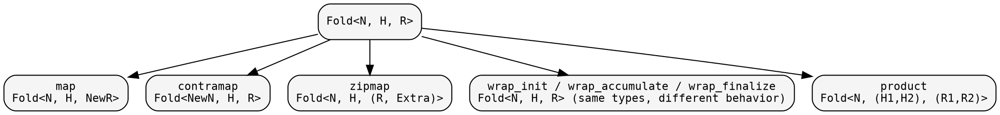
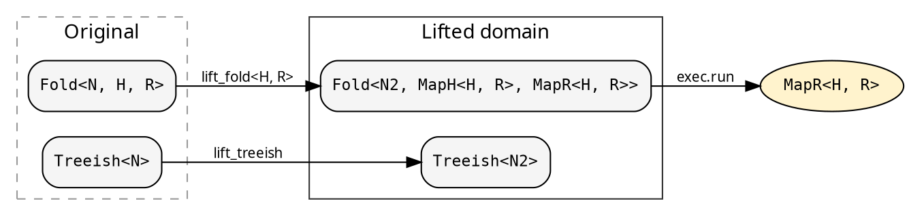

# Transformations and Lifts

hylic's types are designed for compositional transformation. Folds
can be mapped, contramapped, zipped, and wrapped. Graphs can be
filtered, contramapped, and treemapped. These operations produce new
values from existing ones without modifying the originals (for
Clone domains) or by consuming them (for Owned).

See the [Fold guide](../guides/fold.md) and
[Graph guide](../guides/graph.md) for the full transformation API.

## Fold transformations

The fold transformation diagram summarizes what's available:



These are all type-level transformations that compose. The fold's
three-phase structure (init/accumulate/finalize) is preserved.

## Lifts — type-domain transformations

A lift goes further than fold transformations: it transforms BOTH
the fold AND the treeish into a different type domain. The executor
runs the lifted computation and returns `MapR<H, R>` — the caller
extracts the original result as appropriate for the lift (e.g.
`ExplainerResult::orig_result`, or identity when `MapR<H, R> = R`).

The `Lift` trait defines three operations:

- **lift_treeish**: `Treeish<N>` → `Treeish<N2>`
- **lift_fold\<H, R\>**: `Fold<N, H, R>` → `Fold<N2, MapH<H, R>, MapR<H, R>>`
- **lift_root**: `&N` → `N2`

The lifted heap and result types are GATs on the trait, determined
by each lift implementation:



`cata::lift::run_lifted` applies the three transformations, runs the
lifted computation through a Shared-domain executor, and returns
`MapR<H, R>`. H and R are inferred from the fold at the call site.

## Explainer — computation tracing

The `Explainer` is a unit struct implementing `Lift`. It wraps
the fold to record every accumulation step. The heap becomes
`ExplainerHeap` (initial state, node, transitions). The result
becomes `ExplainerResult` (original result + full trace).

```rust
{{#include ../../../src/docs_examples.rs:explainer_usage}}
```

In recursion-scheme terms, this is a histomorphism — each node
sees its subtree's full computation history.

## The mathematical picture

The catamorphism's algebra is `F R → R` — collapse one layer with
children already folded to R. hylic factors this through a working
type `H`: init creates `H` from the node, accumulate folds child
results `R` into `H`, finalize projects `H → R`. The carrier is `R`
at every subtree. `H` is internal to the bracket. See
[The N-H-R algebra factorization](../design/milewski.md) for the
correspondence with Milewski's monoidal decomposition and the
equivalence conditions.

A lift is an algebra morphism: it maps the carrier types through
`MapH` and `MapR` while preserving the fold structure.
