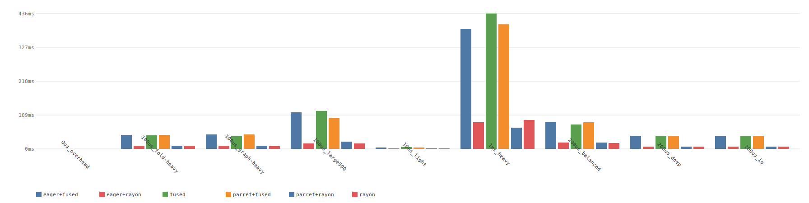

# Benchmark results

Execution mode comparison across workload profiles. Four modes:

- **fused**: callback-based recursion, zero allocation, sequential
- **rayon**: par_iter on children, parallel traversal, eager fold
- **uio+fused**: UIO Lift (fold-level parallelism via join_par), fused traversal
- **uio+rayon**: UIO Lift + rayon traversal (double parallelism)

## Results table

```
{{#include ../bench-results/bench-table.txt}}
```

## Chart



## Raw data

```csv
{{#include ../bench-results/bench.csv}}
```

## Benchmark source

```rust
{{#include ../../../hylic/benches/par_bench.rs}}
```
