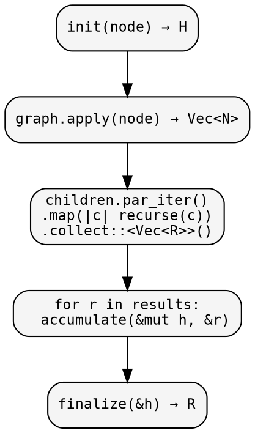

# Parallel execution

hylic offers three approaches to parallelism, each at a different
level of the architecture. All produce identical results for the
same fold and graph.

## Approach 1: Exec::rayon — parallel child visiting

The simplest form. `Exec::rayon()` collects a node's children into
a `Vec`, then evaluates sibling subtrees in parallel via rayon's
`par_iter`. No Lift needed — the fold and graph are unchanged.

```rust
// Same fold, different executor — identical results
let r1 = Exec::fused().run(&fold, &graph, &root);
let r2 = Exec::rayon().run(&fold, &graph, &root);
assert_eq!(r1, r2);
```

Internally, `Exec::rayon` does this at each node:



**Tradeoff**: requires `N: Clone` (to collect children), uses
rayon's global thread pool. Best for moderate-to-heavy workloads
where the work per node exceeds the scheduling overhead.

## Approach 2: ParLazy — deferred parallel evaluation

A [Lift](../design/lifts.md) that transforms the fold's result type
to `ParRef<R>` — a lazy, memoized computation. The executor builds a
tree of `ParRef` values (Phase 1). Calling `eval()` on the root
triggers bottom-up parallel evaluation (Phase 2).

```rust
let result = Exec::fused().run_lifted(&ParLazy::lift(), &fold, &graph, &root);
```

The execution proceeds in two phases:

```dot process
digraph {
    rankdir=LR;
    node [shape=box, style="rounded,filled", fillcolor="#f5f5f5", fontname="monospace", fontsize=11];
    edge [fontname="sans-serif", fontsize=10];

    subgraph cluster_p1 {
        label="Phase 1: build ParRef tree\n(sequential, via Exec::fused)";
        style=dashed; color="#999"; fontname="sans-serif";
        init1 [label="init(node) → (H, [])"];
        acc1  [label="accumulate:\npush child ParRef"];
        fin1  [label="finalize:\ncreate ParRef closure\ncapturing H + children"];
        init1 -> acc1 -> fin1;
    }

    subgraph cluster_p2 {
        label="Phase 2: evaluate\n(parallel, via rayon)";
        style=solid; color="#333"; fontname="sans-serif";
        eval [label="root.eval()"];
        join [label="ParRef::join_par(children)\nrayon par_iter on siblings"];
        accf [label="accumulate child results"];
        finf [label="finalize → R"];
        eval -> join -> accf -> finf;
    }

    fin1 -> eval [style=dashed, label="unwrap"];
}
```



Phase 1 runs `fold.init` for each node (quasi-fused — real work
happens during tree construction). Phase 2 only runs accumulate
and finalize, which are typically lightweight.

**Tradeoff**: does not require `N: Clone`. Parallelism comes from
rayon's `par_iter` inside `ParRef::join_par`. Two traversals of the
tree structure (build + eval), but the second is cheap if
accumulate/finalize are fast.

## Approach 3: ParEager — fork-join on a heap tree

A [Lift](../design/lifts.md) that extracts heaps into an `EagerNode`
tree (Phase 1), then executes bottom-up with a hand-rolled
fork-join scheduler backed by a `WorkPool` (Phase 2).

```rust
WorkPool::with(WorkPoolSpec::threads(3), |pool| {
    Exec::fused().run_lifted(&ParEager::lift(pool), &fold, &graph, &root)
});
// or the convenience form:
ParEager::with(WorkPoolSpec::threads(3), |lift| {
    Exec::fused().run_lifted(lift, &fold, &graph, &root)
});
```

The execution flow:

```dot process
digraph {
    rankdir=LR;
    node [shape=box, style="rounded,filled", fillcolor="#f5f5f5", fontname="monospace", fontsize=11];
    edge [fontname="sans-serif", fontsize=10];

    subgraph cluster_p1 {
        label="Phase 1: build heap tree\n(sequential, via Exec::fused)";
        style=dashed; color="#999"; fontname="sans-serif";
        init1 [label="init(node) → EagerNode{heap, []}"];
        acc1  [label="accumulate:\npush child Arc<EagerNode>"];
        fin1  [label="finalize:\nwrap into Arc<EagerNode>"];
        init1 -> acc1 -> fin1;
    }

    subgraph cluster_p2 {
        label="Phase 2: fork-join\n(parallel, via WorkPool)";
        style=solid; color="#333"; fontname="sans-serif";
        fork [label="submit n-1 children\nto WorkPool"];
        self_ [label="execute last child\nin current thread"];
        help [label="help process queue\nwhile waiting"];
        accf [label="accumulate results\nin tree order"];
        finf [label="finalize → R"];
        fork -> self_ -> help -> accf -> finf;
    }

    fin1 -> fork [style=dashed, label="unwrap"];
}
```



At each branching node, the parent submits n-1 children to the
pool, runs the last child in-place, and helps drain the work queue
while waiting. This is deadlock-free: waiting threads are productive
(they execute other nodes), so nested fork-join never starves.

The `WorkPool` uses scoped threads (`std::thread::scope`) — workers
are guaranteed joined when `WorkPool::with` returns, even on panic.

**Tradeoff**: does not require `N: Clone`. Hand-rolled scheduling
avoids rayon's work-stealing overhead. Fixed thread count, no
per-task allocation. Best when you want fine control over the
thread pool.

## Comparison

| | `Exec::rayon` | `ParLazy` | `ParEager` |
|---|---|---|---|
| Mechanism | rayon `par_iter` | ParRef tree + rayon `join_par` | Heap tree + WorkPool fork-join |
| Requires `N: Clone` | yes | no | no |
| Thread management | rayon global pool | rayon global pool | explicit `WorkPool` |
| Scheduling | work-stealing | work-stealing | fork-join with helping |
| Is a Lift | no | yes | yes |

All three are interchangeable — they produce the same result for
the same fold. Choose based on your constraints (`N: Clone`, thread
control, workload characteristics).

See [Benchmarks](./benchmarks.md) for performance comparison.

## Working example

```rust
{{#include ../../../src/cookbook/parallel_execution.rs}}
```

Output:

```
{{#include ../../../src/cookbook/snapshots/hylic_docs__cookbook__parallel_execution__tests__parallel.snap:5:}}
```
