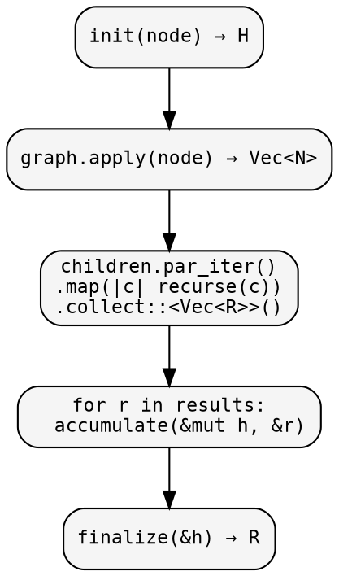

# Parallel execution

hylic offers four approaches to parallelism, each at a different
level of the architecture. All produce identical results for the
same fold and graph.

## Approach 1: dom::RAYON — parallel child visiting

The simplest form. `dom::RAYON` collects a node's children into
a `Vec`, then evaluates sibling subtrees in parallel via rayon's
`par_iter`. No Lift needed — the fold and graph are unchanged.

```rust
use hylic::domain::shared as dom;

// Same fold, different executor — identical results
let r1 = dom::FUSED.run(&fold, &graph, &root);
let r2 = dom::RAYON.run(&fold, &graph, &root);
assert_eq!(r1, r2);
```

Internally, `dom::RAYON` does this at each node:

<!-- -->



**Tradeoff**: requires `N: Clone + Send + Sync`, Shared domain only.
Uses rayon's global thread pool. Best for moderate-to-heavy workloads
where the work per node exceeds the scheduling overhead.

## Approach 2: PoolIn — fork-join, all domains

Our own parallel executor — no rayon dependency. Uses `WorkPool`
(scoped thread pool) with binary-split fork-join. Works with all
domains via SyncRef.

```rust
use hylic::domain::shared as dom;
use hylic::cata::exec::{PoolIn, PoolSpec};
use hylic::prelude::{WorkPool, WorkPoolSpec};

WorkPool::with(WorkPoolSpec::threads(4), |pool| {
    let exec = PoolIn::<hylic::domain::Shared>::new(pool, PoolSpec::default_for(4));
    let r = exec.run(&fold, &graph, &root);
});
```

At each node, PoolIn collects children, then binary-splits them
across pool workers via `fork_join_map`. A depth-based cutoff
(`PoolSpec`) falls back to sequential below a threshold — avoids
fork overhead on small subtrees.

**Tradeoff**: requires `N: Clone + Send, R: Send` — no `Sync`
needed (SyncRef handles it). Works with Local and Owned domains.
Uses our own `WorkPool` instead of rayon. Competitive with rayon,
especially on init-heavy workloads.

## Approach 3: ParLazy — deferred parallel evaluation

A [Lift](../design/lifts.md) that transforms the fold's result type
to `ParRef<R>` — a lazy, memoized computation. The executor builds a
tree of `ParRef` values (Phase 1). Calling `eval()` on the root
triggers bottom-up parallel evaluation (Phase 2).

```rust
use hylic::domain::shared as dom;
use hylic::prelude::{ParLazy, WorkPool, WorkPoolSpec};

WorkPool::with(WorkPoolSpec::threads(3), |pool| {
    let lift = ParLazy::lift::<NodeType, u64, u64>(pool);
    let result = dom::FUSED.run_lifted(&lift, &fold, &graph, &root);
});
```

Phase 1 builds a tree of ParRef closures (sequential, via the Phase 1
executor). Phase 2 evaluates bottom-up with parallel sibling
evaluation via `fork_join_map` on our WorkPool.

```dot process
digraph {
    rankdir=LR;
    node [shape=box, style="rounded,filled", fillcolor="#f5f5f5", fontname="monospace", fontsize=11];
    edge [fontname="sans-serif", fontsize=10];

    subgraph cluster_p1 {
        label="Phase 1: build ParRef tree\n(sequential, via dom::FUSED)";
        style=dashed; color="#999999"; fontname="sans-serif";
        init1 [label="init(node) → (H, [])"];
        acc1  [label="accumulate:\npush child ParRef"];
        fin1  [label="finalize:\ncreate ParRef closure\ncapturing H + children"];
        init1 -> acc1 -> fin1;
    }

    subgraph cluster_p2 {
        label="Phase 2: evaluate\n(parallel, via WorkPool)";
        style=solid; color="#333333"; fontname="sans-serif";
        eval [label="root.eval()"];
        join [label="ParRef::join_par(children)\nfork_join_map on siblings"];
        accf [label="accumulate child results"];
        finf [label="finalize → R"];
        eval -> join -> accf -> finf;
    }

    fin1 -> eval [style=dashed, label="unwrap"];
}
```

<!-- -->



**Tradeoff**: Two traversals (build + eval). The allocation cost of
building ParRef nodes can overwhelm parallelism gains on light
workloads. Best when Phase 2 work is substantial. Works with any
Phase 1 executor (FUSED or RAYON).

## Approach 4: ParEager — continuation-passing on a heap tree

A [Lift](../design/lifts.md) that extracts heaps into an `EagerNode`
tree (Phase 1), then executes bottom-up with continuation-passing
(Completion + Collector + FoldPtr) backed by a `WorkPool` (Phase 2).

```rust
use hylic::domain::shared as dom;
use hylic::prelude::{ParEager, WorkPool, WorkPoolSpec};

WorkPool::with(WorkPoolSpec::threads(3), |pool| {
    let lift = ParEager::lift::<NodeType, u64, u64>(pool);
    dom::FUSED.run_lifted(&lift, &fold, &graph, &root)
});
```

<!-- -->



```dot process
digraph {
    rankdir=LR;
    node [shape=box, style="rounded,filled", fillcolor="#f5f5f5", fontname="monospace", fontsize=11];
    edge [fontname="sans-serif", fontsize=10];

    subgraph cluster_p1 {
        label="Phase 1: build heap tree\n(sequential, via dom::FUSED)";
        style=dashed; color="#999999"; fontname="sans-serif";
        init1 [label="init(node) → EagerNode{heap, []}"];
        acc1  [label="accumulate:\npush child Arc<EagerNode>"];
        fin1  [label="finalize:\nwrap into Arc<EagerNode>"];
        init1 -> acc1 -> fin1;
    }

    subgraph cluster_p2 {
        label="Phase 2: continuation-passing\n(parallel, via WorkPool)";
        style=solid; color="#333333"; fontname="sans-serif";
        fork [label="submit n-1 children\nto WorkPool"];
        self_ [label="last child runs\nin current thread"];
        cont [label="last child to arrive\nruns parent's acc+fin"];
        finf [label="finalize → R"];
        fork -> self_ -> cont -> finf;
    }

    fin1 -> fork [style=dashed, label="unwrap"];
}
```

No task ever blocks — the chain propagates upward via type-erased
callbacks. Leaves complete, notify parents, parents complete, up to
root.

**Tradeoff**: Phase 1 is sequential (FUSED). Best when Phase 2
(accumulate + finalize) dominates. When init is also heavy, combine
with the Pool executor for Phase 1.

### ParEager + Pool: both phases parallel

Combine ParEager's continuation-passing (Phase 2) with PoolIn's
fork-join (Phase 1):

```rust
use hylic::domain::shared as dom;
use hylic::cata::exec::{PoolIn, PoolSpec};
use hylic::prelude::{ParEager, WorkPool, WorkPoolSpec};

WorkPool::with(WorkPoolSpec::threads(4), |pool| {
    let lift = ParEager::lift::<NodeType, u64, u64>(pool);
    let exec = PoolIn::<hylic::domain::Shared>::new(pool, PoolSpec::default_for(4));
    exec.run_lifted(&lift, &fold, &graph, &root)
});
```

This parallelizes both the tree traversal (Phase 1 via Pool) and the
accumulate/finalize work (Phase 2 via WorkPool). The recommended
default when both phases have significant work.

## Comparison

| | `dom::RAYON` | `PoolIn` | `ParLazy` | `ParEager` | Eager+Pool |
|---|---|---|---|---|---|
| Mechanism | rayon `par_iter` | binary fork-join | ParRef tree + eval | heap tree + continuation-passing (FoldPtr) | Pool Phase 1 + continuation-passing Phase 2 |
| Requires `N: Clone` | yes | yes | yes | yes | yes |
| Requires `Sync` | yes | no (SyncRef) | no | no | no |
| Domains | Shared | all | all | all | all |
| Thread management | rayon global | explicit WorkPool | explicit WorkPool | explicit WorkPool | explicit WorkPool |
| Is a Lift | no | no | yes | yes | yes |
| Best for | heavy per-node work | domain-generic parallel | deferred evaluation | finalize-heavy | both phases heavy |

All approaches are interchangeable — they produce the same result for
the same fold. Choose based on your constraints (domain, thread
control, workload characteristics).

See [Benchmarks](./benchmarks.md) for performance comparison.

## Working example

<!-- -->

```rust
{{#include ../../../src/cookbook/parallel_execution.rs}}
```

Output:

```
{{#include ../../../src/cookbook/snapshots/hylic_docs__cookbook__parallel_execution__tests__parallel.snap:5:}}
```
