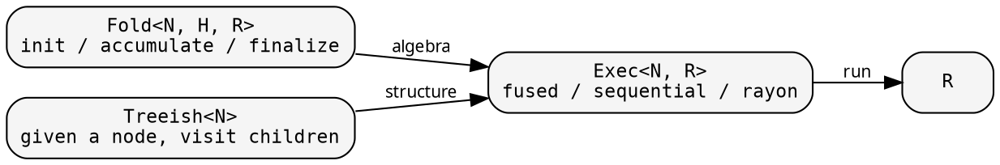
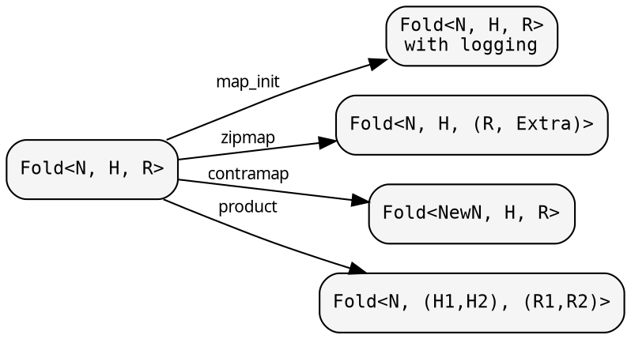
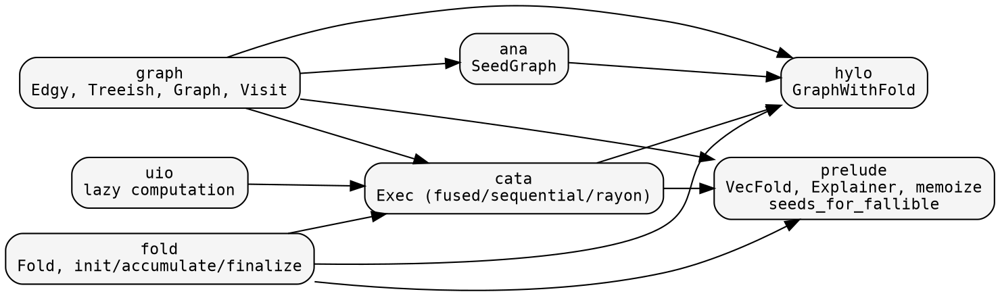

# Core composition

hylic decomposes recursive tree computation into independently
definable, independently transformable pieces. This page shows
how they compose.

## The pieces

Three independent definitions compose into a result:

**Fold** defines what to compute at each node: initialize a heap,
fold each child's result into it, finalize the heap into the node's
result. It knows nothing about tree structure.

**Treeish** defines the tree: given a node, call a callback for each
child. It knows nothing about what is computed. Callback-based
traversal means zero allocation per node.

**Exec** drives the execution. `Exec::fused()` recurses via callbacks
(zero allocation). `Exec::rayon()` parallelizes sibling subtrees.
The executor is parameterized by a child-visiting lambda — the
lambda encapsulates the traversal mode and any parallelism bounds.

## Transformations

Because Fold is data (three closures behind Arc), you transform it
rather than rewrite it:

- **map_init / map_accumulate / map_finalize** — wrap individual phases.
- **map** — change the result type R → R' (with backmapper).
- **zipmap** — augment R with derived data: R → (R, Extra).
- **contramap** — change the node type: Fold<N,...> → Fold<NewN,...>.
- **product** — two folds in one pass: (R1, R2) from one traversal.

Similarly, Treeish/Edgy has: **map**, **contramap**, **contramap_or**,
**filter**, **treemap**. Graph has **map_treeish**, **map_top_edgy**.

## The layers

Each layer only depends downward:

`graph` and `fold` are independent of each other. `cata` combines
them via `Exec`. `ana` builds graphs from seeds. `hylo` wires
everything into `GraphWithFold` — the runnable hylomorphism pipeline.
`prelude` provides convenience types built on all of the above.

## Seed-based graphs (ana)

`SeedGraph<Node, Seed, Top>` is a general anamorphism — it defines
how to unfold a tree from seeds:
- **seeds_from_node**: given a node, what are its dependency seeds?
- **grow**: given a seed, produce a node
- **seeds_from_top**: entry point → initial seeds

`SeedGraph` knows nothing about error handling or Either types.
For fallible resolution (where growing can fail), the prelude
provides `seeds_for_fallible` which lifts a valid-only seed function
to handle Either<Error, Valid> nodes — errors become leaves.

This is the pattern described in the next section,
[The two-function problem](./two_function_problem.md).
