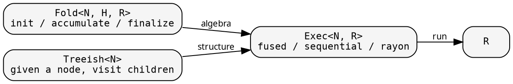
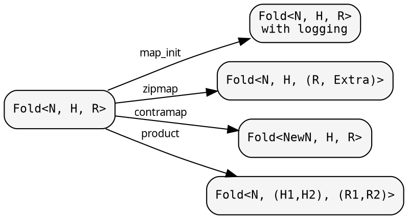
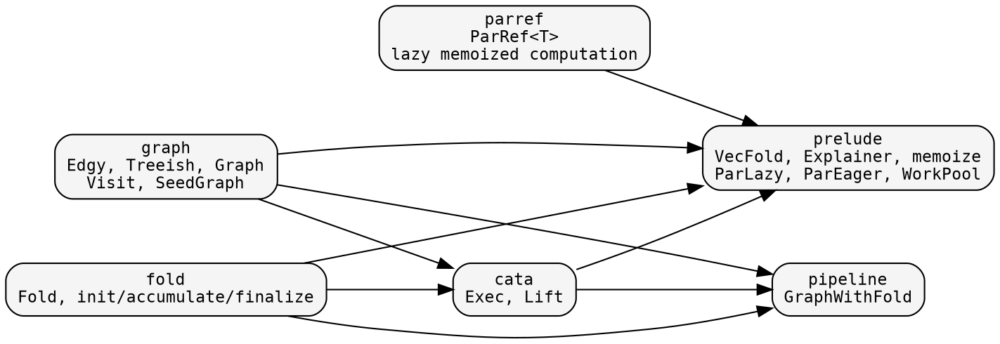

# Core composition

hylic decomposes recursive tree computation into independently
definable, independently transformable pieces. This page shows
how they compose.

## The pieces

Three independent definitions compose into a result:



**Fold** defines what to compute at each node: initialize a heap,
fold each child's result into it, finalize the heap into the node's
result. It knows nothing about tree structure.

**Treeish** defines the tree: given a node, call a callback for each
child. It knows nothing about what is computed. Callback-based
traversal means zero allocation per node.

**Exec** drives the execution. `Exec::fused()` recurses via callbacks
(zero allocation). `Exec::rayon()` parallelizes sibling subtrees.
The executor is parameterized by a child-visiting lambda — the
lambda encapsulates the traversal mode and any parallelism bounds.

## Transformations

Because Fold is data (three closures behind Arc), you transform it
rather than rewrite it:



- **map_init / map_accumulate / map_finalize** — wrap individual phases.
- **map** — change the result type R → R' (with backmapper).
- **zipmap** — augment R with derived data: R → (R, Extra).
- **contramap** — change the node type: Fold<N,...> → Fold<NewN,...>.
- **product** — two folds in one pass: (R1, R2) from one traversal.

Similarly, Treeish/Edgy has: **map**, **contramap**, **contramap_or**,
**filter**, **treemap**. Graph has **map_treeish**, **map_top_edgy**.

## Lift: type-domain transformations

When simple fold transformations aren't enough — when you need
to change the heap type, the result type, or the entire
computation strategy — you use a [Lift](./lifts.md).

A Lift transforms both the Treeish and the Fold into a different
type domain, runs the computation there, and maps the result back.
Execution goes through `Exec::run_lifted`:

```rust
// Direct execution:
let r = Exec::fused().run(&fold, &graph, &root);

// Lifted execution — same result, enriched computation:
let r = Exec::fused().run_lifted(&lift, &fold, &graph, &root);
```

hylic's three built-in Lifts:

| Lift | Purpose | See |
|---|---|---|
| `Explainer::lift()` | Record computation trace | [Transformations](../cookbook/transformations.md) |
| `ParLazy::lift()` | Lazy parallel evaluation | [Parallel execution](../cookbook/parallel_execution.md) |
| `ParEager::lift(pool)` | Eager fork-join parallelism | [Parallel execution](../cookbook/parallel_execution.md) |

## The layers

Each layer only depends downward:



`graph` and `fold` are independent of each other. `cata` combines
them via `Exec` and provides `Lift` for type-domain transformations.
`pipeline` wires graph + fold into runnable pipelines (`GraphWithFold`).
`prelude` provides batteries built on core: VecFold, Explainer,
memoization, fallible seed helpers, and parallel execution strategies.

## SeedGraph (in graph/)

`SeedGraph<Node, Seed, Top>` defines how to unfold a tree from seeds:
- **seeds_from_node**: given a node, what are its dependency seeds?
- **grow**: given a seed, produce a node
- **seeds_from_top**: entry point → initial seeds

It's general — no assumption about the Node type. For fallible
resolution (Either<Error, Valid> nodes), the prelude provides
`seeds_for_fallible` which lifts a valid-only seed function so
errors become leaves.

See [The two-function problem](./two_function_problem.md) for the
motivation behind SeedGraph.
