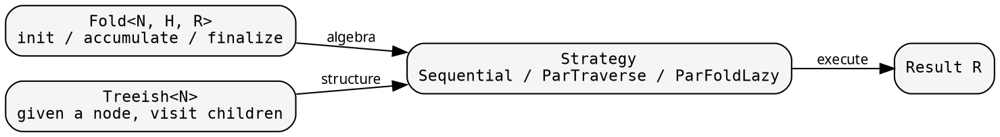
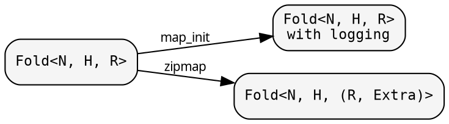

# Core composition

hylic decomposes recursive tree computation into independently
definable, independently transformable pieces. This page shows
how they compose.

## The pieces



**Fold** defines what to compute at each node: initialize a heap,
fold each child's result into it, finalize the heap into the node's
result. It knows nothing about tree structure.

**Treeish** defines the tree: given a node, call a callback for each
child. It knows nothing about what is computed. Callback-based
traversal means zero allocation per node.

**Strategy** drives the execution: walk the tree (via Treeish),
apply the fold at each node (via Fold), return the root's result.
Sequential does this in a single recursion. Parallel strategies
fan out sibling subtrees via rayon.

## Transformations

Because Fold is data (three closures behind Arc), you transform it
rather than rewrite it:



- **map_init / map_accumulate / map_finalize** — wrap individual phases.
  Logging, validation, side effects.
- **map** — change the result type R → R'. Requires a backmapper
  for children's results to flow through accumulate.
- **zipmap** — augment R with derived data: R → (R, Extra).
  The Extra is per-node (derived from that node's R), not accumulated.

The same Treeish can be used with different Folds. The same Fold
can run over different trees. Transformations compose without
touching either.

## The layers

```dot
digraph {
    rankdir=LR;
    node [shape=box, style="rounded,filled", fillcolor="#f5f5f5", fontname="monospace", fontsize=11];
    edge [fontname="sans-serif", fontsize=10];

    uio     [label="uio\nlazy memoized computation"];
    utils   [label="utils\nstring helpers"];
    graph   [label="graph\nEdgy, Treeish, Graph, Visit"];
    fold    [label="fold\nFold, init/accumulate/finalize"];
    cata    [label="cata\nStrategy, execution"];
    ana     [label="ana\nSeedGraph, error builders"];
    hylo    [label="hylo\nFoldAdapter, SeedFoldAdapter\nGraphWithFold, SeedGraphFold"];
    prelude [label="prelude\nVecFold, Explainer\nTreeFormatCfg, memoize"];

    uio -> cata;
    uio -> prelude;
    utils -> fold;
    graph -> cata;
    fold -> cata;
    graph -> ana;
    ana -> hylo;
    cata -> hylo;
    fold -> hylo;
    graph -> prelude;
    fold -> prelude;
    cata -> prelude;
}
```

Each layer only depends downward. `graph` and `fold` are independent
of each other. `cata` combines them. `ana` builds graphs from seeds.
`hylo` wires everything into execution adapters. `prelude` provides
convenience types built on all of the above.

## Seed-based graphs (ana)

The `ana` module is not core in the same way `fold` and `graph` are.
It's a construction pattern built entirely on the core mechanisms,
showing how to bridge the gap between a starting "seed" and a full
recursive tree.

`SeedGraph` defines three things:
- How to get dependency seeds from a resolved node
- How to grow a seed into a resolved node (or an error)
- How to get the initial seeds from a top-level entry point

From these, it constructs a `Treeish` and a `Graph` — standard core
types. The `hylo` module then wires this graph with a `Fold` for
execution.

This is the pattern described in the next section,
[The two-function problem](./two_function_problem.md).
