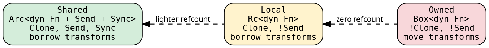
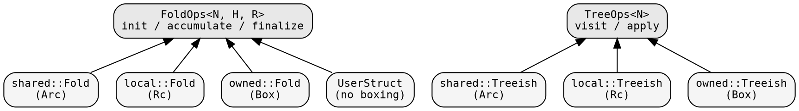

# Domain system

A **domain** is a boxing strategy — how closures inside Fold and
Treeish are stored. Three built-in domains cover the spectrum from
maximum capability to zero overhead.

## The three domains

<!-- -->



| Domain | Storage | Clone | Send+Sync | Transforms | Executors |
|--------|---------|-------|-----------|------------|-----------|
| **Shared** | `Arc<dyn Fn + Send + Sync>` | yes | yes | borrow (`&self`) | Fused, Funnel |
| **Local** | `Rc<dyn Fn>` | yes | no | borrow (`&self`) | Fused |
| **Owned** | `Box<dyn Fn>` | no | no | move (`self`) | Fused |

## Domain modules as the single entry point

Each domain has its own module that re-exports everything needed:

```rust
use hylic::domain::shared as dom;   // the standard choice
use hylic::domain::local as dom;    // lighter refcount
use hylic::domain::owned as dom;    // zero overhead
```

Each domain module owns its concrete types. Infrastructure modules
contain only domain-independent combinator logic, shared by all domains
but not directly user-facing.

```
domain/
  shared/
    fold.rs         Fold<N,H,R>  (Arc)    + constructors
    graph.rs        Edgy, Treeish (Arc)   + constructors
    compose.rs      Graph, SeedGraph, GraphWithFold
  local/
    mod.rs          Fold, Treeish (Rc)    + constructors
  owned/
    mod.rs          Fold, Treeish (Box)   + constructors

fold/
  combinators.rs    map_fold, contramap_fold, wrap_init, ...  (domain-independent)
graph/
  combinators.rs    map_edges, contramap_node, filter_edges, ...  (domain-independent)
  visit.rs          Visit<T,F>  push iterator
```

Users access types and constructors exclusively through domain modules.
One way in.

## The `Domain` trait

<!-- -->

```rust
{{#include ../../../../hylic/src/domain/mod.rs:domain_trait}}
```

Each domain marker implements this trait, providing concrete Fold
and Treeish types via GATs (Generic Associated Types). The executor
trait is parameterized by the domain:

```rust
{{#include ../../../../hylic/src/cata/exec/mod.rs:executor_trait}}
```

The compiler resolves `D::Fold<H, R>` to the concrete type — e.g.,
`shared::Fold<N, H, R>` when `D = Shared`.

## FoldOps and TreeOps — the universal interface

The operations traits sit above all domains:



Any type implementing `init`/`accumulate`/`finalize` is a fold. Any
type implementing `visit` is a graph. The executor's recursion engine
takes `&impl FoldOps + &impl TreeOps` — fully generic.

## Why the domain is on the executor, not the fold

Fold and Treeish have no domain parameter: `Fold<N, H, R>` and
`Treeish<N>`. This keeps types simple. The domain marker lives on
the executor: `Exec<D, S>`.

This solves a type inference problem: if the domain were on the fold,
the compiler couldn't determine D from the argument types (GATs are
not injective). With D on the executor, each const has exactly one
`D`, and the compiler resolves everything statically. See
[Domain integration](../executor-design/domain_integration.md) for
the full explanation.

## Constructing folds in different domains

Same closures, different constructor:

```rust
{{#include ../../../src/docs_examples.rs:domain_switching}}
```

The closures are domain-independent. The constructor selects the
boxing strategy. To switch domains, change the import — the code
stays the same.

## When to use which domain

**Shared** — the default. Use when:
- You need parallel execution (Funnel requires Send+Sync)
- You use Lifts (Explainer)
- You use GraphWithFold pipelines (they need Clone)
- You need non-destructive fold transformations (original preserved)

**Local** — lighter refcount:
- Rc clone is ~1ns vs Arc's ~5ns
- Full fold and graph transformations (same as Shared, no Send+Sync)
- Works with Fused

**Owned** — zero refcount:
- Box is the cheapest storage
- Full fold and graph transformations via move semantics (original consumed)
- Works with Fused
- Shows the framework's raw overhead in benchmarks

All three domains support the same transformation API surface
(`wrap_init`, `wrap_accumulate`, `wrap_finalize`, `map`, `zipmap`,
`contramap`, `product`, `filter`, `treemap`). Shared and Local
borrow (`&self`) — the original is preserved. Owned consumes
(`self`) — the original is moved into the result.

Most users should use Shared and never think about domains.
