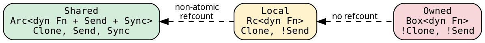
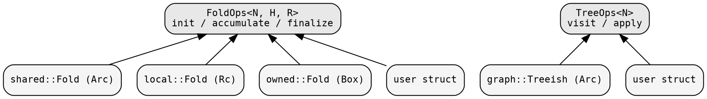

# Domain system

A domain controls how fold closures are stored — the boxing strategy
that determines the refcount overhead, thread-safety, and
transformation semantics of a `Fold<N, H, R>`. Graph types are
domain-independent and live in a separate module (`hylic::graph`).

## The three domains

The three built-in domains form a spectrum from maximum capability
to minimum overhead:



| Domain | Fold storage | Clone | Send+Sync | Fold transforms | Executors |
|--------|-------------|-------|-----------|-----------------|-----------|
| **Shared** | `Arc<dyn Fn + Send + Sync>` | yes | yes | borrow (`&self`) | Fused, Funnel |
| **Local** | `Rc<dyn Fn>` | yes | no | borrow (`&self`) | Fused |
| **Owned** | `Box<dyn Fn>` | no | no | move (`self`) | Fused |

The domain affects only the fold. Graph types (`Treeish`, `Edgy`,
`Graph`) are always Arc-based because graph composition requires
Clone. The executor accepts any graph type that implements
`TreeOps<N>` — the graph's storage is checked at the call site, not
through the domain.

## Module structure

Each domain module provides fold constructors and executor bindings.
Graph types are in a separate public module:

```
domain/
  shared/fold.rs    Fold (Arc) + fold(), exec(), FUSED
  local/mod.rs      Fold (Rc)  + fold(), exec(), FUSED
  owned/mod.rs      Fold (Box) + fold(), exec(), FUSED

graph/
  edgy.rs           Edgy<N,E>, Treeish<N> (Arc) + combinators
  compose.rs        Graph
```

A typical program imports the prelude — every domain marker, the
Shared-default constructors, and the graph constructors come with
it:

```rust,no_run
use hylic::prelude::*;
```

For Local or Owned construction, address the per-domain module
directly (`hylic::domain::local`, `hylic::domain::owned`) — see
[Import patterns](../guides/imports.md).

## The Domain trait

The `Domain` trait provides a single associated type — the concrete
Fold type for each domain:

```rust
{{#include ../../../../hylic/src/domain/mod.rs:domain_trait}}
```

The Executor trait is parameterized by `D: Domain<N>`, so the
compiler resolves `D::Fold<H, R>` to the concrete fold type at
monomorphization time. The graph type is a separate type parameter
`G: TreeOps<N>` on the Executor trait, constrained per executor
implementation (Fused accepts any G; Funnel requires G: Send+Sync).

```rust
{{#include ../../../../hylic/src/exec/mod.rs:executor_trait}}
```

## FoldOps and TreeOps

The operations traits provide the universal interface that executors
program against:



Any type implementing `init`/`accumulate`/`finalize` is a fold. Any
type implementing `visit` is a graph. The executor's recursion engine
operates on these traits, not on concrete types.

## Why the domain is on the executor

`Fold<N, H, R>` has no domain parameter — the domain is a type
parameter on the executor: `Exec<D, S>`. This resolves a type
inference problem: GATs are not injective (`D::Fold<H, R>` does not
uniquely identify `D`), so placing the domain on the fold would
prevent the compiler from inferring the domain from the argument
types. With `D` on the executor, each constant (`shared::FUSED`,
`local::FUSED`, `owned::FUSED`) or `<domain>::exec(...)` call fixes
`D`, and the compiler resolves everything statically. See
[Domain integration](../executor-design/domain_integration.md).

## Choosing a domain

**Shared** is the default choice. It supports parallel execution
(Funnel requires Send+Sync folds), lift integration (Explainer
operates on Shared folds), and non-destructive fold transformations
(the original fold is preserved after map/contramap/product).

**Local** provides the same transformation API with lighter
refcounting (Rc vs Arc — non-atomic vs atomic increment). It works
with the Fused executor for single-threaded computation.

**Owned** eliminates refcounting entirely. Fold transformations
consume the original (move semantics). Useful for measuring the
framework's raw overhead in benchmarks, or for single-use folds
where the original is not needed after transformation.

All three domains provide the same fold combinator surface:
`wrap_init`, `wrap_accumulate`, `wrap_finalize`, `map`, `zipmap`,
`contramap`, `product`. The difference is in the calling convention
(borrow vs move) and the auto-traits (Send+Sync vs neither).
