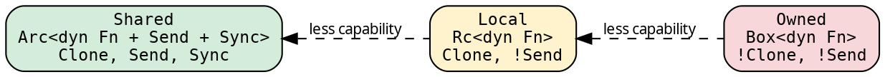
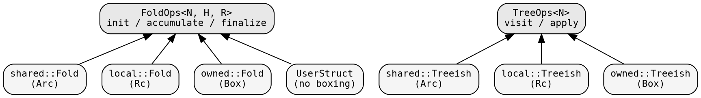

# Domain system

A **domain** is a boxing strategy — how closures inside Fold and
Treeish are stored. Three built-in domains cover the spectrum from
maximum capability to zero overhead.

## The three domains



| Domain | Storage | Clone | Send+Sync | Executors | Use case |
|--------|---------|-------|-----------|-----------|----------|
| **Shared** | `Arc<dyn Fn + Send + Sync>` | yes | yes | all | Rayon, Lifts, pipelines |
| **Local** | `Rc<dyn Fn>` | yes | no | Fused, Sequential | single-thread, lighter refcount |
| **Owned** | `Box<dyn Fn>` | no | no | Fused, Sequential | zero refcount, maximum speed |

## The `Domain` trait

```rust
{{#include ../../../../hylic/src/domain/mod.rs:domain_trait}}
```

Each domain marker implements this trait, providing concrete Fold
and Treeish types via GATs (Generic Associated Types). The executor
trait is parameterized by the domain:

```rust
{{#include ../../../../hylic/src/cata/exec/mod.rs:executor_trait}}
```

The compiler resolves `D::Fold<H, R>` to the concrete type — e.g.,
`shared::Fold<N, H, R>` when `D = Shared`.

## FoldOps and TreeOps — the universal interface

The operations traits sit above all domains:



Any type implementing `init`/`accumulate`/`finalize` is a fold. Any
type implementing `visit` is a graph. The executor's recursion engine
takes `&impl FoldOps + &impl TreeOps` — fully generic. When called
with a concrete user struct, the compiler monomorphizes and inlines:
zero vtable, zero boxing.

## Why the domain is on the executor, not the fold

Fold and Treeish are parameter-free: `Fold<N, H, R>` and `Treeish<N>`.
No domain parameter. This keeps the types simple throughout the
codebase.

The domain marker lives on the executor: `FusedIn<D>(PhantomData<D>)`.
Each const value fixes D: `exec::FUSED` is `FusedIn<Shared>`,
`exec::FUSED_OWNED` is `FusedIn<Owned>`.

This solves a type inference problem: if the domain were on the fold,
the compiler couldn't determine D from the argument types when multiple
`Executor` impls exist (GATs are not injective — the compiler can't
reason "this fold type came from Shared, therefore D = Shared"). With
D on the executor, each const has exactly one `Executor` impl.

See [GAT injectivity](../../KB/.plans/exec-refactor/GAT-injective-problem/problem.md)
for the full technical details.

## Constructing folds in different domains

The same closures work in any domain — closures are domain-independent:

```rust
{{#include ../../../src/docs_examples.rs:domain_switching}}
```

The constructor selects the domain. The closures are the source of
truth. To switch domains, use the same closures with a different
constructor — no conversion functions needed.

The type system enforces compatibility: `exec::RAYON` only accepts
Shared-domain folds. Passing an `owned::Fold` to `exec::RAYON`
is a compile error — Rayon doesn't implement `Executor<N, R, Owned>`.

## When to use which domain

**Shared** — the default. Use when:
- You need Rayon (parallel execution)
- You use Lifts (Explainer, ParLazy, ParEager)
- You use GraphWithFold pipelines (they need Clone)
- You need to share folds across threads

**Local** — for single-threaded work with lighter refcounting:
- Rc is ~1ns per clone vs Arc's ~5ns
- Meaningful only in very hot loops on tiny trees
- Not compatible with Rayon or Lifts

**Owned** — for maximum performance:
- Zero refcount — Box is the cheapest storage
- The fold can't be cloned, so no Lifts, no pipelines
- Use with Fused for the absolute fastest sequential path
- Good for benchmarking: shows the framework's raw overhead

Most users should use Shared and never think about domains.
