# Executor architecture

The executor controls **how** the tree recursion runs. The fold says
what to compute; the treeish says where the children are; the executor
decides the traversal order, parallelism strategy, and boxing domain.

## Import pattern

```rust
use hylic::cata::exec::{self, Executor};

exec::FUSED.run(&fold, &graph, &root);        // sequential
exec::RAYON.run(&fold, &graph, &root);         // parallel via rayon
exec::FUSED_OWNED.run(&fold, &graph, &root);   // zero-boxing domain
```

The `exec` module is the single namespace for all executor concerns.
`Executor` is the trait — imported to call `.run()` on the const values.

## The `Executor` trait

```rust
pub trait Executor<N: 'static, R: 'static, D: Domain<N>> {
    fn run<H: 'static>(
        &self,
        fold: &D::Fold<H, R>,
        graph: &D::Treeish,
        root: &N,
    ) -> R;
}
```

Three type parameters: the node type `N`, the result type `R`, and
the boxing domain `D`. The domain determines which concrete Fold and
Treeish types the executor accepts — via GATs on the `Domain` trait
(see [Domain system](./domains.md)).

`run` is the only required method. Two more are provided automatically
via `ExecutorExt` (Shared domain only):

```rust
pub trait ExecutorExt<N, R>: Executor<N, R, Shared> {
    fn run_lifted(...)  -> R0 { /* uses self.run() */ }
    fn run_lifted_zipped(...) -> (R0, R) { /* uses self.run() */ }
}
```

Any executor supporting the Shared domain automatically gets Lift
integration — all parallel strategies and the Explainer work through
`run_lifted`.

## Domain-parameterized executors

Each executor is a zero-sized struct parameterized by a domain marker:

```rust
pub struct FusedIn<D>(PhantomData<D>);
pub struct SequentialIn<D>(PhantomData<D>);
pub struct RayonIn<D>(PhantomData<D>);
```

The domain is part of the executor's TYPE, not the fold's or the
treeish's. This means `FusedIn<Shared>` has exactly one `Executor`
impl — no ambiguity for the compiler.


## The four built-in variants

Each lives in its own module under `cata/exec/variant/` with its
own recursion engine. All pass fold and graph by `&` reference —
no Arc clones in recursion.

### Fused — all domains

Callback-based traversal via `graph.visit()`. Recursion and
accumulation interleave inside the callback — zero collection,
zero allocation. The fastest single-threaded path.

```rust
exec::FUSED.run(&fold, &graph, &root);         // Shared domain
exec::FUSED_LOCAL.run(&fold, &graph, &root);    // Local domain
exec::FUSED_OWNED.run(&fold, &graph, &root);    // Owned domain
```

### Sequential — all domains

Collects children to a `Vec` via `graph.apply()`, then iterates.
Requires `N: Clone`. Exists as a reference for the unfused path.
Prefer Fused for production sequential work.

```rust
exec::SEQUENTIAL.run(&fold, &graph, &root);
```

### Rayon — Shared domain only

Collects children to `Vec`, `par_iter()` for parallel recursion.
Requires `N: Clone + Send + Sync, R: Send + Sync`. These bounds
are on Rayon's module, not on the Executor trait.

```rust
exec::RAYON.run(&fold, &graph, &root);
```

### Custom — Shared domain only

User-defined child visitor via `ChildVisitorFn`. The escape hatch
for parallelism strategies that don't fit the built-in executors.
Pays 5 Arc clones per node (the recurse closure captures cloned
fold/graph/visitor). For other domains, implement `Executor` directly.

## Domain support matrix

```dot process
digraph {
    rankdir=LR;
    node [shape=record, style=filled, fontname="monospace", fontsize=10];

    domains [label="{ Domain | Shared (Arc) | Local (Rc) | Owned (Box) }", fillcolor="#e8e8e8"];
    fused [label="{ Fused | FUSED | FUSED_LOCAL | FUSED_OWNED }", fillcolor="#d4edda"];
    seq [label="{ Sequential | SEQUENTIAL | SEQ_LOCAL | SEQ_OWNED }", fillcolor="#d4edda"];
    rayon [label="{ Rayon | RAYON | - | - }", fillcolor="#fff3cd"];
    custom [label="{ Custom | Custom::new() | - | - }", fillcolor="#fff3cd"];

    domains -> fused [style=invis];
    fused -> seq [style=invis];
    seq -> rayon [style=invis];
    rayon -> custom [style=invis];
}
```



Fused and Sequential support all domains (they never clone the fold
or graph). Rayon needs `Sync` (which `Arc`-based Shared types provide).
Custom needs `Clone + Send + Sync` (for the recurse closure captures).

## The `Exec` enum — runtime dispatch

When the executor is chosen at runtime, wrap variants in `Exec`:

```rust
let executors = vec![exec::Exec::fused(), exec::Exec::rayon()];
for e in &executors {
    let result = e.run(&fold, &graph, &root);
}
```

`Exec<N, R>` operates in the Shared domain. Its `run()` is an
inherent method — no trait import needed. Bounds: `N: Clone + Send +
Sync, R: Send + Sync` (the union of all variants).

For static dispatch (zero overhead), use the const values directly:
`exec::FUSED.run(...)`.

## Recursion engines and FoldOps/TreeOps

Each variant's recursion engine is generic over the operations traits:

```rust
fn recurse(
    fold: &impl FoldOps<N, H, R>,
    graph: &impl TreeOps<N>,
    node: &N,
) -> R { ... }
```

`FoldOps` and `TreeOps` are the universal interface — any type
implementing `init/accumulate/finalize` or `visit` works. The
standard `Fold<N, H, R>` and `Treeish<N>` implement these traits.
A user-defined struct can too — for zero-boxing, fully-monomorphized
execution.

When `recurse` is called with `&Fold<N, H, R>`, it dispatches through
`Arc<dyn Fn>` (vtable call). When called with a concrete user struct,
the compiler inlines the methods completely — zero indirection.

## Adding a new executor

1. Create `cata/exec/variant/<name>/mod.rs`
2. Define `pub struct MyExecIn<D>(PhantomData<D>)`
3. Implement `Executor<N, R, D>` — blanket over `D: Domain<N>` if
   domain-universal, or for specific domains
4. Write the recursion engine as a private function taking
   `&impl FoldOps + &impl TreeOps`
5. Add const values and type aliases in `exec/mod.rs`
6. Add to the `Exec` enum if Shared-domain

The `ExecutorExt` blanket provides `run_lifted` automatically for
any executor supporting the Shared domain.

## Adding a new domain

1. Define a marker struct (e.g. `pub struct Arena`)
2. Implement `Domain<N>` with GATs pointing to your Fold/Treeish types
3. Create the domain module with Fold and Treeish implementing
   `FoldOps` and `TreeOps`
4. Add const values for each compatible executor:
   `pub const FUSED_ARENA: FusedIn<Arena> = FusedIn(PhantomData);`

Existing executors with blanket impls (Fused, Sequential) work
immediately. No changes to any executor code.
