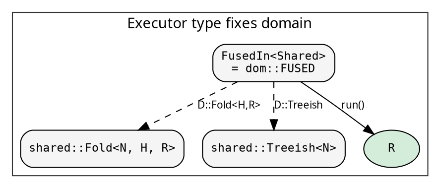

# Executor architecture

The executor controls **how** the tree recursion runs. The fold says
what to compute; the treeish says where the children are; the executor
decides the traversal order, parallelism strategy, and boxing domain.

## Import pattern

<!-- -->

```rust
use hylic::domain::shared as dom;

dom::FUSED.run(&fold, &graph, &root);         // sequential
dom::RAYON.run(&fold, &graph, &root);          // parallel via rayon
```

No trait import. The `.run()` method is **inherent** on each executor
const. The domain module is the single entry point for all executor
concerns.

## The `Executor` trait

<!-- -->

```rust
{{#include ../../../../hylic/src/cata/exec/mod.rs:executor_trait}}
```

Three type parameters: the node type `N`, the result type `R`, and
the boxing domain `D`. The domain determines which concrete Fold and
Treeish types the executor accepts — via GATs on the `Domain` trait
(see [Domain system](./domains.md)).

The trait exists for **generic code only** (e.g., pipeline.rs). Users
never import it — inherent methods handle everything at call sites.

## The inherent method trick

Each executor provides inherent `run`, `run_lifted`, `run_lifted_zipped`:

```rust
impl<D> FusedIn<D> {
    pub fn run<N, H, R>(
        &self,
        fold: &<D as Domain<N>>::Fold<H, R>,
        graph: &<D as Domain<N>>::Treeish,
        root: &N,
    ) -> R
    where D: Domain<N>
    { ... }
}
```

**D is constrained by the self type.** When you write `dom::FUSED.run(...)`,
D is `Shared` (known from the const's type). N, H, R are inferred from
the arguments. No trait import needed — the method is on the struct
itself.

This is why the domain lives on the executor type, not the fold.
`FusedIn<Shared>` has one impl block with D = Shared. The compiler
resolves everything from the type of the const.

## Domain-parameterized executors

Each executor is a zero-sized struct with a domain marker:

```rust
pub struct FusedIn<D>(PhantomData<D>);
pub struct SequentialIn<D>(PhantomData<D>);
pub struct RayonIn<D>(PhantomData<D>);
pub struct PoolIn<D> { pool: Arc<WorkPool>, spec: PoolSpec, _domain: PhantomData<D> }
```



## The five built-in variants

Each lives in its own module under `cata/exec/variant/` with its
own recursion engine. All pass fold and graph by `&` reference —
no Arc clones in recursion.

### Fused — all domains

Callback-based traversal via `graph.visit()`. Recursion and
accumulation interleave inside the callback — zero collection,
zero allocation. The fastest single-threaded path.

### Sequential — all domains

Collects children to a `Vec` via `graph.apply()`, then iterates.
Requires `N: Clone`. Reference implementation for the unfused path.

### Rayon — Shared domain only

Collects children to `Vec`, `par_iter()` for parallel recursion.
Requires `N: Clone + Send + Sync, R: Send + Sync`.

### Pool — all domains

Binary-split fork-join via our own `WorkPool`. Requires
`N: Clone + Send, R: Send` — no `Sync` thanks to `SyncRef`.
Tree-aware sequential cutoff via `PoolSpec`. Competitive with
rayon, works with Local and Owned domains.

### Custom — Shared domain only

User-defined child visitor via `ChildVisitorFn`. The escape hatch
for strategies that don't fit the built-in executors.

## Domain support matrix

| | Shared | Local | Owned |
|---|:---:|:---:|:---:|
| **Fused** | yes | yes | yes |
| **Sequential** | yes | yes | yes |
| **Rayon** | yes | - | - |
| **Pool** | yes | yes | yes |
| **Custom** | yes | - | - |

Fused, Sequential, and Pool support all domains (they borrow, never
clone the fold). Rayon needs `Sync` (which `Arc`-based Shared types
provide). Pool bypasses this via `SyncRef` — a scoped-thread safety
wrapper (see [Implementation notes](./implementation_notes.md)).

## `DynExec` — runtime dispatch

When the executor is chosen at runtime:

```rust
use hylic::domain::shared as dom;

let executors: Vec<dom::DynExec<N, u64>> = vec![
    dom::DynExec::fused(),
    dom::DynExec::rayon(),
];
for e in &executors {
    let result = e.run(&fold, &graph, &root);
}
```

`DynExec<N, R>` operates in the Shared domain. Its `run()` is
inherent — no trait import. Bounds: `N: Clone + Send + Sync,
R: Send + Sync` (the union of all variants).

For static dispatch (zero overhead), use the const values directly.

## Recursion engines and FoldOps/TreeOps

Each variant's recursion engine is generic over the operations traits:

```rust
fn recurse(
    fold: &impl FoldOps<N, H, R>,
    graph: &impl TreeOps<N>,
    node: &N,
) -> R { ... }
```

`FoldOps` and `TreeOps` are the universal interface — any type
implementing `init/accumulate/finalize` or `visit` works. When
called with a concrete user struct, the compiler monomorphizes and
inlines — zero vtable, zero boxing.

## Adding a new executor

1. Create `cata/exec/variant/<name>/mod.rs`
2. Define `pub struct MyExecIn<D>(PhantomData<D>)`
3. Implement `Executor<N, R, D>` — blanket over `D: Domain<N>` if
   domain-universal, or for specific domains
4. Add inherent `run`, `run_lifted`, `run_lifted_zipped` methods
5. Write the recursion engine taking `&impl FoldOps + &impl TreeOps`
6. Add const values in domain modules and type aliases in `exec/mod.rs`
