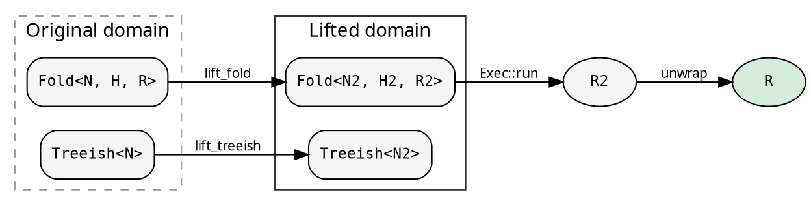
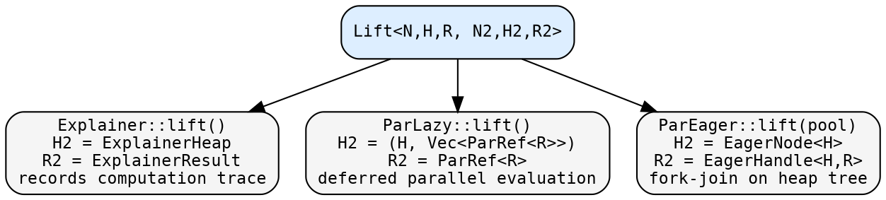

# Lifts

A Lift is hylic's mechanism for transforming a computation
into a different type domain, running it there, and mapping the
result back. It is the key to parallelism, tracing, and any
enrichment that augments what a fold computes without rewriting
the fold itself.

## The idea

A `Fold<N, H, R>` computes `R` from a tree of `N`. But sometimes
you want to run the fold in a *transformed* world — where the heap
tracks extra information, or the result type carries deferred
computation, or the tree structure is augmented. A Lift does this
transparently: the caller gets back `R`, as if no transformation
happened.



A Lift packages four functions:

| Function | Purpose |
|----------|---------|
| `lift_treeish` | Transform `Treeish<N>` → `Treeish<N2>` |
| `lift_fold` | Transform `Fold<N,H,R>` → `Fold<N2,H2,R2>` |
| `lift_root` | Transform the root node `&N` → `N2` |
| `unwrap` | Extract the original result `R2` → `R` |

The Lift itself knows nothing about execution. It is purely a
type transformation. Execution goes through `Exec::run_lifted`:

```rust
// The uniform pattern: Exec drives, Lift transforms
let result: R = exec.run_lifted(&lift, &fold, &graph, &root);
```

Internally this does:
1. `lift.lift_treeish(graph)` — transform the tree
2. `lift.lift_fold(fold)` — transform the fold
3. `lift.lift_root(root)` — transform the root node
4. `exec.run(lifted_fold, lifted_treeish, lifted_root)` — run in the lifted domain
5. `lift.unwrap(result)` — map back to `R`

## Lifts in hylic

hylic provides three Lifts, each transforming the fold's type
domain to achieve a different purpose:



### Explainer

Records the full execution trace at every node. The lifted fold
wraps each accumulation step, tracking the heap state before and
after each child result is folded in.

- **H2** = `ExplainerHeap` — initial heap, node, transitions, working heap
- **R2** = `ExplainerResult` — original result + full trace
- **unwrap** extracts `R` from `ExplainerResult`

Use `Explainer::explain()` when you want the trace itself, or
`Explainer::lift()` for transparent tracing that discards the
trace and returns `R`.

### ParLazy (lazy parallelism)

Transforms the fold so each node's result is a deferred
computation (`ParRef<R>`). During traversal (Phase 1), the executor
builds a tree of `ParRef` values. In unwrap, `eval()` on the root
triggers bottom-up parallel evaluation — sibling subtrees compute
concurrently via rayon's `par_iter`.

- **H2** = `(H, Vec<ParRef<R>>)` — heap + collected child handles
- **R2** = `ParRef<R>` — deferred computation
- **unwrap** calls `eval()`, which triggers the parallel cascade

See [Parallel execution](../cookbook/parallel_execution.md) for
details on how ParLazy works.

### ParEager (eager parallelism)

Transforms the fold to extract heaps into an `EagerNode` tree
during traversal (Phase 1). In unwrap, a hand-rolled fork-join
scheduler executes the fold bottom-up on the heap tree, using a
fixed-size `WorkPool` for thread management.

- **H2** = `EagerNode<H>` — extracted heap + child pointers
- **R2** = `EagerHandle<H, R>` — heap tree root + fold operations
- **unwrap** runs recursive fork-join on the heap tree

The pool is scoped — `WorkPool::with` guarantees all worker threads
are joined on return. See [Parallel execution](../cookbook/parallel_execution.md).

## Composability

Lifts compose with the rest of hylic's transformation machinery.
`map_lifted_fold` and `map_lifted_treeish` let you further
transform the lifted fold or treeish without changing types:

```rust
let traced_parallel = ParLazy::lift()
    .map_lifted_fold(|f| f.map_init(|orig| Box::new(move |n: &N| {
        println!("visiting node");
        orig(n)
    })));
```

Because the Lift is just four closures behind `Arc`, it is cheaply
cloneable and can be passed around, stored, and reused.

## The functional perspective

In recursion-scheme terms, a Lift is a *natural transformation*
between two algebras. It maps the carrier (H, R) of one
F-algebra to another, preserving the fold structure. The
`unwrap` function is the inverse mapping on the carrier's
result component — it recovers the original algebra's fixpoint.

The key property: the lifted computation produces the *same*
result as the original (modulo the enrichment that the Lift adds
and unwrap discards). This is what makes Lifts transparent —
you can layer tracing, parallelism, or any other enrichment
without the caller knowing.
