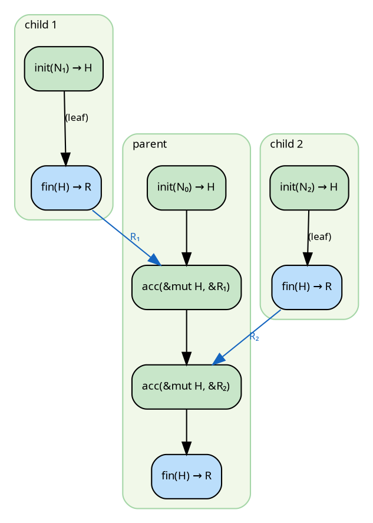
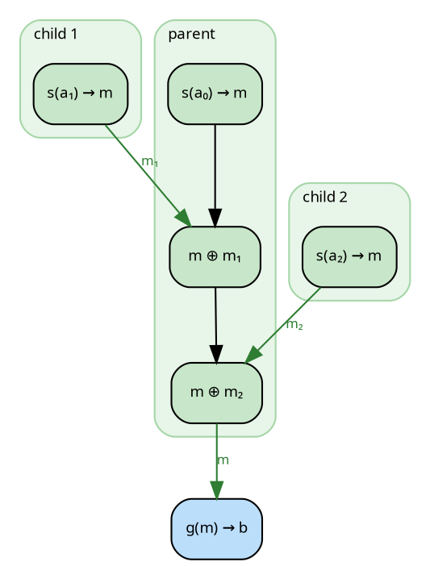
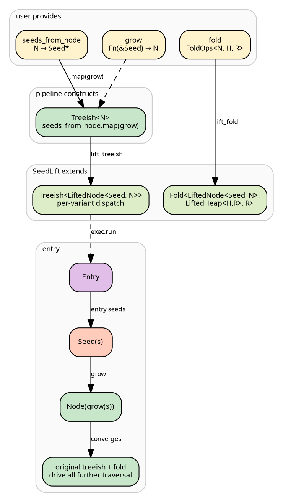

# The N-H-R algebra factorization

A catamorphism's algebra collapses one layer of recursive structure.
The standard formulation is a single morphism `F R → R`. Both hylic
and Milewski's [monoidal catamorphism](https://bartoszmilewski.com/2020/06/15/monoidal-catamorphisms/)
factor this morphism into composable steps. They factor it
differently. This page establishes the precise relationship between
the two and shows when one can be derived from the other.

## The two formulations

| | hylic | Milewski |
|---|---|---|
| **Extract** | `init: &N → H` | `s: a → m` (scatter) |
| **Combine** | `acc: &mut H, &R` | `⊕: m × m → m` (monoid) |
| **Output** | `fin: &H → R` (every node) | `g: m → b` (root only) |
| **Working type** | `H` (unconstrained) | `m` (associative, with identity) |
| **Carrier** | `R` | `m` |

In hylic, the carrier is `R`. Every subtree produces `R`. In
Milewski, the carrier is `m`. Every subtree produces `m`, and a
separate function `g` converts to the output type `b` once at the
root.

## The bracket

At each node, `init` opens mutable working state `H`, `accumulate`
folds each child's `R` into it, and `finalize` closes it to `R`.
The heap `H` never crosses node boundaries. Only `R` flows between
nodes.



Green is `H`-world (mutable working state). Blue is `R` (immutable
result). The green-to-blue transition at each node is the finalize
step, the bracket closing.

The node type `N` seeds the heap but is not part of the algebra. It
is the node's identity; the recursive structure lives in
[`Treeish<N>`](../concepts/separation.md), not in `N`. The pair
`(N, Treeish<N>)` is hylic's runtime equivalent of Milewski's
type-level `Fix (f a)`.

The bracket separates mutable working state from immutable results.
`H` can be a growable `Vec` while `R` is a frozen `Arc<[T]>`, for
example. Without the bracket, the user would either accumulate into
Arc (expensive reallocation on every push) or return Vec as the
result (wrong invariant for the parent, which expects immutable
data). The Rust type system reinforces this: `&mut H` is
single-owner and never shared, while `R` can be `Send` and cross
thread boundaries. The [Funnel executor](../funnel/overview.md)
exploits this directly. `R` values are delivered across threads via
[slot delivery](../funnel/accumulation.md); `H` stays on the
sweeping thread. For single-child nodes, the bracket is carried as
a [direct continuation](../funnel/continuations.md) with no
allocation and no atomic. Each [phase can be wrapped
independently](../cookbook/transformations.md) via `wrap_init`,
`wrap_accumulate`, `wrap_finalize`.

## The monoidal form

In Milewski's decomposition, the working type `m` is a monoid
(associative binary operation `⊕` with identity `ε`). A `Fold(s, g)`
pairs a scatter function `s: a → m` with a gather function
`g: m → b`. An `MAlgebra` provides the structural combination rule,
combining one layer of the functor using only `⊕` and `ε`.

The catamorphism `cat malg (Fold s g) = g ∘ cata (malg ∘ bimap s id)`
produces `m` at every node. `g` converts to `b` once at the root.



Compare the two diagrams. In the bracket form, every node has a
green-to-blue transition (per-node finalize). In the monoidal form,
green `m` flows uniformly and the single blue step occurs at the
root.

## Relationship

**Claim.** Milewski's monoidal catamorphism is a special case of
hylic's N-H-R fold.

**Proof.** Given a Milewski fold with monoid `(m, ⊕, ε)`, scatter
`s: a → m`, and gather `g: m → b`, construct the hylic fold:

```
H = R = m,   init = s,   acc = ⊕,   fin = identity
```

At each node, hylic computes `acc(acc(init(n), r₁), r₂)`
= `s(n) ⊕ r₁ ⊕ r₂`. This is the value Milewski's catamorphism
produces at every node. The user applies `g` to the root result to
obtain `b`. ∎

**Conditions for the converse.** A hylic fold is expressible as a
Milewski monoidal catamorphism when:

- `H = R` and `fin = identity`
- `acc` is a monoid (associative with identity element)

These make `(H, acc, ε)` a monoid. The correspondence is then
`m = H`, `s = init`, `⊕ = acc`, `g = identity`.

Without these conditions, hylic's fold is strictly more general. It
admits non-associative accumulation and distinct working/result
types.

## Examples

Folds that satisfy the monoid conditions:

- **Sum.** `H = R = u64`, `acc = +`, `fin = id`. Addition with
  identity 0.
- **Extend.** `H = R = Vec<T>`, `acc = extend`, `fin = clone`.
  Concatenation with identity `vec![]`. The
  [filesystem summary](../cookbook/filesystem_summary.md) uses this.
- **Union.** `H = R = HashSet<K>`, `acc = union`, `fin = clone`.
  Associative and commutative.

Folds that do not:

- **Child count.** `acc((s,c), r) = (s+r, c+1)`. The count tracks
  immediate children, not descendants. Not associative:
  `(h₁⊕h₂)⊕h₃` yields `c+2` while `h₁⊕(h₂⊕h₃)` yields `c+1`.
- **Bracketed formatting.** `fin(h) = format!("[{}]", h)`. Here
  `H ≠ R` and regrouping changes the nesting: `[a[b]][c] ≠
  [a][b[c]]`.

## Associativity and parallel accumulation

A monoid's associativity allows the executor to contract adjacent
sibling results in any grouping. If children b and c have completed
but a has not, `b ⊕ c` can proceed without waiting for a. When a
eventually completes, it combines with the already-contracted result.
For n children, this reduces the accumulation depth from O(n) to
O(log n).

hylic's [Funnel executor](../funnel/overview.md) does not perform
this contraction. It parallelizes subtree computation (children run
concurrently on different workers) and accumulates their results
left-to-right as the [sweep cursor](../funnel/accumulation.md)
advances. This is a design choice: sequential accumulation enables
progressive memory freeing, where each child's `R` is consumed and
dropped as the cursor passes. It also means the executor imposes no
algebraic requirements on `acc`. It is up to the user to supply an
appropriate accumulate function, and up to the executor to decide
how results are folded into `H`.

A [lift](../concepts/lifts.md) can recover O(log n) depth when
needed: by transforming the tree structure to insert balanced
reduction nodes, the contraction becomes a property of the tree
shape rather than the algebra.

## The general structure

In algebraic terms, `acc: H × R → H` is an action of `R` on `H`.
When `H = R` and `acc` is a monoid, this is a monoid acting on
itself, which is Milewski's formulation. In general, it is an
R-module: `R` acts on a distinct type `H` through `acc`, with
`fin: H → R` as the projection. A monoid is a module over itself;
a module is not necessarily a monoid.

hylic's API does not distinguish between these cases. The user
writes `init`, `acc`, `fin`. The executor runs them with sequential
accumulation and parallel subtree computation via
[CPS work-stealing](../funnel/cps_walk.md).

## Composability

hylic's fold combinators
([`product`](../cookbook/filesystem_summary.md),
[`map`](../guides/fold.md), [`zipmap`](../guides/fold.md),
[`wrap_*`](../cookbook/transformations.md)) and graph combinators
([`filter`](../guides/treeish.md),
[`memoize`](../guides/treeish.md),
[`contramap`](../guides/treeish.md)) achieve the same practical
composability as Milewski's `Functor`/`Applicative` on `Fold`.
[Lifts](../concepts/lifts.md) transform both fold and treeish in
sync, changing the carrier types through GATs. The
[SeedPipeline](../pipeline/seed.md) uses a lift internally
to bridge coalgebra and algebra when they speak different types.

## Bridging coalgebra and algebra: SeedPipeline

A hylomorphism fuses a coalgebra (produce children) with an algebra
(fold results). Both operate on the same type `N`. In practice, the
dependency structure often speaks a different type. A module
resolver starts with module names (seeds), not parsed modules
(nodes). A `grow` function resolves one into the other.

The user provides:

```
grow:            Fn(&Seed) → N           resolve a reference
seeds_from_node: N → Seed*              a node's dependency references
fold:            FoldOps<N, H, R>        the algebra, defined over N
```

In hylic, `N → Seed*` is `Edgy<N, Seed>`, the general edge
function. `N → N*` is `Treeish<N>`, the special case where node and
edge types match.

The coalgebra produces `Seed`. The algebra consumes `N`. The
morphism `grow: Seed → N` bridges them.
[`SeedPipeline`](../pipeline/seed.md) reconciles this
through two combinator chains.

**Chain 1: coalgebra composition.** Close `N → Seed*` into
`N → N*` via `.map(grow)`:

```
seeds_from_node: Edgy<N, Seed>             N → Seed*
    .map(grow)                             Seed → N
= treeish:       Edgy<N, N>               N → N*  (= Treeish<N>)
```

In code: the `(grow, seeds_from_node)` pair is fused internally
at run time via `Shared::fuse_grow_with_seeds`, producing the
`Treeish<N>` that drives traversal past the entry. The underlying
combinator is `Edgy::map` — see
[`hylic/src/graph/edgy.rs`](../../../../hylic/src/graph/edgy.rs).

**Chain 2: entry lifting.** The `SeedLift` constructs a
`Treeish<LiftedNode<N>>` with two variants: `Node(n)` visits the
original treeish (wrapping children as `Node`), and `Entry` fans
out the entry seeds by running `grow(seed)` on each and wrapping
the result as `Node`.

The relevant struct and its `Lift` impl:

```rust
{{#include ../../../../hylic/src/ops/lift/seed_lift.rs:seed_lift_struct}}
```

```rust
{{#include ../../../../hylic/src/ops/lift/lifted_node.rs:lifted_node_enum}}
```

`Node(n)` delegates to the inner treeish. `Entry` has no children
of its own in the treeish — its children come from the entry
seeds provided at run time.

(Historical note: an earlier design had a third `Seed(s)` variant
that deferred grow. The current design grows inline at
Entry-visit time, so no deferred-grow state is ever observable —
retired as dead code during the 2026-04 refactor.)



After the `Entry → Seed → Node` transition, the original coalgebra
and algebra drive all further recursion. The `LiftedNode` type, the
`LiftedHeap`, and the composed treeish are internal to the pipeline.

Entry seeds are supplied at run time via `Edgy<(), Seed>` passed to
`pipeline.run(exec, entry_seeds, initial_heap)`, or via
`pipeline.run_from_slice(exec, &[seed1, seed2], initial_heap)`.
The pipeline itself stores no entry concerns — only `grow`,
`seeds_from_node`, and the fold.

## Further reading

- Milewski. [Monoidal Catamorphisms](https://bartoszmilewski.com/2020/06/15/monoidal-catamorphisms/) (2020).
- Gonzalez. [foldl](https://hackage.haskell.org/package/foldl) — the left-fold-with-extraction type.
- Meijer, Fokkinga, Paterson. *Functional Programming with Bananas, Lenses, Envelopes and Barbed Wire* (1991).
