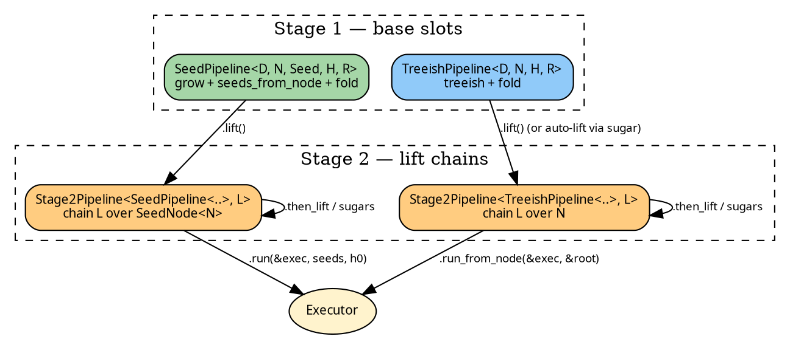

# Pipeline transformability

This chapter explains how pipelines and Stage-2 pipelines compose,
why the seed-rooted Stage-2 form has its own sugar surface even
though it shares the `Stage2Pipeline<Base, L>` type, and how the
transformation layers fit together.

The core mechanics are in scope for every user; the two
appendices at the end are flagged **interested user only** and
cover the hard design problems that were worked through to arrive
at the current shape. Most readers can stop at [The two stages
at a glance](#the-two-stages-at-a-glance).

## The two stages at a glance

A pipeline has a **Stage 1** (base slots — coalgebraic form) and
a **Stage 2** (stacked lifts — algebraic transformation form). A
`.lift()` call moves a pipeline from Stage 1 to Stage 2.



Two transformation vocabularies:

- **Stage 1 (reshape):** rewrites base slots in place. A
  `SeedPipeline`'s `.filter_seeds`, `.wrap_grow`, `.map_node_bi`,
  `.map_seed_bi` all produce another `SeedPipeline` of (possibly
  different) type parameters. Cheap; no lift chain involved.

- **Stage 2 (lift-chain compose):** appends a library lift to the
  chain. `.wrap_init`, `.zipmap`, `.map_r_bi`, `.map_n_bi`,
  `.filter_edges`, `.memoize_by`, `.explain`, `.wrap_accumulate`,
  `.wrap_finalize` — each one delegates internally to
  `then_lift(Domain::xxx_lift(...))`.

The same sugar name may appear at both stages with different
semantics. `map_node_bi` at Stage 1 is a reshape (new Stage-1
pipeline); `map_n_bi` at Stage 2 composes a `ShapeLift` onto the
chain. Distinct names make the stage unambiguous at the call
site.

## The Lift trait — the single transformation primitive

Every Stage-2 sugar ultimately builds a value implementing
`Lift<D, N, H, R>`:

```rust
{{#include ../../../../hylic/src/ops/lift/core.rs:lift_trait}}
```

A `Lift` takes a `(treeish, fold)` pair over `(N, H, R)` and
produces another over `(N2, MapH, MapR)`. The library ships four
atoms:

- **`IdentityLift`** — pass-through; the seed of every chain.
- **`ComposedLift<L1, L2>`** — sequential composition, `L1`'s
  outputs feeding `L2`'s inputs.
- **`ShapeLift`** — the universal store-three-xforms lift that
  every library sugar instantiates (one per axis: treeish, fold,
  plus N-type).
- **`SeedLift`** — the finishing lift that closes the seed axis
  (assembled at run time; not user-constructed in the common
  path).

A chain is a right-associated tree of `ComposedLift` values
rooted at `IdentityLift`; every `.then_lift(L)` or sugar call
wraps the current tip in `ComposedLift<current, L>`. Each lift
specifies how it rewrites the pair via its `apply` method, which
uses [CPS](#appendix-b--typing-hard-problems) so the caller's
continuation-return type threads through composition.

See [Lifts — cross-axis transforms](../concepts/lifts.md) for the
full catalogue and the atom-level reference.

## One Stage-2 type, two Base configurations

Stage 2 has a single pipeline type — `Stage2Pipeline<Base, L>` —
but its sugar surface bifurcates by Base because the chain `L`
operates over a different node type in each configuration.

### Treeish-rooted: `Stage2Pipeline<TreeishPipeline<…>, L>`

When the base is a `TreeishPipeline` (or another treeish-rooted
`Stage2Pipeline` being extended), the chain `L: Lift<D, N, H, R>`
operates over the base's `N` directly. All sugars come from the
blanket trait `LiftedSugarsShared` / `LiftedSugarsLocal`.

### Seed-rooted: `Stage2Pipeline<SeedPipeline<…>, L>`

When the base is a `SeedPipeline`, `SeedLift` is assembled at
`.run()` time from the base's `grow` plus the caller-supplied
`root_seeds` and `entry_heap`, and composed as the **first** lift
in the run-time chain. `SeedLift`'s output node type is
`SeedNode<N>`, so every lift in the stored chain `L` must be
typed at `SeedNode<N>` — not `N`. The chain-bound difference
prevents the trait-based blanket sugars from covering this
configuration uniformly; each Stage-2 sugar on the seed-rooted
form is therefore an inherent method.

Sugars hide the variant dispatch. User closures are written over
base `N`; internally each sugar wraps the user's closure to
dispatch on `SeedNode::EntryRoot` / `SeedNode::Node(n)`. See
[Stage 1 — SeedPipeline](../pipeline/seed.md) for the
user-facing semantics of each variant dispatch (EntryRoot passes
through `wrap_init`, `filter_edges` always admits EntryRoot, etc.).

The seed-pipeline-unification (one cycle ago) collapsed the
historical two struct types `LiftedPipeline` and
`LiftedSeedPipeline` into the single `Stage2Pipeline<Base, L>`.
The two old names remain as deprecated type aliases.

## Run composition: how `.run()` actually produces a result

For a treeish-rooted `Stage2Pipeline<TreeishPipeline<…>, L>`:

```
1. Base = TreeishPipeline: yield (treeish, fold) over (N, H, R).
2. Chain L applied: (treeish, fold) over (N, H, R)
                  → (treeish', fold') over (N2, MapH, MapR).
3. Executor: run(&fold', &treeish', &root) → MapR.
```

For a seed-rooted `Stage2Pipeline<SeedPipeline<…>, L>`:

```
1. Base = SeedPipeline: hold (grow, seeds_from_node, fold) over (N, Seed, H, R).
   At .run time the user adds (root_seeds, entry_heap: H).

2. Fuse: treeish_base = seeds_from_node.map(grow)   — over N.

3. SeedLift::apply (the first, innermost lift):
   (treeish_base, fold_base) over (N, H, R)
   → (treeish_lifted, fold_lifted) over (SeedNode<N>, H, R).

4. Chain L applied: (treeish_lifted, fold_lifted) over (SeedNode<N>, H, R)
                  → (treeish', fold') over (SeedNode<N2>, MapH, MapR).

5. Executor: run(&fold', &treeish', &SeedNode::entry_root()) → MapR.
```

The critical design point in step 3 is that `SeedLift` is applied
**inside** the chain, not as an outer wrap. That's what lets the
user chain `L` transform the fold and treeish in ways that would
otherwise depend on the seed-closing step having already
happened. See [Appendix A](#appendix-a--interested-user-only---seed-pipeline-lifting-and-run-composition)
for the history of this choice.

## Transformation variance at a glance

Each axis in the `(N, H, R)` triple has a distinct variance:

| Axis | Role in fold                    | Variance                                  | Sugar            |
|------|---------------------------------|-------------------------------------------|------------------|
| N    | `init(&N) → H` (contra)         | invariant (used in both fold and graph)   | `map_node_bi` (S1) / `map_n_bi` (S2) — bijection required |
| H    | `&mut H` (internal)             | invariant (never crosses node boundaries) | `wrap_init`, `wrap_accumulate`, `wrap_finalize` |
| R    | `finalize(&H) → R`; `&R` in acc | invariant (appears in and out)            | `zipmap`, `map_r_bi` |

Invariance on all three is why every N- and R-change sugar
requires both a forward and a backward closure. See
[Transforms and variance](../concepts/transforms.md) for the
categorical picture.

## Where the abstractions stop

Two deliberate asymmetries exist in the current surface:

1. **Auto-lift on `TreeishPipeline` but not on `SeedPipeline`.**
   `tp.wrap_init(w)` works directly; `sp.wrap_init(w)` is a
   compile error — write `sp.lift().wrap_init(w)` explicitly.
   Reason: the chain-bound mismatch between treeish-rooted and
   seed-rooted Stage-2 forms (chain over `N` versus chain over
   `SeedNode<N>`) prevents a single blanket sugar trait covering
   both.

2. **Parallel inherent-methods surface on the seed-rooted form.**
   `Stage2Pipeline<SeedPipeline<…>, L>`'s Stage-2 sugars are not
   shared with `LiftedSugarsShared/Local`; each is written once
   per domain as an inherent method. Mechanical duplication;
   accepted because collapsing would require trait-level
   parameters that Rust cannot express without macros, and the
   library declines macros.

---

## Appendix A — interested user only: seed pipeline, lifting, and run composition

This section is intentionally deeper than the preceding narrative
and is safe to skip. It exists for readers who want to know why
the current shape is as it is.

### The problem the SeedPipeline solves

A hylomorphism fuses a coalgebra (`N → children`) with an
algebra (`children → result`). In practice the dependency graph
often speaks a **different type** than the algebra: module paths,
URLs, database keys — a `Seed` that must be `grow`n to an `N`
before the algebra can inspect it. A `SeedPipeline` carries the
triple `(grow: Seed → N, seeds_from_node: N → Seed*, fold: N → H → R)`
and fuses seed-axis and node-axis into one treeish at run time.

The fusion is:

```
seeds_from_node:  N → Seed*            via Edgy<N, Seed>
    .map(grow):   Seed → N            via the domain's grow xform
=>  treeish:      N → N*               via Edgy<N, N> ≡ Treeish<N>
```

The result is a `Treeish<N>` that the executor can walk. But
before walking, execution needs a **root**. The user supplies
entry seeds (`root_seeds: Edgy<(), Seed>`) and an initial heap
(`entry_heap: H`); these must be turned into (a) a starting node
the executor can descend from, and (b) a top-level accumulation
protocol for the children's results.

### The EntryRoot-as-node compromise

The executor's `run` method takes a single root: `run(fold,
treeish, &N) → R`. To handle a **forest** of entry seeds under a
single-root executor, the library invents a synthetic root row:

```rust
{{#include ../../../../hylic/src/ops/lift/seed_node.rs:seed_node_enum}}
```

`SeedLift` wraps the treeish so that:
- `SeedNode::EntryRoot.visit` fans out to `SeedNode::Node(grow(s))` for each entry seed.
- `SeedNode::Node(n).visit` delegates to the base treeish.

And wraps the fold so that:
- `init(SeedNode::EntryRoot) = entry_heap_fn()` — returns the user's `entry_heap`.
- `init(SeedNode::Node(n)) = base.init(n)`.
- `accumulate` / `finalize` are uniform.

The executor then begins at `&SeedNode::entry_root()` and walks
normally. At the value level the EntryRoot row participates in
the fold like any other node — it receives children's R via
`accumulate`, has its own `finalize`, and produces the final R.

This is a **compromise**, not the most principled shape: a
native-forest executor (one that accepts `run_forest(fold,
treeish, roots: &[N], initial_heap: H) → R` directly) would
eliminate `SeedNode<N>` entirely from the chain's node type and
strip the leak from user-visible result types. The refactor
cost is significant (touches the `Executor` trait, every
executor impl, and the accumulation protocol) and was deferred.
See [Sealed SeedNode](../pipeline/seed.md#sealed-seednode) for
how the current shape is sealed at the user surface.

### Why SeedLift is composed first (not last)

The library considered two architectures for where `SeedLift`
sits relative to the stored user chain `L`.

**Option A (rejected).** `SeedLift` as the **outermost** lift,
wrapped around the user's chain. The user's chain operates over
plain `N`; `SeedLift` wraps the result to introduce
`SeedNode<N>` at the outside.

Under this arrangement, N-changing lifts inside the user's chain
would produce an `N2` that needs to be re-introduced as the
inner node type that `SeedLift`'s grow-output is wrapped as.
Because the Lift trait cannot, in general, surface both a
forward and backward map over N (variance is already invariant
on N), Option A would force `L::N2 = Base::N` — the chain could
not change N. For N-change to work on the seed path, this
invariance had to be broken.

**Option B (shipped).** `SeedLift` as the **innermost** lift,
composed first at run time. The user's chain operates over
`SeedNode<N>` from `.lift()` onward. N-changing lifts inside
the chain change `SeedNode<N>` → `SeedNode<N2>`, which is
natural — the chain sees EntryRoot as part of the structure and
any N-transform that preserves EntryRoot works.

The cost Option B pays is the `SeedNode<N>` leak into
chain-tip types (visible in `ExplainerResult<SeedNode<N>, H,
R>`). That cost is bounded: the sugar layer hides the variant in
user closures (EntryRoot is auto-routed), and
`SeedExplainerResult` (via `From`) projects the trace to N-typed
when the user wants a sealed view.

### Why SeedLift is assembled at run time, not at `.lift()`

`SeedLift` needs three ingredients: `grow` (from the base),
`root_seeds` (from the caller of `.run`), and `entry_heap`
(from the caller of `.run`). Only the first is available at
`.lift()` time. The library has two places to put the
`root_seeds` and `entry_heap`:

(a) as parameters to `.lift()`, turning it into a real
   constructor — which then requires knowing the entry data
   before any Stage-2 sugars are composed.

(b) as parameters to `.run()`, letting Stage-2 chains be
   composed and reused across different `(seeds, h0)` inputs.

The library chose (b): a seed-rooted `Stage2Pipeline` is a
reusable computation; seeds + initial heap vary per call. This
lets patterns like:

```text
let lsp = pipe.lift().wrap_init(w).zipmap(m);
let r1 = lsp.run_from_slice(&exec, &seeds1, h0);
let r2 = lsp.run_from_slice(&exec, &seeds2, h0);
```

work without reconstructing the chain.

### The default semantics of EntryRoot-dispatch in sugars

Each user-closure sugar on the seed-rooted `Stage2Pipeline` makes a
per-sugar decision about EntryRoot:

| Sugar                | EntryRoot behaviour                                                |
|----------------------|--------------------------------------------------------------------|
| `wrap_init(w)`       | EntryRoot bypasses `w`; original init (returns `entry_heap`) runs  |
| `wrap_accumulate(w)` | applied uniformly (no N-signature to dispatch on)                  |
| `wrap_finalize(w)`   | applied uniformly                                                  |
| `filter_edges(p)`    | EntryRoot always admits its children; `p(&CurN)` applied to Nodes  |
| `memoize_by(k)`      | EntryRoot uncached (keyed `None`); Nodes keyed `Some(k(n))`        |
| `zipmap(m)` / `map_r_bi`(fwd,bwd) | applied uniformly                                     |
| `map_n_bi(co, contra)` | EntryRoot → EntryRoot; Node(n) ↔ Node(f(n))                      |
| `explain()`          | EntryRoot is a fold row with its own trace                         |

Users who need different defaults — e.g., `filter_edges` that
excludes EntryRoot's fan-out — use
`.then_lift(Domain::xxx_lift::<SeedNode<CurN>, …>(pred))`
directly. The sugars hide the common case; the raw surface
remains available for specialisation.

---

## Appendix B — interested user only: the typing front

### Why `Lift::apply` uses CPS

A direct `apply` signature would return the transformed pair
`(Graph<D, N2>, Fold<D, N2, H2, R2>)`. Composition stacks these
returns:

```
fn apply(self) -> (Graph<D, N_k>, Fold<D, N_k, H_k, R_k>)
```

After three chained lifts, `N_k`, `H_k`, `R_k` are all
associated types of a `ComposedLift<ComposedLift<ComposedLift<…>,
…>, …>`. No single named alias exists for the final return type
before the whole chain is constructed, and Rust's inference
cannot thread the unnamed types through composition.

The CPS form threads the caller's `T` outward:

```rust
fn apply<T>(
    &self,
    treeish: Graph<D, N>,
    fold:    Fold<D, N, H, R>,
    cont: impl FnOnce(Graph<D, N2>, Fold<D, N2, H2, R2>) -> T,
) -> T;
```

Whatever type the caller's closure produces at the innermost
`apply` (usually the executor's `MapR`) flows back through every
enclosing `apply` call. Rust infers the intermediate pair types
at each junction without needing a named alias.

### GAT normalisation helpers

The `Domain<N>` trait exposes three GATs:

```rust
type Fold<H, R>;
type Graph<E>;
type Grow<Seed, NOut>;
```

For `Shared`: `Grow<Seed, N> = Arc<dyn Fn(&Seed) -> N + Send +
Sync>`. For `Local`: `Grow<Seed, N> = Rc<dyn Fn(&Seed) -> N>`.

Inside a **generic impl body** parameterised over some other
type (say `N`), Rust's trait solver **does not reduce**
`<Shared as Domain<N>>::Grow<Seed, N>` to `Arc<dyn Fn…>`. The
types compare equal by definition, but the solver doesn't do the
reduction unless `Self = Shared` is pinned in the enclosing
scope.

The library works around this via **free helper functions** that
pin the domain:

```rust
fn shared_grow_as_arc<Seed, NOut>(
    g: <Shared as Domain<NOut>>::Grow<Seed, NOut>,
) -> Arc<dyn Fn(&Seed) -> NOut + Send + Sync> { g }
```

Inside this function's body, `Self = Shared` is the only option
and the GAT normalises. The function is a no-op at runtime (the
same value, type-coerced in), but makes the type checker happy
in a context that was about to timeout.

`lifted_seed/gat_helpers.rs` collects six such helpers for
Shared and six more for Local. Every crossing of the generic-impl
boundary uses one. Not elegant; necessary until Rust's GAT
normalisation improves.

### The trait-twin Shared/Local pattern

Every sugar file has a `_shared.rs` and a `_local.rs` version.
Bodies are line-for-line identical; only `Arc` vs `Rc`, `Send +
Sync` vs nothing differ. A macro could collapse these; the
library has
[declined](../../../../hylic/KB/.plans/finishing-up/post-split-review/ACCEPTED-DEBT.md)
to adopt macros, preferring readable duplicate files.

The same pattern repeats for the seed-rooted Stage-2 form: the
chain-bound mismatch with `LiftedSugarsShared/Local` forces a
separate inherent-method surface, and that surface has its own
`sugars_shared.rs` + `sugars_local.rs` pair.

### Why `SeedNode<N>` cannot be fully hidden in chain-tip types

`Lift`'s associated type `N2` is the chain's output node type,
which appears in every type parameter of every chain-tip result
the user sees. On the seed path, `SeedLift` sets `N2 =
SeedNode<N>`; any later lift that preserves N preserves
`SeedNode<N>`; any later lift that changes N via `map_n_bi`
produces `SeedNode<N2>`. Concretely: `ExplainerResult`'s first
type parameter — the per-node "heap.node" field — ends up being
`SeedNode<N>`.

Hiding this would require either:

1. **A projection pre-baked into each lift's output** (each lift
   carries a "strip SeedNode" step). This would require the
   library to know at composition time whether the input was a
   SeedPipeline — a structural property the `Lift` trait
   doesn't expose.

2. **A seal at the value-variant level** (SeedNode's variants
   become non-matchable). The current design does this: variants
   are `pub(crate)`, user code inspects via `is_entry_root`,
   `as_node`, `map_node`. The type name still appears in
   chain-tip result types, but the enum-nature is sealed.

The library ships (2) plus a projection helper
(`SeedExplainerResult::from`) for users who want the type-name
seal on the explainer result. (1) would be cleaner but requires
trait-level machinery that's not currently on the roadmap.

### Why the seed-rooted sugar catalogue is inherent, not trait-based

Given the chain-bound mismatch (`Lift<D, SeedNode<N>, H, R>`
versus `Lift<D, N, H, R>`), a single trait `LiftedSugars<N, H,
R>` cannot cover both Stage-2 configurations uniformly. Options
considered:

- **Generalise the trait** over the chain's "effective N type"
  with some associated-type-level bridging (the chain's N-slot
  may or may not equal the user-visible N). Possible in
  principle; requires trait-level type-level functions that
  Rust doesn't have. A ground-up redesign.

- **Use two traits** with identical signatures. Possible, but
  dispatch becomes ambiguous at the callsite when a type is in
  both traits' impl domain.

- **Duplicate as inherent** (shipped). The catalogue is written
  once on `Stage2Pipeline<SeedPipeline<Shared, …>, L>` (plus its
  Local twin). Imports become simpler — no extra trait in scope
  — at the cost of ~200 LOC of inherent methods per domain that
  mirror the trait. Ergonomic wins, maintenance cost accepted.

### Summary of accepted debts on the typing front

1. CPS `apply` signature — avoidable in Haskell/Scala; mandated
   by Rust's lack of type-level first-class tuple inference.
2. GAT normalisation helpers — six Shared, six Local; zero-cost
   at runtime, real cognitive cost; awaiting better GAT
   normalisation in rustc.
3. Shared/Local duplication — every sugar trait has two mirror
   files; macros could collapse; refused.
4. Seed-rooted Stage-2 inherent-method catalogue — parallel to
   `LiftedSugarsShared/Local`; necessary because the chain-bound
   differs; could be unified by a trait-level redesign that
   Rust's type system doesn't currently admit cleanly.
5. `SeedNode<N>` sealed but not eliminated from chain-tip types
   — elimination requires native forest execution, a deferred
   `Executor`-trait refactor.

Each debt has a clear architectural "out" that would require
either a Rust language feature (GATs normalising, HKT-ish trait
parameters) or a significant library refactor (native forest
execution, macro-based collapse). The current shape is the
principled minimum the library can ship without those.
