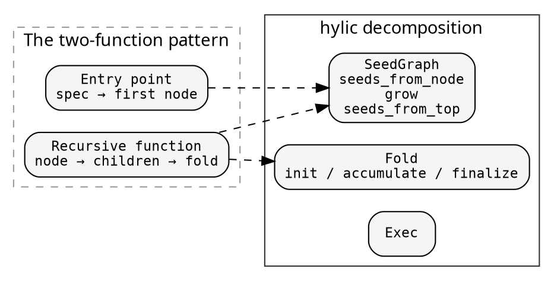

# The two-function problem

Most recursive algorithms in practice look like this:

```rust
fn resolve(spec: &str) -> Resolution {
    let root = find_module(spec);
    resolve_recursive(&root)
}

fn resolve_recursive(module: &Module) -> Resolution {
    let children: Vec<Resolution> = module.deps.iter()
        .map(|dep| {
            let child = lookup(dep);
            resolve_recursive(&child)
        })
        .collect();
    Resolution { module, children }
}
```

The entry point has different inputs (a spec string) than the
recursive function (a module). They share the fold logic but
differ in how they produce the first node.

As the algorithm grows, concerns tangle:
- Error handling appears in both functions
- Logging/caching gets woven into the recursive function
- The fold logic is duplicated or threaded through parameters
- Testing either function in isolation is difficult

## How hylic decomposes it

The two functions map onto independent pieces:



**SeedGraph** captures the unfolding:
- `seeds_from_node`: what are a node's dependency seeds?
- `grow`: how does a seed become a node?
- `seeds_from_top`: how does the entry point produce initial seeds?

From these three, `make_graph()` constructs a `Graph<Top, Node>`.
The entry point's special handling is encoded in `seeds_from_top`,
not in a separate function.

**Fold** captures what to compute — defined once, independently of
how the tree is constructed.

**GraphWithFold** wires graph + fold + a top-level heap initializer
into a runnable pipeline. `run(exec, top)` executes the hylomorphism.

## What changes when you add concerns

| Concern | Two-function pattern | hylic |
|---------|---------------------|-------|
| Error handling | Modify both functions | `seeds_for_fallible` makes errors into leaves; fold handles both |
| Logging | Add logging to the recursive function | `fold.map_init(add_logging)` — one transformation |
| Caching | Add a cache to the recursive function | `memoize_treeish_by(graph, key_fn)` — wrap the graph |
| Parallelism | Rewrite with async/threads | `Exec::rayon()` — same fold, same graph |
| Testing | Test both functions, mock dependencies | Test fold and graph independently |

Each concern is a transformation on one piece. The others are
untouched.

## The module resolution cookbook entry

The [module resolution example](../cookbook/module_resolution.md)
implements exactly this: a registry of modules, a SeedGraph that
looks up dependencies (using `seeds_for_fallible` for error handling),
a Fold that collects resolved names and errors, wired through
`GraphWithFold`.
