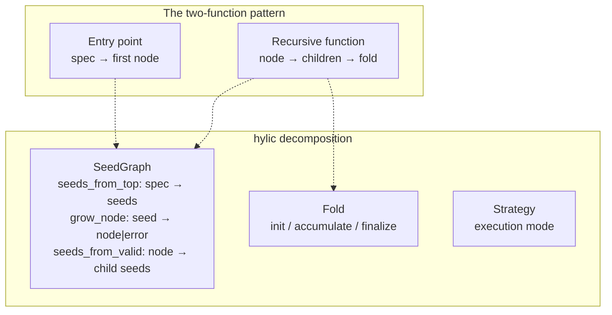

# The two-function problem

Most recursive algorithms in practice look like this:

```rust
// Entry point: knows the starting context
fn resolve(spec: &str) -> Resolution {
    let root = find_module(spec);      // seed-specific
    resolve_recursive(&root)           // hand off
}

// Recursive part: knows the tree structure
fn resolve_recursive(module: &Module) -> Resolution {
    let children: Vec<Resolution> = module.deps.iter()
        .map(|dep| {
            let child = lookup(dep);   // grow: dep name → module
            resolve_recursive(&child)  // recurse
        })
        .collect();
    Resolution { module, children }    // fold
}
```

The entry point has different inputs (a spec string) than the
recursive function (a module). They share the fold logic but
differ in how they produce the first node.

As the algorithm grows, concerns tangle:
- Error handling appears in both functions
- Logging/caching gets woven into the recursive function
- The fold logic is duplicated or threaded through parameters
- Testing either function in isolation is difficult

## How hylic decomposes it



**SeedGraph** captures the "entry point differs from recursion" pattern:
- `seeds_from_top`: how does the top-level spec produce initial seeds?
- `grow_node`: how does a seed become a resolved node (or fail)?
- `seeds_from_valid`: what are a resolved node's dependency seeds?

From these three, hylic constructs a `Treeish` — the standard
`node → children` function that the core mechanisms work with.
The entry point's special handling is encoded in `seeds_from_top`,
not in a separate function.

**Fold** captures the "what to compute" part — the fold logic that
was shared between both functions. Define it once, independently
of how the tree is constructed.

**Strategy** runs them together. `SeedFoldAdapter` wires `SeedGraph`
with `Fold` and provides `run_top(strategy, &spec)`.

## What changes when you add concerns

| Concern | Two-function pattern | hylic |
|---------|---------------------|-------|
| Error handling | Modify both functions | Errors are just `Either::Left` nodes in the graph — they have no children, the fold handles them |
| Logging | Add logging to the recursive function | `fold.map_init(add_logging)` — one transformation |
| Caching | Add a cache to the recursive function | `memoize_treeish(graph)` — wrap the graph, fold unchanged |
| Parallelism | Rewrite with async/threads | `Strategy::ParTraverse` — same fold, same graph |
| Testing | Test both functions, mock dependencies | Test fold and graph independently, compose for integration |

Each concern is a transformation on one piece. The others are
untouched.

## The module resolution cookbook entry

The [module resolution example](../cookbook/module_resolution.md)
implements exactly this decomposition: a `Registry` of modules,
a `SeedGraph` that looks up dependencies, a `Fold` that collects
resolved names and errors, wired through `SeedFoldAdapter`.
