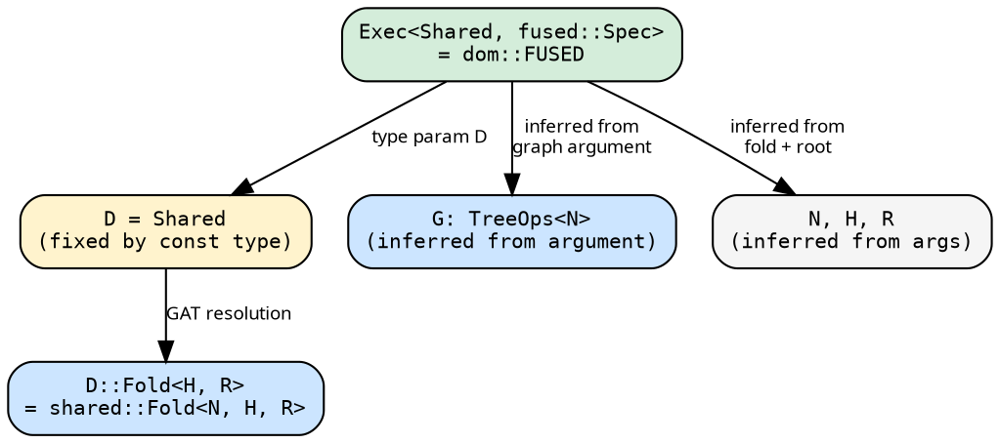
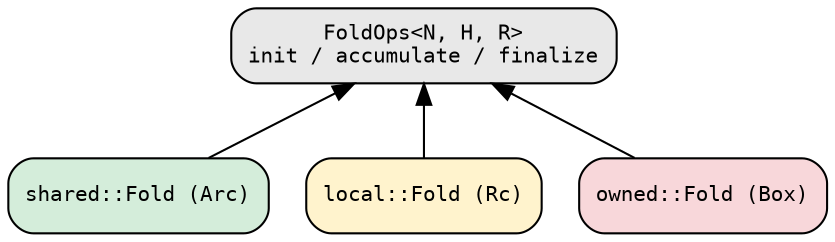

# Domain integration

The domain system lets executors accept folds without knowing their
concrete storage. The `Domain` trait maps a marker type to a concrete
`Fold` type via a GAT. The graph type is a separate concern — the
`Executor` trait accepts any `G: TreeOps<N>`, with per-executor
bounds checked at the call site.

## The Domain trait

The Domain trait provides a single associated type — the fold:

```rust
{{#include ../../../../hylic/src/domain/mod.rs:domain_trait}}
```

Each domain marker (`Shared`, `Local`, `Owned`) implements this
trait with a different closure boxing strategy:

| Domain | `Fold<H, R>` storage | Send+Sync |
|--------|---------------------|-----------|
| **Shared** | `Arc<dyn Fn + Send + Sync>` | yes |
| **Local** | `Rc<dyn Fn>` | no |
| **Owned** | `Box<dyn Fn>` | no |

Graph types are domain-independent. `Treeish<N>` and `Edgy<N, E>`
in `hylic::graph` are always Arc-based (they need Clone for graph
composition). Any type implementing `TreeOps<N>` can serve as a
graph, including user-defined structs with no boxing at all.

## The Executor trait

The executor trait has four type parameters: `N` (node), `R`
(result), `D` (domain), and `G` (graph):

```rust
{{#include ../../../../hylic/src/exec/mod.rs:executor_trait}}
```

The domain `D` determines the fold type (`D::Fold<H, R>`). The graph
type `G` is constrained per executor implementation. This separation
means the fold's boxing strategy and the graph's storage are
independent choices.

The type resolution at a call site proceeds as follows:



The compiler checks that `G` satisfies the executor's requirements.
For Fused, any `TreeOps<N>` suffices. For Funnel, `G` must also be
`Send + Sync` (the graph reference is shared across a scoped pool).
If the graph type does not satisfy the executor's bounds, the call
site produces a compile error.

## Why D is on the executor, not the fold

`Fold<N, H, R>` carries no domain parameter — the domain lives on
the executor: `Exec<D, S>`. This resolves a type inference problem:
GATs are not injective (`D::Fold<H, R>` does not uniquely identify
`D`), so the compiler cannot infer `D` from a fold argument alone.
With `D` fixed by the executor constant or `exec()` call, everything
resolves statically.

## Domain compatibility

| | Shared | Local | Owned |
|---|:---:|:---:|:---:|
| **Fused** | yes | yes | yes |
| **Funnel** | yes | — | — |

Fused supports all domains because it borrows both fold and graph
on a single thread. Funnel requires `N: Clone + Send` and `R: Send`
on the fold's types, which the Shared domain satisfies. The graph
must additionally be `Send + Sync`.

## The FoldOps trait

Executors do not call fold methods through the concrete domain type.
They operate through the `FoldOps<N, H, R>` trait, which all domain
Fold types implement:



The executor's recursion engine takes `&impl FoldOps<N, H, R>` —
fully monomorphized for the concrete fold type, with no runtime
dispatch beyond the closure's own vtable.
