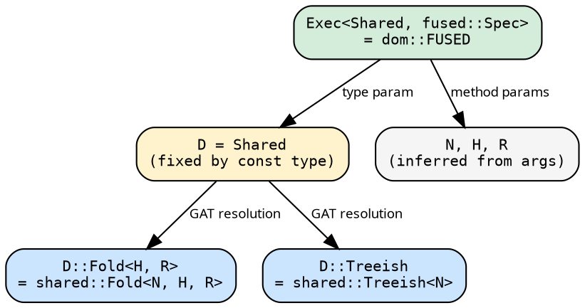
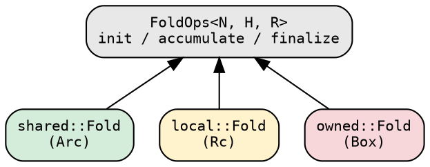

# Domain Integration

The domain system lets executors accept folds and graphs without
knowing their concrete storage (Arc, Rc, Box). The `Domain` trait
maps a marker type to concrete `Fold` and `Treeish` types via GATs.
The executor is parameterized by the domain — the compiler resolves
everything statically.

## The Domain trait

```rust
{{#include ../../../../hylic/src/domain/mod.rs:domain_trait}}
```

Each domain marker (`Shared`, `Local`, `Owned`) implements this
trait, providing concrete types:

| Domain | `Fold<H, R>` storage | `Treeish` storage | Send+Sync |
|---|---|---|---|
| **Shared** | `Arc<dyn Fn + Send + Sync>` | `Arc<dyn Fn + Send + Sync>` | yes |
| **Local** | `Rc<dyn Fn>` | `Rc<dyn Fn>` | no |
| **Owned** | `Box<dyn Fn>` | `Box<dyn Fn>` | no |

## Why D is on the executor, not the fold

`Fold<N, H, R>` and `Treeish<N>` have no domain parameter. The
domain marker lives on the executor: `Exec<D, S>`.

This solves a type inference problem. If the domain were on the fold,
the compiler couldn't determine `D` from the argument types — GATs
are not injective (`D::Fold<H, R>` doesn't uniquely identify `D`).
With `D` on the executor, each const (`dom::FUSED`) has exactly one
`D`, and the compiler resolves everything from the const's type.



## Domain modules as entry points

Each domain has its own module that re-exports constructors:

```rust
use hylic::domain::shared as dom;   // the standard choice
// dom::fold(init, acc, fin)
// dom::treeish(|n| n.children.clone())
// dom::FUSED.run(&fold, &graph, &root)
```

Implementation modules (`fold/`, `graph/`) are `pub(crate)`. Users
access types and constructors exclusively through domain modules.

## FoldOps and TreeOps

The operations traits sit above all domains:



Any type implementing `init`/`accumulate`/`finalize` is a fold. The
executor's recursion engine takes `&impl FoldOps<N, H, R>` — fully
generic, monomorphized to zero overhead for concrete types.

## Domain support

| | Shared | Local | Owned |
|---|:---:|:---:|:---:|
| **Fused** | yes | yes | yes |
| **Funnel** | yes | — | — |

Fused supports all domains (it borrows, never clones). Funnel
requires `N: Clone + Send, R: Send` — the Shared domain provides
these. `R: Clone` is NOT required — the funnel uses destructive
slot reads during accumulation. Supporting Local/Owned for Funnel
would require the same `SyncRef` pattern used by the Pool executor
(see [Implementation notes](../design/implementation_notes.md)).
