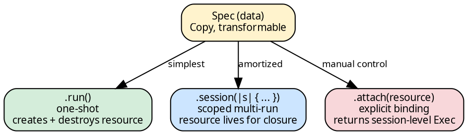
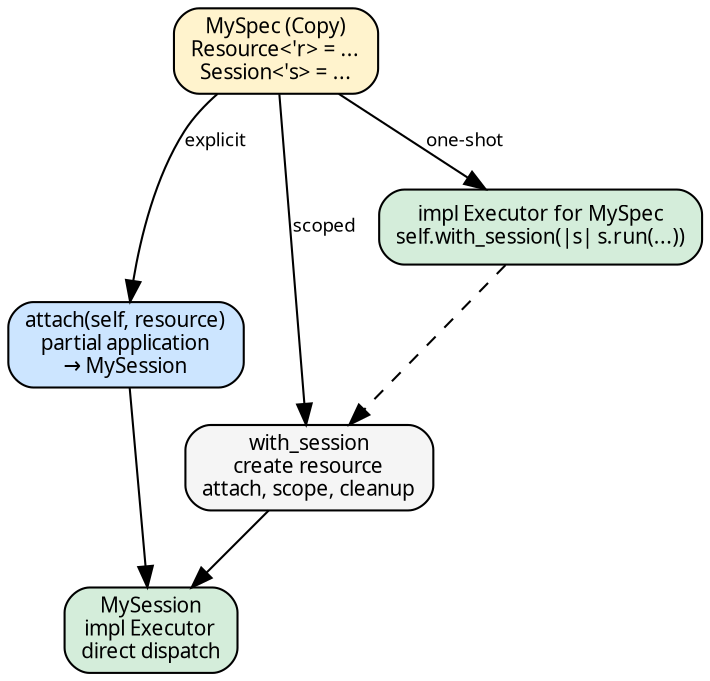

# The Exec Pattern

Every executor in hylic has the same type-level structure. Two
traits — `Executor` (computation) and `ExecutorSpec` (lifecycle) —
and one wrapper — `Exec<D, S>` — compose into a uniform API where
every executor, regardless of whether it needs resources, presents
the same interface to the user.

## The core idea

A **Spec** is a defunctionalized executor — pure data that fully
describes a computation strategy. It is `Copy`: small, moveable,
transformable. Calling `.run()` on a Spec refunctionalizes it: turns
the data back into computation.

For executors that need resources (thread pools, arenas), `.run()`
internally creates the resource, binds it, runs the fold, and
destroys the resource. For executors that need nothing (Fused), the
same `.run()` just runs.

```rust
use hylic::domain::shared as dom;
use hylic::cata::exec::funnel;

// Sequential — no resource needed:
dom::FUSED.run(&fold, &graph, &root);

// Parallel — resource created + destroyed internally:
dom::exec(funnel::Spec::default(8)).run(&fold, &graph, &root);
```

Same shape. Same method. The resource management is an internal
concern of each executor.

## The trait pair

```rust
{{#include ../../../../hylic/src/cata/exec/mod.rs:executor_spec}}
```

`ExecutorSpec` is the lifecycle trait. Two GATs define each executor's
world:

- **`Resource<'r>`**: what the executor needs. A thread pool
  (`&'r Pool`) for Funnel. `()` for Fused.
- **`Session<'s>`**: the bound executor — Spec + resource, ready to
  run folds. Borrows the resource at lifetime `'s`.

Two methods connect them:

- **`attach(self, resource)`**: partial application. Consumes the
  Spec (it's Copy — the caller keeps their copy), fixes the
  resource, produces a Session. This is the explicit path.
- **`with_session(&self, f)`**: the scoped path. Creates the
  resource internally, attaches, calls `f` with the session, cleans
  up. Copies the Spec (since `attach` consumes and
  `with_session` borrows `&self`).

```rust
{{#include ../../../../hylic/src/cata/exec/mod.rs:executor_trait}}
```

`Executor` is the computation trait. Both Specs and Sessions
implement it:

- **Spec::run**: routes through `self.with_session(|s| s.run(...))`
  — creates the resource, runs, destroys
- **Session::run**: direct dispatch — the resource is already bound

## `Exec<D, S>`

```rust
{{#include ../../../../hylic/src/cata/exec/mod.rs:exec_struct}}
```

The user-facing wrapper. `D` is the domain (determines fold/graph
types via GATs). `S` is the strategy — a Spec or a Session.
`Exec` is `repr(transparent)` over `S` and derives `Copy` when
`S` is `Copy`.

Two method blocks:

```rust
{{#include ../../../../hylic/src/cata/exec/mod.rs:inherent_run}}
```

**Block A** (`.run()`): available on ALL `Exec` where `S: Executor`.
This is the one way to execute. Works on Specs and Sessions alike.

```rust
{{#include ../../../../hylic/src/cata/exec/mod.rs:exec_session}}
```

**Block B** (`.session()`, `.attach()`): available only on Spec-level
`Exec` where `S: ExecutorSpec`. These are the resource-management
surface:

- **`.session(|s| ...)`**: borrows the Spec, creates the resource
  in a scope, passes the session-level `Exec` to the closure.
  Multiple `.run()` calls inside share the resource.
- **`.attach(resource)`**: consumes the Spec (partial application),
  returns a session-level `Exec` bound to the resource. One
  expression — no intermediate bindings needed because Specs are
  Copy.

## The three usage tiers

Executors can be used at three levels of resource control:



**One-shot** — the common case. Each `.run()` manages resources
internally:

```rust
dom::exec(funnel::Spec::default(8)).run(&fold, &graph, &root);
```

**Session scope** — amortized multi-run. The resource (thread pool)
is created once, shared across folds:

```rust
dom::exec(funnel::Spec::default(8)).session(|s| {
    s.run(&fold1, &graph1, &root1);
    s.run(&fold2, &graph2, &root2);
});
```

**Explicit attach** — manual resource management. You provide the
resource; the Spec binds to it:

```rust
funnel::Pool::with(8, |pool| {
    dom::exec(funnel::Spec::default(8)).attach(pool).run(&fold, &graph, &root);
});
```

For zero-resource executors (Fused), all three tiers compile but
`.session()` and `.attach(())` are identity — the compiler optimizes
them away.

## The impl table

Every executor fills the same shape:

| Type | `Resource` | `Session` | `Executor::run` |
|---|---|---|---|
| `fused::Spec` | `()` | `Self` | direct recursion |
| `funnel::Spec<P>` | `&Pool` | `Session<P>` | routes through `with_session` |
| `funnel::Session` | — | — | direct `dispatch::run_fold` |

Sessions do NOT implement `ExecutorSpec` — they're the output of
`attach`, not a Spec themselves.

## Domain constants

Fused is a zero-sized Spec exposed as a domain-bound const:

```rust
pub const FUSED: Exec<Shared, fused::Spec> = Exec::new(fused::Spec);
```

`FUSED` is `Copy`. `.run()` calls `Executor::run` on `fused::Spec`
directly (it implements both traits). No resource, no session — the
Spec IS the session.

## Generic-over-executor code

The `Executor` trait is the single generic bound:

```rust
fn measure<S: Executor<NodeId, u64, Shared>>(
    exec: &Exec<Shared, S>, fold: &..., graph: &..., root: &NodeId,
) -> u64 {
    exec.run(fold, graph, root)
}
```

This works for `Exec<Shared, fused::Spec>`, `Exec<Shared, funnel::Spec<P>>`,
and `Exec<Shared, funnel::Session<'_, P>>` — all through the same
bound, the same `.run()`, the same call site.

## How a new executor fits in

Adding a new executor requires implementing two traits:



1. Define `MySpec` (Copy) and `MySession<'s>`
2. Implement `ExecutorSpec` on `MySpec` — define `Resource`, `Session`,
   `attach`, `with_session`
3. Implement `Executor` on `MySession` — the direct dispatch
4. Implement `Executor` on `MySpec` — route through `with_session`
5. Users: `dom::exec(MySpec { ... }).run(...)` — same shape as every
   other executor

The framework provides `.run()`, `.session()`, `.attach()` for free
via the `Exec<D, S>` wrapper.
