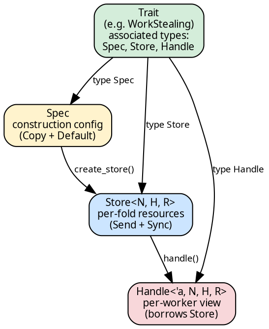
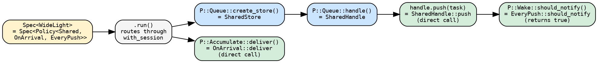

# Policy Traits: Zero-Cost Configuration

Funnel's three behavioral axes (queue, accumulation, wake) are each
a trait with an associated `Spec` type. The `FunnelPolicy` bundle
combines them into one type parameter. This pattern —
**Spec → Store/State → Handle, resolved at compile time** — is the
general recipe for adding zero-overhead configuration axes to any
executor.

This page describes the pattern generically. For the concrete
implementations (Chase-Lev deques, streaming sweep, etc.), see the
[Funnel](../funnel/overview.md) section.

## Specs as data

Every Spec in hylic is `Copy` — a small value type that fully
describes configuration. This follows from the
[defunctionalization principle](exec_pattern.md): Specs are data,
not behavior. Combining Specs via axis transformations produces new
Specs. Attaching a resource to a Spec produces a Session. Running
a Spec creates the resource internally.

The policy sub-specs (`PerWorkerSpec`, `OnFinalizeSpec`, `EveryKSpec`,
etc.) are all `Copy + Default + Send + Sync`. Most are ZSTs. The
funnel `Spec<P>` composes them and is itself Copy (~40 bytes of
usizes and ZSTs).

## The Spec → Store → Handle pattern

Each axis follows the same three-phase lifecycle:



Three associated types capture the lifecycle:

1. **Spec** — construction-time configuration. Carried in the
   executor's `Spec<P>`. Small, Copy, Default.
2. **Store** — per-fold resources created from the Spec. Owned by
   the fold's stack frame. Send+Sync (shared across workers).
3. **Handle** — per-worker view that borrows from the Store. Has
   the actual push/pop/steal methods.

All three use GATs to carry the task's generic parameters without
boxing.

## Concrete example: WorkStealing

```rust
{{#include ../../../../hylic/src/exec/variant/funnel/policy/queue/mod.rs:work_stealing_trait}}
```

Two implementations:

| | PerWorker | Shared |
|---|---|---|
| **Spec** | `PerWorkerSpec { deque_capacity }` (Copy) | `SharedSpec` (ZST, Copy) |
| **Store** | `Vec<WorkerDeque>` + `AtomicU64` bitmask | `StealQueue` |
| **Handle** | refs to own deque + all deques + bitmask | ref to queue |

## Bundling: FunnelPolicy

Three independent axes combined into one type parameter:

```rust
{{#include ../../../../hylic/src/exec/variant/funnel/policy/mod.rs:funnel_policy_trait}}
```

```rust
{{#include ../../../../hylic/src/exec/variant/funnel/policy/mod.rs:policy_struct}}
```

`Policy<Q, A, W>` is the generic implementor. Named presets are type
aliases. The funnel `Spec<P>` carries each axis's sub-spec:

```rust
{{#include ../../../../hylic/src/exec/variant/funnel/mod.rs:funnel_spec}}
```

## Named presets as transformations

Every named preset is a transformation of `Spec::default(n)`.
Default values live in ONE place — the `default()` constructor.
Presets compose axis builders on top:

```rust
// WideLight = default + Shared queue + OnArrival accumulation
fn for_wide_light(n: usize) -> Spec<WideLight> {
    Spec::default(n)
        .with_queue::<Shared>(SharedSpec)
        .with_accumulate::<OnArrival>(OnArrivalSpec)
}
```

The axis builders (`with_queue`, `with_accumulate`, `with_wake`)
are typestate transformations — they change the Policy type parameter,
producing a new Spec type.

## How monomorphization flows

The type parameter propagates from Spec to every call site:



From `Spec<WideLight>` to the innermost push/deliver/notify — every
call is resolved at compile time. No vtable, no trait object, no
indirect call.

## The const generic optimization

Wake strategies like `EveryK<K>` use a const generic for the
notification interval. The modulus `count % K` compiles to a bitmask
when K is a power of 2 — the compiler sees the constant and
optimizes.

## Applying the pattern to new axes

To add a fourth axis (e.g., steal ordering):

1. Define a trait: `pub trait StealOrder: 'static { type Spec: Copy + Default + Send + Sync; ... }`
2. Add implementations: `struct Fifo;`, `struct Lifo;`
3. Add to `FunnelPolicy`: `type Steal: StealOrder;`
4. Update `Policy<Q, A, W, St>` and named presets
5. Thread through `Spec<P>` and `run_fold`

The call chain monomorphizes automatically. No runtime cost for the
new axis.
