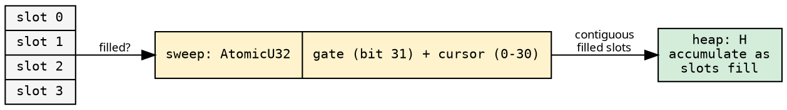
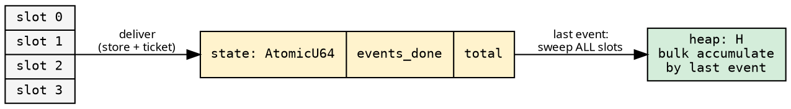

# Accumulation Strategies

Two ways to fold child results into the parent's heap, selected at
compile time via the `AccumulateStrategy` trait. Both preserve child
order — accumulate is called in slot order regardless of which worker
delivered first. This is what allows hylic's
[non-associative accumulate](../design/milewski.md#the-general-case-h--r)
to run correctly in parallel:

```rust
{{#include ../../../../hylic/src/exec/variant/funnel/policy/accumulate/mod.rs:accumulate_strategy_trait}}
```

Both use the same [ticket system](ticket_system.md) for last-event
detection. They differ in WHEN and HOW the heap is swept.

## OnArrival: streaming sweep

Each delivery tries to sweep contiguous filled slots immediately.
A CAS gate (bit 31 of `sweep: AtomicU32`) ensures only one thread
sweeps at a time. A cursor (bits 0-30) tracks sweep progress.



**Per-delivery flow**:
1. Write result to slot, `filled.store(true, Release)`
2. `state.fetch_add(1, Relaxed)` — take ticket
3. Try CAS gate: if won, sweep contiguous filled slots from cursor
4. If this was the last event (ticket), spin until sweep completes

**Advantage**: Results accumulate as they arrive — lower latency
to completion when children finish in order.

**Cost**: CAS contention on the sweep gate when multiple threads
deliver simultaneously. ~16-28ns per delivery depending on gate
outcome.

## OnFinalize: bulk sweep

Deliveries only store + ticket. No sweep, no CAS gate. The last
event (determined by the ticket) bulk-sweeps all slots at once.



**Per-delivery flow**:
1. Write result to slot, `filled.store(true, Release)`
2. `state.fetch_add(1, Relaxed)` — take ticket
3. If last event: iterate all slots, `filled.load(Acquire)` each,
   accumulate, finalize

**Advantage**: Zero CAS contention per delivery. Each delivery is
~11ns (store + fetch_add only).

**Cost**: The finalizer must spin-wait on any slot whose `filled`
hasn't been published yet (rare — `Release`/`Acquire` propagates
quickly). Cold-cache sweep if slots were written by other cores.

## When to use which

| Workload | Strategy | Why |
|---|---|---|
| Init-heavy, graph-heavy | OnArrival | Streaming pipelines computation |
| Balanced, finalize-heavy | OnFinalize | Minimal per-delivery overhead |
| Wide trees (bf > 10) | Either | OnArrival if results arrive in order |
| Deep narrow (bf=2) | OnFinalize | Only 2 slots — sweep trivial |

## Memory footprint

Both strategies use destructive reads — results are moved out of
their slots during accumulation, then dropped. For result types that
own heap memory (String, Vec, etc.), this means resources are freed
progressively as the sweep advances, not held alive until fold
completion.

With OnArrival, the live memory at any point is bounded by the
number of delivered-but-not-yet-swept results (typically much
smaller than total results). With OnFinalize, all results are
delivered before the bulk sweep, so peak memory equals the node's
child count × result size — freed in one pass.

This is relevant for folds over large trees where each result carries
significant heap data (parsed documents, artifact records, aggregated
datasets). See [Infrastructure](infrastructure.md) for the arena
allocation model.
