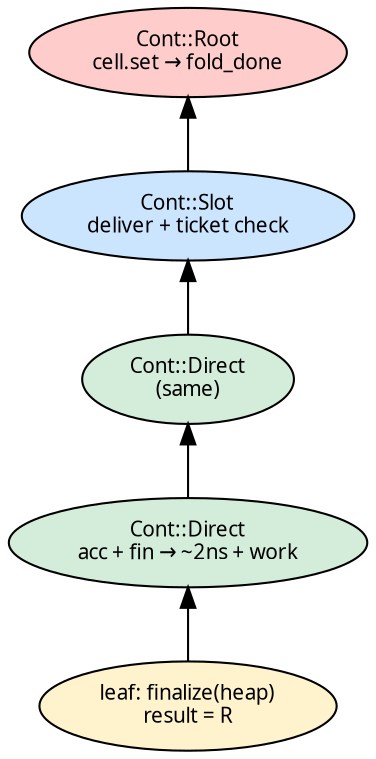
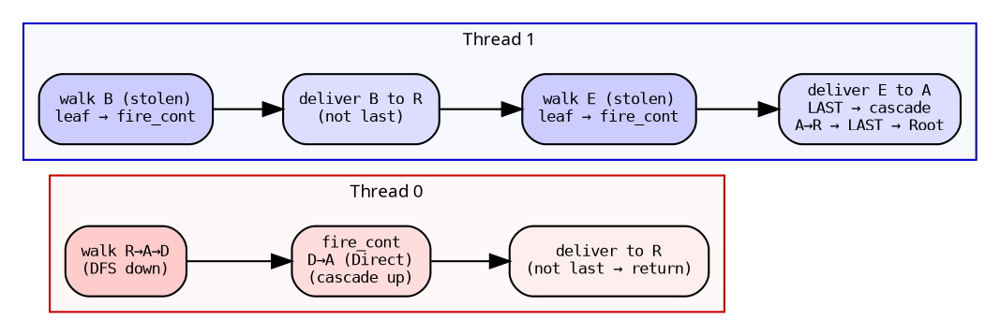

# Cascade: The Trampolined Upward Pass

When a child completes, `fire_cont` delivers its result and cascades
upward through the continuation chain. It is a **loop**, not
recursion — zero stack growth. One thread can cascade from leaf to
root without touching the queue.

This is the dual of [`walk_cps`](cps_walk.md): walk descends,
`fire_cont` ascends. Together they form a single DFS round-trip —
down and back up — on one thread for the inline spine, handing off
across threads at multi-child boundaries.

## The function

```rust
{{#include ../../../../hylic/src/cata/exec/variant/funnel/cps/walk.rs:fire_cont}}
```

Three continuation variants, three behaviors, one loop.

## Per-variant behavior

### `Cont::Root` — terminal

The fold is complete. Write the result to the `RootCell`, set
`fold_done`, notify all parked workers. Cost: ~5ns. One cell write,
one atomic store, one futex wake.

### `Cont::Direct` — single-child fast path

Accumulate the child result into the heap. Finalize. Take the parent
continuation from the `ContArena`. Continue the loop. No atomics, no
synchronization — pure sequential speed. The heap was moved INTO the
continuation by `walk_cps`. The entire single-child spine collapses
into loop iterations at ~2ns overhead + user work each.

### `Cont::Slot` — multi-child delivery

Deliver the result to the `FoldChain` slot via
`P::Accumulate::deliver()`. The [ticket system](ticket_system.md)
determines if this thread is the last to arrive. If yes: sweep or
finalize the chain, take the parent continuation, continue cascading.
If no: return — this thread's cascade is done.

This is where parallelism meets sequentiality. Multiple threads race
to deliver. Exactly one wins. The winner cascades; the losers return
to the help loop to steal more work.

## The cascade as a round-trip



A leaf fires upward. Direct levels collapse at sequential speed. The
Slot level requires atomic delivery and a ticket check. Root stores
the result and signals completion.

## Parallel interleaving

The cascade runs WITHOUT touching the queue. One thread goes up
while other threads simultaneously go down:



Thread 0's delivery to R and Thread 1's delivery to R are concurrent
atomic operations on R's `FoldChain`. The [ticket](ticket_system.md)
determines which thread cascades past R.

## Cache warmth

The same thread that walks DOWN the DFS spine walks back UP via
`fire_cont`. `ChainNode`s allocated on the way down are in L1 cache
on the way up — no cross-core transfer. This is a structural
consequence of [first-child inlining](cps_walk.md#first-child-inlining):
the allocating thread is the reading thread.

## Compile-time accumulation dispatch

In the `Cont::Slot` arm, the accumulation strategy is resolved at
compile time:

```rust
let delivered = P::Accumulate::deliver(&node.chain, slot, result, fold);
```

`P::Accumulate` is an associated type on `FunnelPolicy`, resolved
via monomorphization. No runtime branch — the compiler inlines
`deliver_and_sweep` (OnArrival) or `deliver_and_finalize` (OnFinalize)
directly. See [Accumulation](accumulation.md) for the two strategies.
