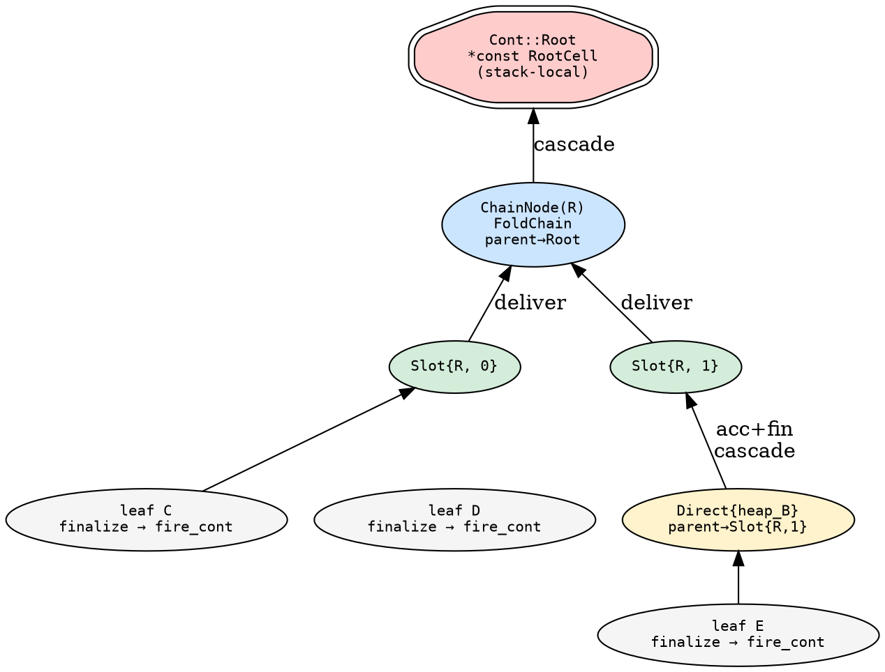
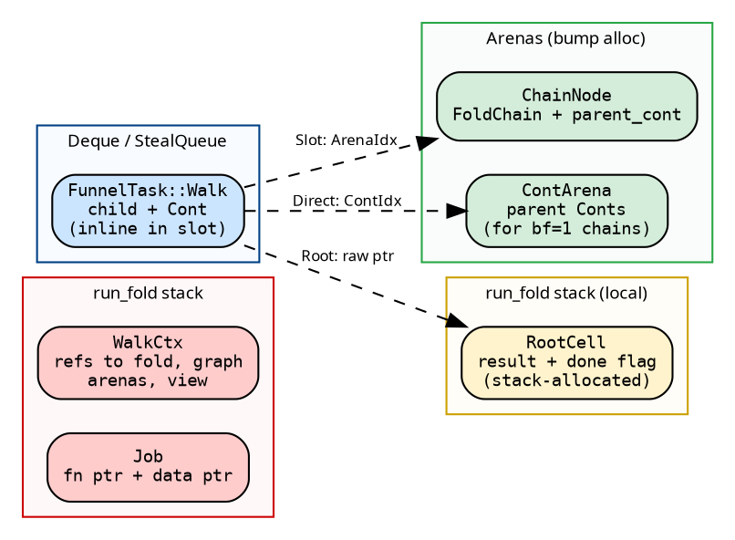

# Continuations: CPS Data Types

Three types carry the fold's state through the CPS pipeline:
`FunnelTask` (the parallelism boundary), `Cont` (the continuation),
and `ChainNode` (the multi-child accumulator). A fourth, `RootCell`,
is the terminal sink for the final result. Together they replace
implicit stack frames with explicit data that can be created on one
thread and consumed on another.

## FunnelTask

```rust
{{#include ../../../../hylic/src/exec/variant/funnel/cps/cont.rs:funnel_task}}
```

The unit of parallelism. Stored inline in deque slots (PerWorker)
or queue segments (Shared). No heap allocation per task — the enum
variant IS the data. `N` must be `Clone + Send` (cloned during
`graph.visit`, sent across threads). `R` must be `Send` (results are
moved across threads via destructive slot reads). `H` has no bounds
— it travels inside `Cont::Direct`.

## Cont

```rust
{{#include ../../../../hylic/src/exec/variant/funnel/cps/cont.rs:cont_enum}}
```

The defunctionalized continuation. Tells [`fire_cont`](cascade.md)
what to do with a result:

### `Cont::Root`

Terminal. Created once per fold. When `fire_cont` receives it, the
fold is complete: the result is written to the `RootCell` and
`fold_done` is signaled. Size: 8 bytes (one raw pointer).

The `RootCell` lives on `run_fold`'s stack — no heap allocation.
The raw pointer is safe because the scoped pool guarantees all
workers complete before `run_fold` returns.

### `Cont::Direct`

Single-child fast path. The heap value travels WITH the continuation
— no `ChainNode`, no `FoldChain`, no atomics. `parent_idx` is a
`ContIdx(u32)` into the `ContArena`. When `fire_cont` receives it:
accumulate the result into the heap, finalize, take the parent
continuation from the arena, continue the loop.

Size: `sizeof(H) + 4` bytes.

### `Cont::Slot`

Multi-child delivery. Two `u32` indices: `node` (arena index to the
`ChainNode`) and `slot` (which position in the `FoldChain`). When
`fire_cont` receives it: deliver the result to the slot, check the
[ticket](ticket_system.md). If this was the last event, sweep/finalize
the chain and take the parent continuation. If not, return — another
thread will finalize.

Size: 8 bytes (two `u32`, regardless of `H` or `R`).

## ChainNode

```rust
{{#include ../../../../hylic/src/exec/variant/funnel/cps/cont.rs:chain_node}}
```

Arena-allocated. Created lazily on child 2 (never for single-child
nodes). Contains:
- `chain`: the `FoldChain` — slot cells, heap, ticket state
- `parent_cont`: the continuation of the creating node, moved out
  exactly once by the finalizing thread via `take_parent_cont()`

## Continuation graph

For a tree with root R, child A (2 children: C, D), and child B
(1 child: E, leaf):



Leaf C finalizes, delivers to Slot{R,0}. Leaf E finalizes, fires
Direct for B (accumulates + finalizes), delivers to Slot{R,1}.
Whichever delivery is last (ticket) sweeps ChainNode(R) and fires
Root.

## Data ownership

Each CPS type lives in a specific memory region:



Deque stores tasks inline. Arena indices are `u32` (Copy, no
refcount). The CPS pipeline has **zero heap allocations** on the
critical path — RootCell is stack-local, arenas grow lazily via
[segmented allocation](infrastructure.md), and tasks are stored
inline in deque slots.

## Size summary

| Type | Size | Notes |
|---|---|---|
| `Cont::Root` | 8 bytes | raw pointer to stack-local RootCell |
| `Cont::Direct` | `sizeof(H) + 4` | heap value + `ContIdx(u32)` |
| `Cont::Slot` | 8 bytes | `ArenaIdx(u32) + SlotRef(u32)` |
| `FunnelTask::Walk` | `sizeof(N) + sizeof(Cont) + tag` | stored inline in deque |
| `ChainNode` | `sizeof(FoldChain) + sizeof(Option<Cont>)` | arena-allocated |
| `RootCell` | `sizeof(Option<R>) + 1` | stack-local in `run_fold` |
