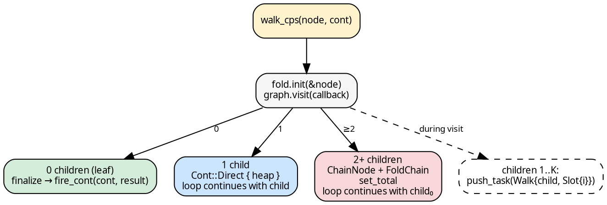
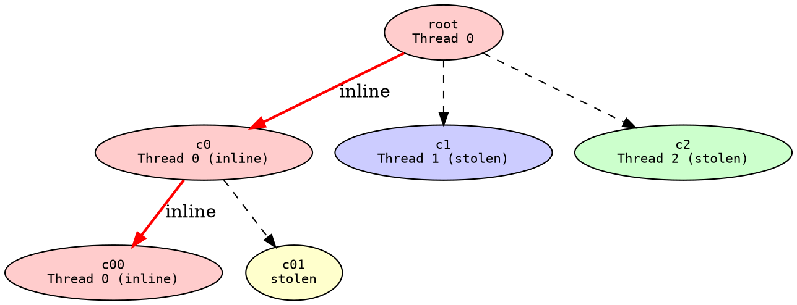
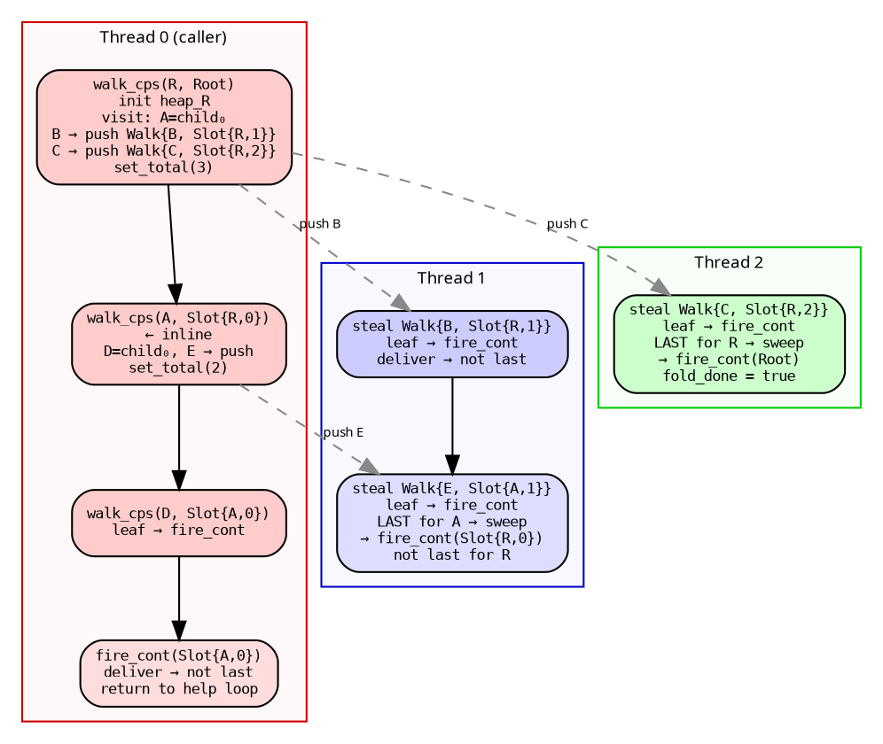

# CPS Walk: The Downward Pass

`walk_cps` is the core of the funnel executor. It processes one node
at a time: initializes the fold heap, iterates children through the
graph's push-based visitor, and branches on the child count. It is a
**void function** — results flow through continuations, not return
values. This is what makes cross-thread result delivery possible
without blocking.

## The algorithm

```rust
{{#include ../../../../hylic/src/cata/exec/variant/funnel/cps/walk.rs:walk_cps}}
```

The function takes `(wctx, node, cont)`:
- `wctx`: per-worker context (queue handle + wake state)
- `node`: the graph node to process
- `cont`: what to do with this node's result

It loops (trampolined for the inline child case), processing one
node per iteration.

## Child-count branching

After `graph.visit` returns, the child count determines the control flow:



**Leaf (0 children):** Finalize the heap and call
[`fire_cont`](cascade.md) with the original continuation. This is
the base case — the upward cascade begins here.

**Single child (1):** No `ChainNode` needed. The heap moves into a
`Cont::Direct`, the parent continuation is stored in the `ContArena`,
and the loop continues with the child. Zero queue interaction, zero
atomic operations.

**Multi-child (2+):** A `ChainNode` is allocated in the arena
(lazily, on child 2 — not child 1). Children 1..K are pushed as
`FunnelTask::Walk` to the queue. Then `set_total` records the child
count in the [ticket system](ticket_system.md). The loop continues
with child 0 (inline walk).

## First-child inlining

Child 0 is ALWAYS walked inline — a continuation of the current
thread's DFS spine, with zero queue overhead. Siblings are pushed
to the queue for workers to steal. This gives every active thread
a guaranteed DFS path from its entry point to a leaf:



Red edges = inline walks (zero queue cost). Dashed = queue
submissions. Thread 0 walks root → c0 → c00 → ... → leaf without
touching the queue at any level. This is structurally equivalent to
Cilk's continuation-stealing, inverted: we push sibling tasks (child
stealing) instead of stealing the parent's continuation.

Three compounding effects make this critical:

- **Zero-queue spine.** For depth D, one thread processes D nodes
  with no push/pop overhead (~20-50ns saved per level).
- **Cache warmth.** `ChainNode`s allocated on the way down are in
  L1 cache on the way up via [`fire_cont`](cascade.md).
- **Reduced contention.** One fewer task per level competing for
  deque access.

## Defunctionalization

Tasks are data, not closures:

```rust
{{#include ../../../../hylic/src/cata/exec/variant/funnel/cps/cont.rs:funnel_task}}
```

`FunnelTask::Walk` pairs a child node with its continuation — plain
data stored inline in deque slots. No `Box<dyn FnOnce>`, no closure
capture, no vtable. The `execute_task` function is the apply:

```rust
{{#include ../../../../hylic/src/cata/exec/variant/funnel/cps/walk.rs:execute_task}}
```

This is the Reynolds/Danvy defunctionalization transformation applied
to parallel work items.

## Streaming submission

Children are pushed to the queue **during** `graph.visit`, not after.
Workers can steal siblings while the parent is still discovering
more children. `append_slot` is called per child inside the callback;
`set_total` is called after `graph.visit` returns. Between these two
events, workers may deliver results to already-appended slots. The
[ticket system](ticket_system.md) handles this race.

## Task submission and wake

```rust
{{#include ../../../../hylic/src/cata/exec/variant/funnel/dispatch/worker.rs:push_task}}
```

`push` goes through the policy's queue handle. If the queue is
full, the task is executed inline (Cilk overflow protocol). Otherwise,
the wake strategy decides whether to notify a parked worker.

## Worked example

A sum fold over tree `R(A(D,E), B, C)` where D, E, B, C are leaves.
Thread 0 is the caller; threads 1-2 are workers.



- Thread 0 walks the left spine (R→A→D) inline
- Thread 1 steals B, then E — becomes finalizer for A, cascades
  A's result to R
- Thread 2 steals C — becomes finalizer for R, fires `Cont::Root`
- The fold completes when any thread fires `Cont::Root`

## Cross-references

- [Continuations](continuations.md) — `Cont`, `FunnelTask`, `ChainNode`
- [Cascade](cascade.md) — `fire_cont`: the trampolined upward pass
- [Ticket system](ticket_system.md) — how `set_total` determines the
  finalizer
- [Queue strategies](queue_strategies.md) — how `push_task` dispatches
  to PerWorker or Shared
