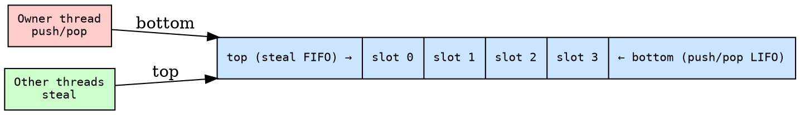
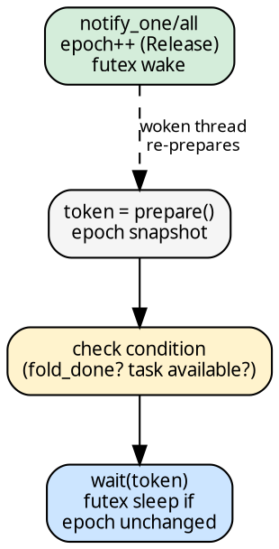

# Infrastructure

Four supporting types: two arena allocators, a Chase-Lev deque, and
a futex-based parking primitive. All are pre-allocated per fold and
bulk-reset or dropped at fold completion.

## Arena\<T\>

Bump-allocated slab for values written once and read many times.
Used for `ChainNode<H, R>` — one slot per multi-child node.

- **`alloc(value) → ArenaIdx`**: one `fetch_add(1, Relaxed)` on the
  bump pointer. No CAS, no lock.
- **`get(idx) → &T`**: unchecked index into contiguous slots.
  One pointer dereference.
- **Drop**: iterates all allocated slots and drops each.

`ArenaIdx` is `u32`, `Copy` — a plain integer index. No refcount.
Passing an index across threads costs 4 bytes.

## ContArena\<T\>

Same bump design as Arena, but with move-out semantics:

- **`alloc(value) → ContIdx`**: identical to Arena.
- **`take(idx) → T`**: moves the value OUT. Called exactly once per
  slot during [`fire_cont`](cascade.md)'s `Cont::Direct` handling.

Drop is a no-op — every allocated slot was already `take()`n during
the upward cascade. If the fold panics mid-execution, slots leak
(no tracking bitset). This is accepted: panic during fold is not
recoverable.

Used for parent continuations in single-child chains.

## WorkerDeque\<T\>

Chase-Lev work-stealing deque. Fixed-capacity ring buffer.

- **Owner**: LIFO push/pop from bottom (no atomics in fast path)
- **Stealers**: FIFO steal from top (CAS for contention)
- `ManuallyDrop<T>` wrapping: prevents double-free on speculative
  reads between pop and steal

Cache-padded: `bottom` and `top` on separate 128-byte lines to
prevent false sharing.

## EventCount

Lock-free thread parking via atomic epoch + futex.

- **`prepare() → Token`**: snapshot the epoch (Acquire)
- **`wait(token)`**: futex sleep if epoch unchanged since `prepare()`
- **`notify_one()` / `notify_all()`**: bump epoch (Release) + wake

Lost wakeup is structurally impossible: if a notification fires
between `prepare()` and `wait()`, the epoch has changed and `wait`
returns immediately.

Used for: pool thread parking (workers wait for jobs) and idle worker
notification (workers park when the queue is empty).

## Why arenas, not per-node allocation

- **Bulk reset**: arena reset is O(N) drops + one atomic store.
  N individual frees would touch the allocator's free list N times.
- **No refcounting**: `ArenaIdx` is `Copy`, 4 bytes. The equivalent
  with per-node allocation would be `Arc<ChainNode>` at ~10-15ns
  per clone/drop.
- **Predictable layout**: contiguous slots mean DFS-order allocation
  is cache-line friendly for the [upward cascade](cascade.md).
