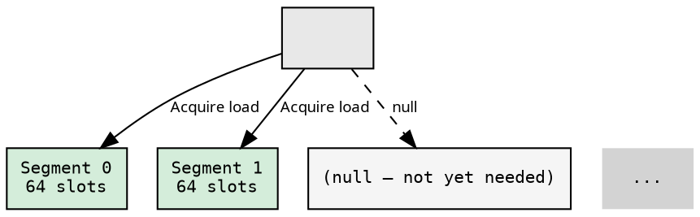
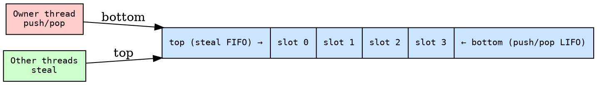
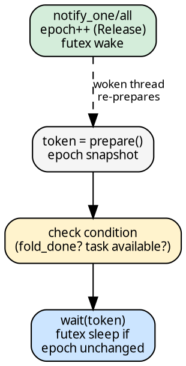

# Infrastructure

Four supporting types underpin the funnel executor: a segmented
bump allocator (backing both Arena and ContArena), a Chase-Lev
deque, and a futex-based parking primitive. All are created per fold
in [`run_fold`](pool_dispatch.md) and dropped at fold completion.

## SegmentedSlab\<T\> — the allocation foundation

Arena and ContArena share a common backing store: `SegmentedSlab<T>`.
It grows lazily in 64-slot segments, never invalidating existing
references. This is the key invariant that makes it safe under the
[CPS walk](cps_walk.md) where `alloc()` and `get()` interleave
with live references during recursive child discovery.

The design follows the same `AtomicPtr` CAS pattern used by the
[`StealQueue`'s SegmentTable](queue_strategies.md):

On `alloc()`:
1. `next.fetch_add(1, Relaxed)` — atomic bump, returns linear index
2. Decompose index: segment = `idx >> 6`, offset = `idx & 0x3F`
3. `ensure_segment(seg)` — Acquire load; if null, allocate + CAS
4. Write value to slot

On `get(idx)` / `take(idx)`:
1. Acquire load the segment pointer (L1 cache hit on hot path)
2. Index into the segment's slot array

Segment allocation races (multiple threads hit a new segment
simultaneously) are resolved by the CAS: one thread installs its
segment, losers free theirs. Exactly one segment is installed per
position.

**Memory profile**: A fold over a 200-node tree with bf=8 allocates
~2 segments (128 slots) instead of pre-allocating 4096. Initial
overhead: 32KB for the null-pointer table. Growth: one heap
allocation per 64 elements. Maximum capacity: 262,144 elements.

## Arena\<T\>

Thin wrapper over `SegmentedSlab<T>` for values written once and
read many times. Used for [`ChainNode<H, R>`](continuations.md) —
one slot per multi-child node.

- **`alloc(value) → ArenaIdx`**: delegates to SegmentedSlab. One
  `fetch_add(1, Relaxed)` + one segment pointer load.
- **`get(idx) → &T`**: segment pointer load + slot index. The
  returned reference is stable — subsequent allocs never invalidate it.
- **Drop**: iterates all allocated slots and drops each value, then
  frees all segments.

`ArenaIdx` is `u32`, `Copy` — a plain integer index. No refcount.
Passing an index across threads costs 4 bytes.

## ContArena\<T\>

Same segmented design as Arena, but with move-out semantics:

- **`alloc(value) → ContIdx`**: identical to Arena.
- **`take(idx) → T`**: moves the value OUT of the slot. Called
  exactly once per slot during [`fire_cont`](cascade.md)'s
  `Cont::Direct` handling.

Drop frees segment memory only — every allocated slot was already
`take()`n during the upward cascade. If the fold panics mid-execution,
slots leak (no tracking bitset). This is accepted: panic during fold
is not recoverable.

Used for parent [continuations](continuations.md) in single-child
chains.

## WorkerDeque\<T\>

Chase-Lev work-stealing deque. Fixed-capacity ring buffer with
power-of-2 masking.

The deque provides per-worker local task storage for the
[PerWorker queue strategy](queue_strategies.md):

- **Owner**: LIFO push/pop from bottom (no atomics in fast path)
- **Stealers**: FIFO steal from top (CAS for contention)
- `ManuallyDrop<T>` wrapping prevents double-free on speculative
  reads between pop and steal
- Cache-padded: `bottom` and `top` on separate 128-byte lines

If the deque is full, `push` returns the task to the caller, which
executes it inline (Cilk overflow protocol). This makes the fixed
capacity a performance knob, not a correctness hazard.

## EventCount

Lock-free thread parking via atomic epoch + futex. Used for pool
thread parking and idle worker notification.

The protocol prevents lost wakeups structurally:

- **`prepare() → Token`**: snapshot the epoch (Acquire)
- **`wait(token)`**: futex sleep if epoch unchanged since `prepare()`
- **`notify_one()` / `notify_all()`**: bump epoch (Release) + wake

If a notification fires between `prepare()` and `wait()`, the epoch
has changed and `wait` returns immediately — no lost wakeup.

## Why arenas, not per-node allocation

- **Stable references**: segmented layout means `alloc()` never
  invalidates existing pointers. `Vec`-backed growth would require
  reallocation, breaking live references in `walk_cps`.
- **No refcounting**: `ArenaIdx` is `Copy`, 4 bytes. The equivalent
  with per-node allocation would be `Arc<ChainNode>` at ~10-15ns
  per clone/drop.
- **Lazy growth**: memory usage is proportional to actual tree size,
  not a pre-configured maximum. No capacity configuration needed.
- **Bulk cleanup**: arena drop iterates allocated slots + frees
  segments. No per-node free list interaction.

## Streaming sweep and memory footprint

With the [OnArrival accumulation strategy](accumulation.md), child
results are moved out of their slots during the sweep (destructive
read). Each result is borrowed for `fold.accumulate`, then dropped.
This means heap resources owned by result values (Strings, Vecs,
etc.) are freed progressively as the sweep advances — not held
alive until fold completion. See
[Accumulation strategies](accumulation.md) for the sweep mechanics.
