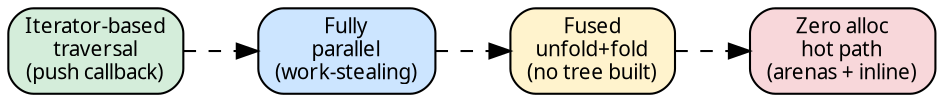
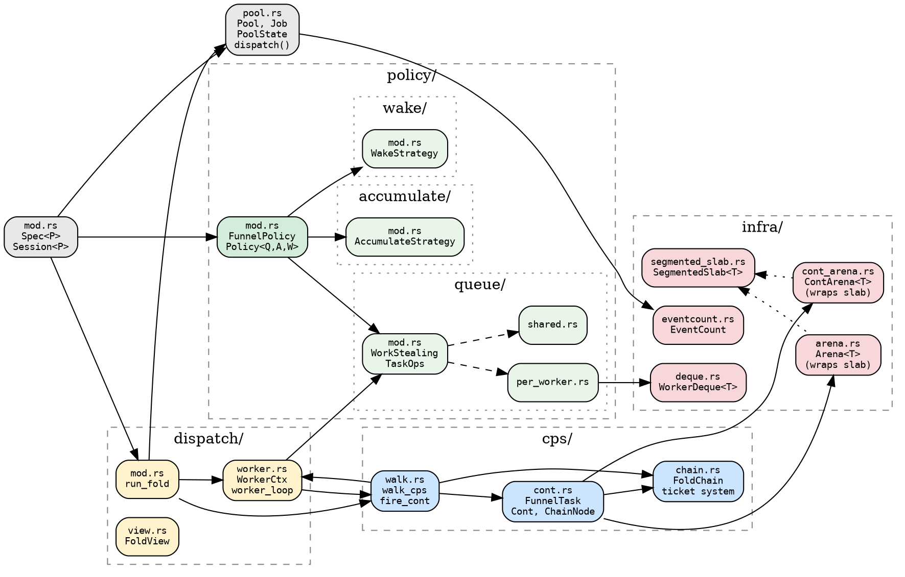
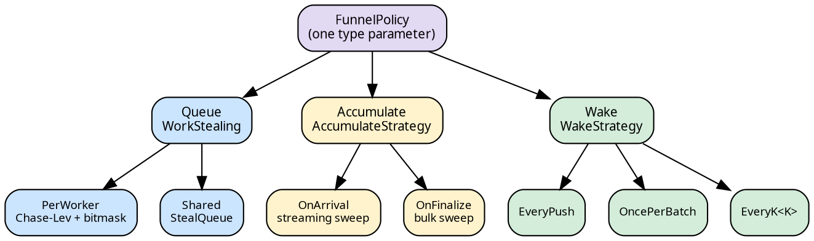

# Funnel: Parallel Fused Hylomorphism

The funnel executor parallelizes a fused hylomorphism — an unfold
(tree traversal) composed with a fold (bottom-up accumulation) where
the intermediate tree is never materialized. Children are discovered
one at a time through a push-based callback, processed concurrently
across worker threads, and their results flow back to the parent
through defunctionalized continuations.

## What a fused hylomorphism is

A **hylomorphism** composes an unfold (anamorphism) with a fold
(catamorphism). The unfold generates a tree structure from a seed;
the fold consumes it bottom-up. When fused, the two interleave:
each node is produced, its children recursively processed, and their
results accumulated — without materializing the tree.

In hylic terms: a `Treeish<N>` (the coalgebra) exposes
`visit(&node, |child| ...)` and a `Fold<N, H, R>` (the algebra,
[factored as init/accumulate/finalize](../design/milewski.md))
provides the per-node bracket. The executor calls `visit` to
discover children, recursively processes each, accumulates their `R`
results into the parent's `H` heap, and finalizes. The intermediate
tree is never materialized as a data structure.

The funnel parallelizes this: children beyond the first are pushed
to a work-stealing queue. Worker threads steal and process subtrees
concurrently. Results flow back through continuations to the parent's
accumulator. The challenge is coordinating the fold — detecting when
all children are done, accumulating their results, and cascading
upward — without locks, without allocation on the critical path.

## Design values

Four properties define the funnel's design:



1. **Iterator-based traversal.** The graph exposes
   `visit(&node, |child| ...)`. Children arrive one at a time.
   There is no `children(&node) -> Vec<N>`.

2. **Fully parallel.** Each child beyond the first is pushed to a
   work-stealing queue. Workers steal and process subtrees concurrently.
   The first child is walked inline — zero queue overhead on the DFS spine.

3. **Fused unfold+fold.** Results accumulate into the parent as they
   arrive (streaming) or in bulk by the last thread (finalize). The
   tree is never materialized.

4. **Zero allocation on the hot path.** Tasks are enum variants stored
   inline in deque slots. Multi-child accumulators are arena-allocated.
   Single-child nodes carry their heap inside the continuation. No
   `Box<dyn FnOnce>`, no `Arc` per task.

## Where funnel sits

| Executor | Parallelism | Unfold/fold fusion | Task repr | Allocation |
|---|---|---|---|---|
| **Fused** | none | fully fused | stack frames | zero |
| **Funnel** | CPS + work-stealing | fully fused | `FunnelTask` enum | arenas |

Fused is the sequential baseline — zero overhead, callback-based
recursion on a single thread. Funnel preserves the fused property
while adding parallelism through CPS (continuation-passing style)
and work-stealing queues. The fold/graph are unchanged between the
two — only the executor differs.

Both use the same [`Exec<D, S>`](../executor-design/exec_pattern.md)
type-level pattern. Funnel's policy system is an instance of the
generic [Spec → Store → Handle](../executor-design/policy_traits.md)
pattern for zero-cost executor configuration.

## Module map

The funnel's code is organized into four clusters:



## Three behavioral axes

The funnel is parameterized along three independent axes, all
resolved at compile time through the `FunnelPolicy` trait:

```rust
{{#include ../../../../hylic/src/cata/exec/variant/funnel/policy/mod.rs:funnel_policy_trait}}
```

Each axis is a trait with its own `Spec`, `Store`/`State`, and
implementations. The `Policy<Q, A, W>` struct bundles any combination:

```rust
{{#include ../../../../hylic/src/cata/exec/variant/funnel/policy/mod.rs:policy_struct}}
```

Named presets are type aliases:

```rust
{{#include ../../../../hylic/src/cata/exec/variant/funnel/policy/mod.rs:named_presets}}
```



See [Policies](policies.md) for the full decision guide and
benchmark-informed recommendations.

## Reading order

| Page | What you learn |
|---|---|
| [CPS walk](cps_walk.md) | The downward pass: how nodes are processed and tasks created |
| [Continuations](continuations.md) | `FunnelTask`, `Cont`, `ChainNode`, `RootCell` — the CPS data types |
| [Cascade](cascade.md) | `fire_cont`: the trampolined upward pass |
| [Ticket system](ticket_system.md) | Packed `AtomicU64` for exactly-one-finalizer detection |
| [Pool and dispatch](pool_dispatch.md) | Thread pool, `Job` struct, the `dispatch()` CPS lifecycle |
| [Queue strategies](queue_strategies.md) | PerWorker (Chase-Lev + bitmask) vs Shared (StealQueue) |
| [Accumulation](accumulation.md) | OnArrival (streaming sweep) vs OnFinalize (bulk) |
| [Policies](policies.md) | `FunnelPolicy` GAT, three axes, named presets, decision guide |
| [Infrastructure](infrastructure.md) | Arena, ContArena, WorkerDeque, EventCount |
| [Testing](testing.md) | Correctness, stress, interleaving proof |
