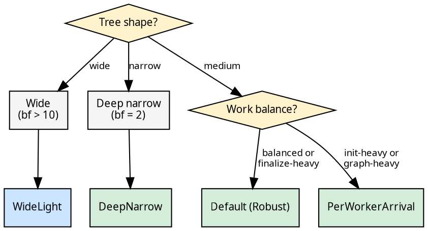

# Policies: Configuration and Presets

The funnel's behavior is fully determined by three compile-time axes
bundled into `FunnelPolicy`:

```rust
{{#include ../../../../hylic/src/cata/exec/variant/funnel/policy/mod.rs:funnel_policy_trait}}
```

## The Spec

```rust
{{#include ../../../../hylic/src/cata/exec/variant/funnel/mod.rs:funnel_spec}}
```

Each axis contributes its `Spec` type. `default_pool_size` sets the
thread count for one-shot execution. Arenas grow lazily via
[segmented allocation](infrastructure.md) — no capacity configuration.

## Named presets

```rust
{{#include ../../../../hylic/src/cata/exec/variant/funnel/policy/mod.rs:named_presets}}
```

Nine names map to seven distinct monomorphizations:

| Preset | Queue | Accumulate | Wake | Use case |
|---|---|---|---|---|
| `Default` / `Robust` | PerWorker | OnFinalize | EveryPush | All-rounder |
| `GraphHeavy` | (same as Robust) | | | Large trees (alias for Robust) |
| `WideLight` | Shared | OnArrival | EveryPush | bf > 10 |
| `LowOverhead` | PerWorker | OnFinalize | OncePerBatch | Noop-sensitive |
| `PerWorkerArrival` | PerWorker | OnArrival | EveryPush | Streaming + deques |
| `SharedDefault` | Shared | OnFinalize | EveryPush | Shared baseline |
| `HighThroughput` | PerWorker | OnFinalize | EveryK\<4\> | Heavy balanced |
| `StreamingWide` | Shared | OnArrival | OncePerBatch | Known +11% fold-hv |
| `DeepNarrow` | PerWorker | OnFinalize | EveryK\<2\> | bf=2 chains |

## Decision guide

Start from the tree shape, then refine by work distribution:



When unsure, use `Spec::default(n)` — the Robust preset has zero
regressions on any benchmarked workload.

## The three usage tiers

```rust
use hylic::cata::exec::funnel;
use hylic::domain::shared as dom;

// One-shot: creates pool, runs, joins
dom::exec(funnel::Spec::default(8)).run(&fold, &graph, &root);

// Session scope: pool lives for the closure, multiple folds share it
dom::exec(funnel::Spec::default(8)).session(|s| {
    s.run(&fold1, &graph1, &root1);
    s.run(&fold2, &graph2, &root2);
});

// Explicit attach: manual pool management
funnel::Pool::with(8, |pool| {
    dom::exec(funnel::Spec::default(8)).attach(pool).run(&fold, &graph, &root);
});
```

See [The Exec pattern](../executor-design/exec_pattern.md) for the
type-level design behind these tiers.

## Wake strategies

```rust
{{#include ../../../../hylic/src/cata/exec/variant/funnel/policy/wake/mod.rs:wake_strategy_trait}}
```

| Strategy | Behavior | Per-worker state |
|---|---|---|
| `EveryPush` | Notify on every push | `()` (none) |
| `OncePerBatch` | First push per `graph.visit` only | `bool` |
| `EveryK<K>` | Every K-th push (K is const generic) | `u32` counter |

`EveryK<K>` uses a const generic — the modulus compiles to a bitmask
when K is a power of 2.

## Zero-cost monomorphization

The entire call chain is generic over `P: FunnelPolicy`. The compiler
generates separate code per policy — `WorkerCtx`, `worker_loop`,
`walk_cps`, `fire_cont`, `push_task` are all monomorphized. No vtable,
no trait object, no indirect call. Each `push` and `try_acquire` is a
direct, inlinable function call.
