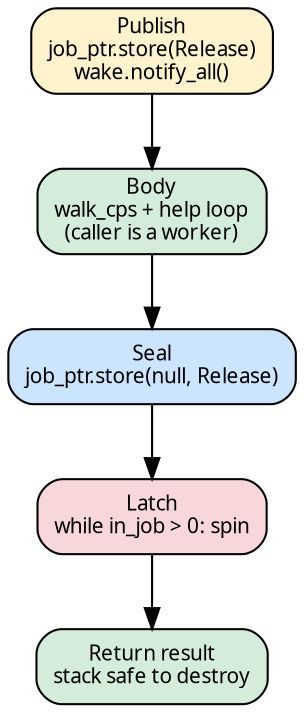
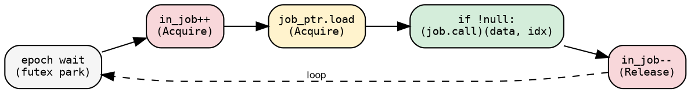

# Pool and Dispatch

The pool provides persistent threads. The executor provides the work.
A thin `Job` struct (two words) bridges them. The `dispatch` function
encapsulates the full lifecycle: publish → body → seal → latch.

## PoolState

```rust
{{#include ../../../../hylic/src/cata/exec/variant/funnel/pool.rs:pool_state}}
```

- `job_ptr`: points to a stack-local `Job` during dispatch, null
  otherwise
- `in_job`: threads currently in the job-handling region (the latch
  counter)
- `wake`: futex-based `EventCount` for thread parking
- `dispatch_lock`: serializes folds (one fold at a time per pool)

## Job

```rust
{{#include ../../../../hylic/src/cata/exec/variant/funnel/pool.rs:job_struct}}
```

`call` is a monomorphized `worker_entry::<N, H, R, F, G, P>` —
a concrete function pointer, not vtable dispatch. `data` points to
a stack-local `FoldState`. Two words, no allocation.

## The dispatch lifecycle

```rust
{{#include ../../../../hylic/src/cata/exec/variant/funnel/pool.rs:dispatch}}
```



1. **Publish**: store the `Job` pointer, wake all threads
2. **Body**: the caller participates in the fold (walk root, help loop)
3. **Seal**: clear `job_ptr` — no new threads can enter
4. **Latch**: spin until `in_job == 0` — all threads have left the
   job-handling region
5. **Return**: the `Job` and `FoldState` on the stack are safe to drop

The body knows nothing about pool lifecycle — it's pure fold logic.
All synchronization is dispatch's responsibility.

## Pool thread

```rust
{{#include ../../../../hylic/src/cata/exec/variant/funnel/pool.rs:pool_thread}}
```

The critical ordering: `in_job` increment happens **before**
`job_ptr` load. This closes the TOCTOU gap:



Without this ordering, a thread could load `job_ptr` (valid), then
the body returns and destroys the stack, then the thread dereferences
the destroyed pointer → SIGSEGV. The `in_job` counter makes the
thread visible to the latch before it touches the pointer.

## run_fold

```rust
{{#include ../../../../hylic/src/cata/exec/variant/funnel/dispatch/mod.rs:run_fold}}
```

Creates per-fold state (store, arenas, root cell, view, context),
erases it to `*const ()` for the `Job`, and delegates to `dispatch`.
The body walks the root and help-loops until `root_cell.is_done()`.

## Scoped pool

`Pool::with(n, |pool| ...)` uses `std::thread::scope` — threads
are joined when the closure returns. No leaked threads, no lifetime
footguns.

The pool is the executor's **Resource** (defined by the `Resource`
GAT on `ExecutorSpec`). It can be provided explicitly via `.attach()`,
or created internally by `.run()` / `.session()`:

```rust
// One-shot: pool created + destroyed per fold
dom::exec(funnel::Spec::default(8)).run(&fold, &graph, &root);

// Session: pool shared across folds
dom::exec(funnel::Spec::default(8)).session(|s| {
    s.run(&fold, &graph, &root);
    s.run(&fold, &graph, &root);
});

// Explicit attach: manual pool, multiple policies
funnel::Pool::with(8, |pool| {
    let pw = dom::exec(funnel::Spec::default(8)).attach(pool);
    let sh = dom::exec(funnel::Spec::for_wide_light(8)).attach(pool);
    pw.run(&fold, &graph, &root);
    sh.run(&fold, &graph, &root);
});
```

Thread spawn/join cost is paid once per pool scope. Each `.run()`
allocates working memory fresh — only threads are shared.
