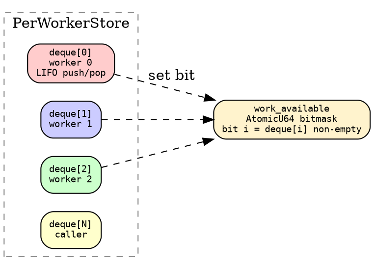
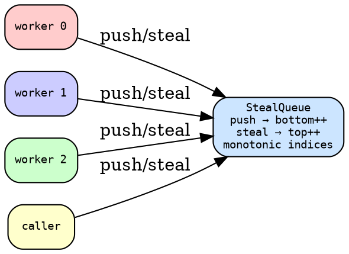

# Queue Strategies

Two work-stealing strategies, selected at compile time via the
`WorkStealing` trait:

```rust
{{#include ../../../../hylic/src/exec/variant/funnel/policy/queue/mod.rs:work_stealing_trait}}
```

The three associated types capture the queue lifecycle:
- **`Spec`**: construction-time configuration
- **`Store<N, H, R>`**: per-fold resources (deques, bitmask, etc.)
- **`Handle<'a, N, H, R>`**: per-worker view that borrows from Store

Workers interact through `TaskOps`:

```rust
{{#include ../../../../hylic/src/exec/variant/funnel/policy/queue/mod.rs:task_ops}}
```

`push` returns `Some(task)` if the queue is full — the caller
executes inline (Cilk overflow protocol). `try_acquire` encapsulates
the strategy's acquisition policy.

## PerWorker: Chase-Lev deques + bitmask steal

Each worker owns a Chase-Lev deque. Push is LIFO (local, no atomic).
Steal uses an `AtomicU64` bitmask to find non-empty deques — one
atomic load instead of scanning N deques.



```rust
{{#include ../../../../hylic/src/exec/variant/funnel/policy/queue/per_worker.rs:per_worker_task_ops}}
```

**Push**: LIFO to own deque (no CAS), set bit in bitmask.

**Try acquire**: Pop local deque first (cache-warm, zero contention).
If empty, load bitmask, iterate set bits, steal FIFO from first
non-empty deque. Clear bit if deque found empty.

**Best for**: Trees with moderate-to-high branching. LIFO push + FIFO
steal gives depth-first local execution with breadth-first work
distribution. The bitmask avoids scanning all N deques.

## Shared: single StealQueue

All threads push to one queue. All threads steal from it.



**Push**: `fetch_add` on `bottom`, write to segment slot.

**Steal**: CAS on `top`, read from segment slot. FIFO order.

**Best for**: Wide trees (bf > 10) and small trees where per-worker
deque overhead is disproportionate. No bitmask, no per-deque
allocation.

## When to use which

| Workload | Strategy | Why |
|---|---|---|
| General (bf=4-8) | PerWorker | LIFO locality, bitmask steal |
| Wide (bf > 10) | Shared | No deque allocation per worker |
| Deep narrow (bf=2) | PerWorker | DFS spine dominates |
| Small tree (< 50 nodes) | Shared | Lower fixed overhead |
