# Ticket System: Packed AtomicU64

Each multi-child node has K+1 concurrent events: K child deliveries
and 1 `set_total`. A single `AtomicU64` determines which event is
last — the **finalizer**. No separate counters, no missed completions.

## The problem

`graph.visit` produces children through a push callback. Workers may
complete and deliver results before the iterator finishes. Two things
happen concurrently:

1. **Child deliveries**: each result written to a slot. Multiple
   threads, unpredictable order.
2. **`set_total`**: after `graph.visit` returns, the child count is
   recorded.

Exactly one thread must detect that ALL events have occurred and
perform the finalization.

## Why two separate variables fail (Dekker race)

With `delivered: AtomicU32` and `total_known: AtomicBool` separately:

- Thread A (delivering child K): `delivered.fetch_add(1)`, then
  checks `total_known.load()` → sees `false` (stale)
- Thread B (set_total): `total_known.store(true)`, then checks
  `delivered.load()` → sees `K-1` (stale)

Neither sees the complete state. Both exit. The fold hangs.

## The solution: packed state

```rust
{{#include ../../../../hylic/src/exec/variant/funnel/cps/chain.rs:fold_chain_struct}}
```

`state: AtomicU64` packs both counters into one word:

| Bits 63–32 | Bits 31–0 |
|---|---|
| `total` (0 = unknown) | `events_done` |

```rust
{{#include ../../../../hylic/src/exec/variant/funnel/cps/chain.rs:state_packing}}
```

## How it works

Each event does a single `fetch_add` on `state`:

```rust
{{#include ../../../../hylic/src/exec/variant/funnel/cps/chain.rs:deliver_ticket}}
```

**Delivery** adds 1 to the low 32 bits (`events_done`).
**`set_total`** adds `pack_total(K)` to the high 32 bits.

`fetch_add` is a read-modify-write (RMW) — atomically reads the
previous state, modifies it, and writes back. No window for
interleaving. Each event gets a unique snapshot of the previous state.

The finalizer condition on `prev`:
- Delivery: `prev_total > 0 && prev_done + 1 >= prev_total`
- `set_total`: `prev_done >= total`

## State transition examples

Deliveries before set_total:

```dot process
digraph {
  rankdir=LR;
  node [shape=record, fontname="monospace", fontsize=10];
  s0 [label="{done:0|total:0}"];
  s1 [label="{done:1|total:0}"];
  s2 [label="{done:2|total:0}"];
  s3 [label="{done:2|total:3}"];
  s4 [label="{done:3|total:3|FINALIZER}", style="filled", fillcolor="#d4edda"];
  s0 -> s1 [label="deliver(0)"];
  s1 -> s2 [label="deliver(1)"];
  s2 -> s3 [label="set_total(3)"];
  s3 -> s4 [label="deliver(2)"];
}
```



All deliveries before set_total (set_total is finalizer):

```dot process
digraph {
  rankdir=LR;
  node [shape=record, fontname="monospace", fontsize=10];
  s0 [label="{done:0|total:0}"];
  s1 [label="{done:1|total:0}"];
  s2 [label="{done:2|total:0}"];
  s3 [label="{done:3|total:0}"];
  s4 [label="{done:3|total:3|FINALIZER}", style="filled", fillcolor="#d4edda"];
  s0 -> s1 [label="deliver(0)"];
  s1 -> s2 [label="deliver(1)"];
  s2 -> s3 [label="deliver(2)"];
  s3 -> s4 [label="set_total(3)"];
}
```



In every interleaving, exactly one event transitions the state to
`{done ≥ total, total > 0}`.

## Why Relaxed ordering is correct

The ticket determines WHO finalizes, not data visibility. Slot data
visibility is guaranteed by per-slot `filled.store(true, Release)` /
`filled.load(Acquire)` pairs. The sweep reads slots only after
confirming `filled == true`.

RMW linearization is ordering-independent: `fetch_add` operations on
a single atomic word are totally ordered by the CPU's coherence
protocol regardless of the memory ordering specified. Relaxed does
not weaken atomicity — it only relaxes ordering with respect to OTHER
memory locations.

## The exactly-one-finalizer proof

**Claim**: For K children, exactly one of K+1 events identifies
itself as the finalizer.

**Proof**: The K+1 `fetch_add` operations form a total order (RMW
linearization). Each returns a unique `prev`. Before `set_total`
fires, `total = 0` in all `prev` values — no delivery can satisfy
the condition. After `set_total` fires, each subsequent delivery
increments `done`. The delivery that pushes `done` to `total` is the
first (and only) to satisfy the condition. If all deliveries fire
before `set_total`, then `set_total` sees `prev_done ≥ total` and is
the finalizer. QED.
