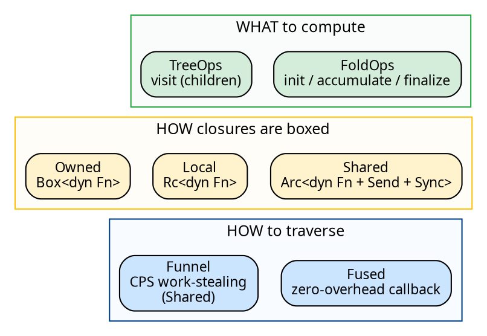
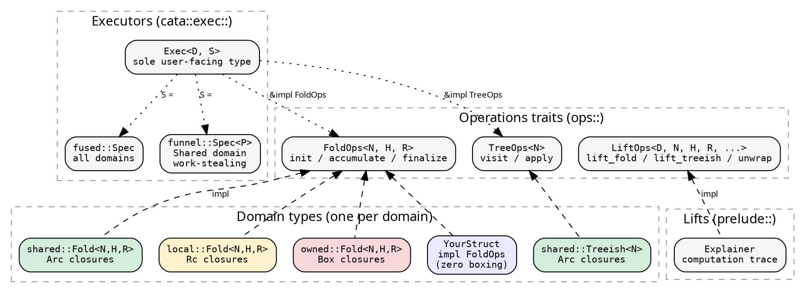
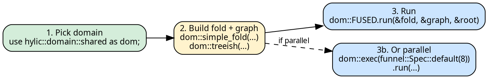

# Concept map

How the pieces fit together.

## The three axes

hylic is built on three orthogonal axes. Each can be chosen
independently:



**Operations** define the computation. **Domain** determines boxing
overhead. **Executor** determines traversal strategy. Any combination
works (subject to domain compatibility).

## Type landscape

<!-- -->



## How a user navigates

<!-- -->



Step 1 is usually `shared` and never changes. Steps 2-3 are the
entire API surface for most programs.

## Domain compatibility matrix

| | Shared | Local | Owned |
|---|:---:|:---:|:---:|
| **Fused** | yes | yes | yes |
| **Funnel** | yes | — | — |
| **Explainer** | yes | yes | — |
| **Pipeline** | yes | — | — |

Fused supports all domains (borrows, never clones). Funnel requires
`N: Clone + Send, R: Send` — the Shared domain provides these.

## Zero-boxing path

For maximum performance, skip the domain system entirely.
Implement `FoldOps` and `TreeOps` on your own structs:

```rust
struct MyFold;
impl FoldOps<MyNode, MyHeap, MyResult> for MyFold {
    fn init(&self, node: &MyNode) -> MyHeap { ... }
    fn accumulate(&self, heap: &mut MyHeap, result: &MyResult) { ... }
    fn finalize(&self, heap: &MyHeap) -> MyResult { ... }
}
```

Pass `&MyFold` directly to a Fused executor's recursion engine.
The compiler monomorphizes everything — zero vtable calls, zero
boxing, zero `Arc`. This is the absolute performance ceiling.
