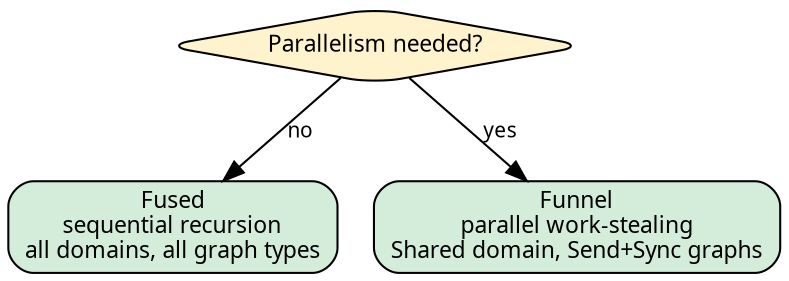

# Execution: choosing the strategy

The executor governs how the tree recursion is carried out. The
fold and graph determine what is computed at each node and how
children are found; the executor determines traversal order,
parallelism, and resource lifecycle. Substituting one executor
for another changes performance characteristics without
modifying the fold or the graph.

## The interface

Both sequential and parallel execution use the same `.run()`
method on `Exec<D, S>`. The method is inherent; no trait import
is required:

```rust,no_run
use hylic::prelude::*;

// Sequential:
FUSED.run(&fold, &graph, &root);

// Parallel:
exec(funnel::Spec::default(8)).run(&fold, &graph, &root);
```

The domain `D` is fixed by the executor instance or the
`exec()` call. The type parameters `N`, `H`, `R`, and the graph
type `G` are inferred from the arguments.

## Built-in executors

Two executors are provided. The choice between them is
straightforward:



| Executor | Domain | Graph requirement | Characteristics |
|----------|--------|-------------------|-----------------|
| Fused | all | any `TreeOps<N>` | Sequential direct recursion (single thread) |
| Funnel | Shared | `TreeOps<N> + Send + Sync` | Parallel work-stealing across a scoped thread pool |

`Fused` operates on all domains and all graph types because it
borrows everything on a single thread. `Funnel` requires
`Send + Sync` on the graph because it shares the graph reference
across a scoped thread pool.

## Using the Funnel executor

The `Funnel` executor supports three usage tiers, trading
convenience for control over resource lifetime:

**One-shot** — the pool is created and destroyed per call:

```rust,no_run
use hylic::prelude::*;
exec(funnel::Spec::default(8)).run(&fold, &graph, &root);
```

**Session scope** — the pool is shared across multiple folds:

```rust,no_run
exec(funnel::Spec::default(8)).session(|s| {
    s.run(&fold, &graph, &root);
    s.run(&fold, &graph, &root);
});
```

**Explicit attach** — the caller manages the pool directly:

```rust,no_run
funnel::Pool::with(8, |pool| {
    exec(funnel::Spec::default(8)).attach(pool).run(&fold, &graph, &root);
});
```

See [Policies and presets](../funnel/policies.md) for
workload-specific configuration.

## Defining a project-wide executor

For projects that use a fixed Funnel configuration, a common
pattern is to define the executor once and reference it
throughout:

```rust,ignore
use hylic::prelude::*;

type MyPolicy = funnel::policy::Policy<
    funnel::queue::PerWorker,
    funnel::accumulate::OnArrival,
    funnel::wake::EveryK<4>,
>;

pub fn project_exec() -> hylic::exec::Exec<Shared, funnel::Spec<MyPolicy>> {
    let nw = std::thread::available_parallelism().map(|n| n.get()).unwrap_or(4);
    exec(
        funnel::Spec::default(nw)
            .with_accumulate::<funnel::accumulate::OnArrival>(
                funnel::accumulate::on_arrival::OnArrivalSpec)
            .with_wake::<funnel::wake::EveryK<4>>(
                funnel::wake::every_k::EveryKSpec)
    )
}
```

Call sites then use `crate::project_exec().run(&fold, &graph, &root)`
without naming the policy type.

## Lift integration

Lifts operate on the Shared domain. The Explainer is the canonical
example — composed onto a fold, it captures every node's
intermediate state into an `ExplainerResult<N, H, R>`:

```rust
{{#include ../../../src/docs_examples.rs:explainer_usage}}
```

See [Lifts](../concepts/lifts.md) for the Explainer and other
lift patterns, and [Pipeline overview](../pipeline/overview.md)
for the chainable `.explain()` sugar that wraps this.

## Further reading

- [The Exec pattern](../executor-design/exec_pattern.md) — the
  type-level design behind `Spec`, `Session`, and `Exec`.
- [Policy traits](../executor-design/policy_traits.md) — how
  Funnel's three behavioural axes compose.
- [The three domains](../concepts/domains.md) — how the domain
  parameter selects fold storage.
