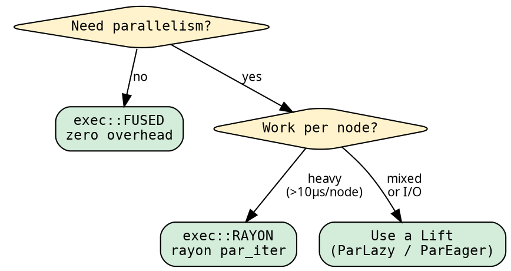

# Execution: choosing the strategy

The executor determines HOW the tree is traversed — sequential,
parallel, fused, unfused. Changing the executor changes the
performance characteristics without changing the fold or graph.

## The exec module

All executor concerns live in one namespace:

```rust
use hylic::cata::exec::{self, Executor};
```

`exec::FUSED`, `exec::RAYON`, etc. are zero-sized const values.
`Executor` is the trait — imported to call `.run()`.

## Switching executors

Same fold, same graph, one-token change:

```rust
use hylic::cata::exec::{self, Executor};

let init = |n: &Node| n.value;
let acc  = |h: &mut u64, r: &u64| *h += r;
let fold = hylic::fold::simple_fold(init, acc);
let graph = hylic::graph::treeish(|n: &Node| n.children.clone());

// Sequential — zero overhead:
let r = exec::FUSED.run(&fold, &graph, &root);

// Parallel via rayon — same fold, same graph:
let r = exec::RAYON.run(&fold, &graph, &root);
```

## When to use which executor



| Executor | Best for | Overhead |
|----------|----------|----------|
| `exec::FUSED` | Sequential, any workload | ~4µs per 200 nodes |
| `exec::SEQUENTIAL` | Testing unfused path | Vec alloc per node |
| `exec::RAYON` | CPU-bound parallel work | rayon scheduling |
| Lifts (ParLazy/ParEager) | Mixed or I/O workloads | Phase 1 + Phase 2 |

## Switching domains

The executor's type parameter determines the boxing domain.
Same closures, different constructor, different executor const:

```rust
// Shared domain (standard):
let fold = hylic::fold::fold(init, acc, fin);
let graph = hylic::graph::treeish_visit(children_fn);
exec::FUSED.run(&fold, &graph, &root);

// Owned domain (zero-boxing, maximum speed):
let fold = hylic::domain::owned::fold(init, acc, fin);
let graph = hylic::domain::owned::treeish_visit(children_fn);
exec::FUSED_OWNED.run(&fold, &graph, &root);
```

The type system enforces compatibility — `exec::RAYON` only accepts
Shared-domain folds. Passing an `owned::Fold` to `exec::RAYON` is a
compile error.

See [Domain system](../design/domains.md) for details.

## Runtime dispatch

When the executor is chosen at runtime, use the `Exec` enum:

```rust
let executors = vec![exec::Exec::fused(), exec::Exec::rayon()];
for e in &executors {
    assert_eq!(e.run(&fold, &graph, &root), expected);
}
```

`Exec` operates in the Shared domain. Its `.run()` is an inherent
method — no trait import needed (unlike the const values).

## Lift integration

Any Shared-domain executor gets `run_lifted` automatically:

```rust
use hylic::cata::exec::{self, Executor, ExecutorExt};
use hylic::prelude::{ParLazy, Explainer};

// Parallel evaluation:
let r = exec::FUSED.run_lifted(&ParLazy::lift(), &fold, &graph, &root);

// Computation tracing:
let (r, trace) = exec::FUSED.run_lifted_zipped(
    &Explainer::lift(), &fold, &graph, &root
);
```

`ExecutorExt` is a blanket trait — any `Executor<N, R, Shared>`
implements it automatically. Import it alongside `Executor` when
using Lifts.

## Performance characteristics

From the April 2026 benchmark run (200 nodes, bf=8):

| Executor | parse-lt (50k init) | parse-hv (200k init) |
|----------|--------------------|--------------------|
| `exec::FUSED` | 27.2ms | 129.4ms |
| `exec::RAYON` | 6.0ms | 17.5ms |
| ParLazy+rayon | 5.1ms | 23.3ms |
| ParEager+rayon | 7.8ms | 26.5ms |
| real-seq (hand-written) | 39.5ms | 142.9ms |

`exec::FUSED` beats hand-written sequential recursion on most
workloads (simpler stack frame → better compiler optimization).
`exec::RAYON` provides 4-8x speedup on CPU-bound work.
See [Benchmarks](../cookbook/benchmarks.md) for the full comparison.
